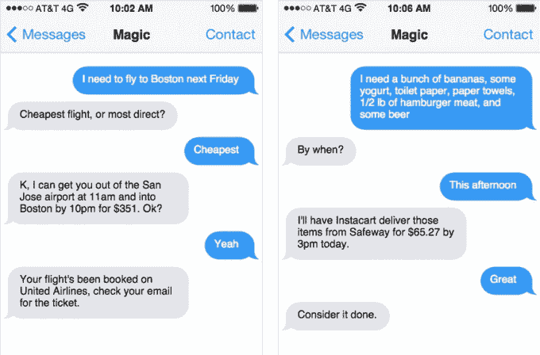

# 来源:Magic 正以 4000 万美元的估值从红杉获得 1200 万美元

> 原文：<https://web.archive.org/web/https://techcrunch.com/2015/03/26/sources-magic-is-raising-12m-from-sequoia-at-a-40m-valuation/>

消息人士称，Magic，一个基于短信的按需送货服务，最初是 YC 公司的周末项目，正在筹集由红杉领投的 1200 万美元首轮融资。消息人士还称，这家成立仅一个月的公司的前期估值为 4000 万美元。

[神奇的](https://web.archive.org/web/20230328032827/https://techcrunch.com/2015/02/23/magic-is-a-startup-that-promises-to-bring-you-anything-if-youre-willing-to-pay-for-it/)让用户发送一个简单的号码就能按需获得任何东西。当然，要额外收费。

在中期从帮助监测血压的应用程序 [Bettir](https://web.archive.org/web/20230328032827/https://techcrunch.com/2014/12/08/bettir-wants-to-chat-with-you-about-your-blood-pressure/) 转向 Y Combinator 后，该公司[于本周从 Y Combinator](https://web.archive.org/web/20230328032827/https://techcrunch.com/2015/03/23/here-are-the-companies-that-presented-at-y-combinator-demo-day-day-1/)毕业。Magic 最初是一个周末项目，在发布到 Product Hunt 之后，在一个周末的过程中就爆炸了。

无论如何，按需交付并不新奇。

Postmates 多年来一直提供这一功能，但 Magic 的纯短信频道已被证明广受欢迎。Magic 的联合创始人迈克·陈(Mike Chen)说，在这项服务上线的头 48 小时里，这项服务已经收到了 1.7 万条短信。

但红杉资本的这笔投资可能超越了短信的简单性，而具有更大的意义:规模。

与其他按需服务相比，Magic 的不同之处在于，它实际上借鉴了其他交付服务，如 Postmates、Eat24、GrubHub、Instacart 等。像 WunWun 这样的服务，为消费者提供几乎相同的功能，但使用自己的助手来送货，没有 Get Magic delivery 的人跑来跑去为你服务。

相反， [Magic](https://web.archive.org/web/20230328032827/http://getmagicnow.com/) 只是充当一个便利层，接受订单，估计总成本，标记这些订单，然后将它们放在任何数量的现有服务中(如 Instacart 或 Postmates)。

同样，这也不是一个完全新颖的想法。 [Alfred](https://web.archive.org/web/20230328032827/https://techcrunch.com/2014/11/18/alfred-goes-live-in-ny-with-a-fresh-2m-in-seed-from-spark-capital/) **，例如，让用户注册每周在家送货/服务(如洗衣、杂货、家居用品、包裹、擦鞋等。)来自阿尔弗雷德·霍普斯，他们会多做一点事，把食品杂货放进冰箱，把要洗的衣服放进衣橱。像魔术一样，你为阿尔弗雷德支付额外的费用(100 美元/月)，作为交换，你可以方便地将一周的家务完全交给别人来做。

考虑到 Magic 的价值主张是通过短信进行交易的便利性，Magic 的便利层远比 Alfred 的轻便，但它遵循类似的模型。

虽然这种模式可以快速扩展——Magic 表示目前在美国任何地方都可以使用——但它可能会遇到定价障碍。

几乎所有的按需送货服务都已经收取了送货费，其中包括一些最大的公司，如 Postmates、WunWun、GrubHub 和 Seamless。这使得 Magic 不得不在每个订单中添加自己的加价，这意味着 Magic 的用户要支付两项额外费用(第一项是为了方便使用按需服务，第二项是为了方便通过文本进行支付)。

尽管如此，红杉似乎在下大赌注，认为消费者会为利基交付服务之上的一层支付一点额外费用，以提供任何东西，只需一条简单的短信。

魔术没有立即回应置评请求。当我们听到更多消息时，我们会更新帖子。

*[*无老虎。](https://web.archive.org/web/20230328032827/https://techcrunch.com/2015/02/27/catch-a-tiger-by-the-toe/)*

** *由 TechCrunch 创始人迈克尔·阿灵顿创立的 CrunchFund 投资了 Alfred。*