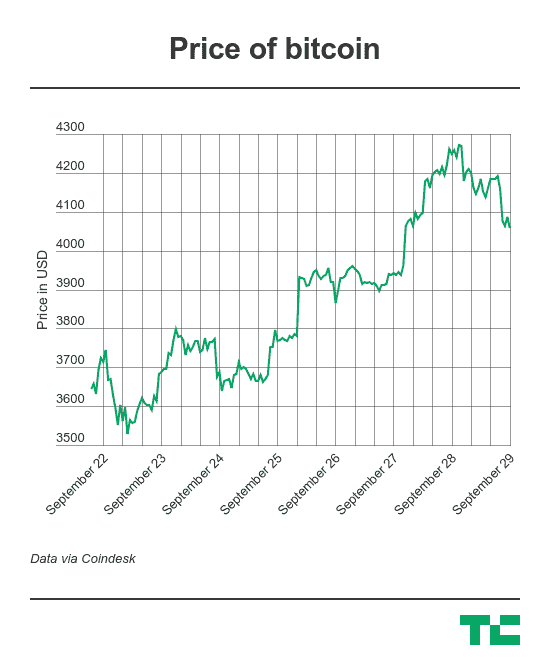

# 先是中国，现在韩国禁止了 ICOs 

> 原文：<https://web.archive.org/web/https://techcrunch.com/2017/09/28/south-korea-has-banned-icos/>

# 先是中国，现在韩国禁止了 ico

由于担心潜在的金融诈骗，韩国已经禁止了 ICOs，这是一种通过加密令牌筹集资金的新兴方法。

本月早些时候，中国央行率先宣布代币销售为非法，现在韩国也在效仿。

今年迄今为止，世界各地的公司已经通过 ICOs 筹集了超过 18 亿美元，其中包括销售一种新铸造的基于以太坊的加密硬币，以资助产品开发。这个领域不像主流金融市场那样受到监管，因此受到了广泛的批评，因为它可能会欺骗投资者，而投资者不需要以任何方式获得认证。

包括美国、新加坡、香港和英国在内的世界各地的监管机构已经警告考虑购买 ICO 的公司，它们可能违反证券法。那些投资者被警告说他们可能会血本无归。

有一些很有前景的项目——包括[支付网络 Omise Go](https://web.archive.org/web/20220928233105/https://beta.techcrunch.com/2017/07/05/omise-go-ico-25-million-omg/) 和 [Kik 的开发者平台](https://web.archive.org/web/20220928233105/https://beta.techcrunch.com/2017/09/12/kik-ico/)——但也有很多更有问题的 ico，尽管数量已经上升到每周 50 个代币销售。

就在上周，[一个知名的香港黑帮与澳门一个 5 亿美元的赌场 ICO](https://web.archive.org/web/20220928233105/http://www.scmp.com/news/hong-kong/law-crime/article/2112789/former-macau-gangland-boss-enters-multibillion-dollar)扯上了关系。一个真正的泡沫迹象是，今年夏天早些时候，一种名为[“无用以太币令牌”](https://web.archive.org/web/20220928233105/https://uetoken.com/)的仿品硬币设法从投资者那里筹集了近 9 万美元。

“通过 ico 筹集资金似乎在全球范围内呈上升趋势，我们的评估是，韩国的 ico 也在增加，”[路透社报道](https://web.archive.org/web/20220928233105/http://uk.reuters.com/article/uk-southkorea-bitcoin/south-korea-bans-raising-money-through-initial-coin-offerings-idUKKCN1C40FF)韩国金融服务委员会(FSC)在与韩国银行和国家税务署举行会议后表示。

据国家新闻机构联合通讯社报道，FSC 副主席金永贝补充道:“现在的情况是，资金已经流向了非生产性和投机性的方向。”。

中国最近实施的监管措施导致韩国在全球加密货币交易中所占的份额越来越大。随着韩国、日本和美国成为新的贸易中心，中国的份额被认为已经从前几年的 90%以上下降到今天的 10%多一点。

鉴于韩国的重要性，今天的新闻导致比特币价格在过去 24 小时内下跌了 3%。以太坊的价值下跌了 6.5%。

