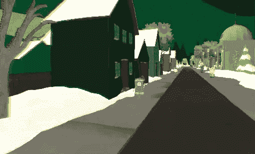

# 南方公园，现在在虚拟现实中

> 原文：<https://web.archive.org/web/https://techcrunch.com/2014/07/03/south-park-now-in-virtual-reality/>

# 南方公园，现在在虚拟现实中

准备好前往(虚拟)南方公园，享受(虚拟)时光了吗？

为了提高他们的虚拟现实技能，一个名为 [Tool](https://web.archive.org/web/20230129064711/http://southparkoculus.toolofnadrive.com/) 的设计师团队用 Oculus Rift 重建了每个人都喜欢的安静的小山城进行探索。

现在，在你开始之前:记住这只是一个有趣的概念证明——所以它有点简单，而且这里并没有塞满几个小时的互动娱乐。一旦你碰到一些市民，发现巴布拉迪警官在他的巡逻车里打滚，你就差不多完成了。(也就是说:至少有一层复活节彩蛋藏在里面。)

获得一张合适的南方公园地图作为地理基础是一个挑战，因为在该剧的 247 集里，小镇的布局已经发生了相当大的变化。在这种情况下，设计师们将他们的小镇基于最近发布的*南方公园:真理之棍*游戏中显示的内容，以及在第 17 季首次亮相的[全面修改的 3D 简介](https://web.archive.org/web/20230129064711/https://www.youtube.com/watch?v=Bdt0pz5C4Xc&feature=kp)中可见的内容。

与此同时，《南方公园》加入了《龙猫》中的[杰瑞·宋飞的公寓](https://web.archive.org/web/20230129064711/http://vrfocus.com/archives/1097/jerrys-place-vr-released-officual-oculus-vr-website/)、《千与千寻》中的[锅炉房](https://web.archive.org/web/20230129064711/https://www.youtube.com/watch?v=iXLY9WQ0pd4)和[公交车站](https://web.archive.org/web/20230129064711/http://www.roadtovr.com/download-my-neighbor-totoro-vr-bus-stop-scene-oculus-rift-demo/)等著名场景/场景的行列，这些场景/场景都是在虚拟现实中重现的。正如 Ready Player One(顺便说一下，这是一本该死的好书)所预测的那样，人们似乎喜欢使用 VR 来探索他们已经知道并喜欢的虚构世界的想法。就等着有人来重现霍格沃茨吧。

你可以在这里找到 Mac 和 PC 的模拟器。