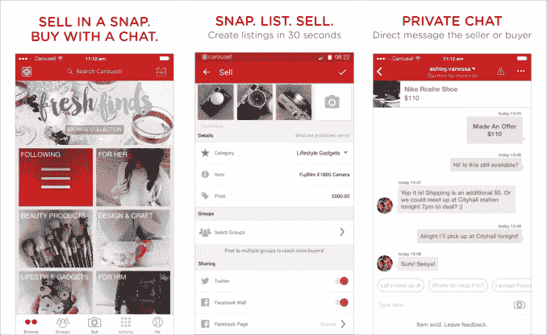

# 总部位于东南亚的 Carousell 为其社交商务应用 筹集了 3500 万美元

> 原文：<https://web.archive.org/web/https://techcrunch.com/2016/08/01/southeast-asia-based-carousell-raises-35m-for-its-social-commerce-app/>

成立四年的新加坡初创公司 Carousell ，开发了一款在东南亚实现点对点销售的上市应用，完成了 3500 万美元的 B 轮融资，以扩大其在新国家的影响力，并增加产品开发。

该公司被视为新加坡新生创业生态系统的宠儿之一，因为三位创始人卢卡斯·恩古(Lucas Ngoo)、马库斯·陈(Marcus Tan)和萧瑞奎(Siu Rui Quek)都是在 20 多岁时毕业于新加坡国立大学(NUS ),并在“常规”工作中度过了一段时间。除此之外，对于新加坡以外的初创公司来说，这无疑是最引人注目(最大)的 B 轮融资之一。

此次融资由现有投资者[乐天创投](https://web.archive.org/web/20230404224601/https://techcrunch.com/2015/11/13/rakuten-launches-100-million-global-fund-for-fintech-startups/)领投，参与投资的还有回归投资者红杉(通过其用于东南亚交易的印度基金)、[金门创投](https://web.archive.org/web/20230404224601/https://techcrunch.com/2016/06/14/golden-gate-ventures-closes-new-60-million-fund-for-southeast-asia/)和 500 家初创公司。这家初创公司之前在 2014 年筹集了 600 万美元的首轮融资[，在 2013 年](https://web.archive.org/web/20230404224601/https://techcrunch.com/2014/11/26/carousell-seriesa/)筹集了 80 万美元的种子融资[，因此新一轮融资似乎即将到来。](https://web.archive.org/web/20230404224601/https://techcrunch.com/2013/11/13/marketplace-app-carousell-raises-800k-seed-round-led-by-rakuten/)

事实上，TechCrunch 去年 12 月报道称，Carousell 正试图从投资者那里筹集高达 5000 万美元的资金。该公司当时拒绝置评，而这一次，Quek(首席执行官)对该报告所能说的就是，Carousell“非常感激和高兴我们得到了现有投资者的支持。”

Quek 在接受 TechCrunch 采访时表示，这款应用最初在新加坡是“一个解决我们自己问题的激情项目”。描述 Carousell 最简单的方式是通过其 iOS 和 Android 应用程序为移动设备提供 Craiglists。它使用带有照片上传选项的聊天式界面，将对买卖商品感兴趣的消费者联系在一起。安排销售和付款的责任落在了个人身上，因为目前，Carousell 还没有从它的服务中赚钱。

该公司声称其服务上有 3500 万个房源，每分钟增加 70 个新房源，活跃用户平均在应用程序上花费 17 分钟。(不错，[脸书最近透露](https://web.archive.org/web/20230404224601/https://techcrunch.com/2016/04/27/facediction/)其用户平均每天花 50 分钟在核心应用 Instagram 和 Messenger 上，这是三个应用。)

如今，Carousell 覆盖了五个国家——新加坡、香港、台湾、马来西亚和印度尼西亚——并计划进一步扩大覆盖范围。奎克说，这可能还包括在现有的东南亚重点之外的一次尝试。

“我们正在解决的问题是一个真正的全球性问题，”他解释道。“所以我们本身不受任何地区的限制。(我们扩张的)其他市场将在东南亚以外，但我们正在努力敲定这些市场。”

今年早些时候，该公司聘请了负责 Airbnb 东南亚业务的柴来管理其国际扩张计划。

在东南亚，电子商务领域的竞争非常激烈，据估计，这个市场的网上交易不到全部交易的 3%。除了 Lazada(今年从阿里巴巴获得了 10 亿美元的投资)之外，还有一些针对特定国家的参与者，如 T2 软银支持的 Tokopedia(T3)和零售集团力宝(Lippo)在印尼运营的 Matahari Mall，而社交网络上的非正规商务已经发展到连脸书都涉足其中的程度。这家美国巨头正在[测试一个社交支付系统](https://web.archive.org/web/20230404224601/https://techcrunch.com/2016/06/09/facebook-is-testing-social-commerce-payments-in-southeast-asia/)，该系统与[一个新的脸书商店功能](https://web.archive.org/web/20230404224601/https://www.facebook.com/business/news/facebooks-new-shop-section-in-pages-lets-products-take-centre-stage)一起，鼓励东南亚的用户在不离开脸书的墙的情况下买卖物品。

此外，有点奇怪的是，乐天创投的母公司乐天在东南亚也有自己的类似旋转木马的社交商务应用程序，名为 Rakuma。

“我们不知道 Rakuma 的推出，”Quek 之前告诉我。“乐天通过其风险投资部门成为投资者。乐天创投对 Carousell 的投资本质上是非战略性的。我们独立运营，不了解他们的战略计划。"

竞争确实很激烈，所以卡罗塞尔现在不太想钱也就不足为奇了。Quek 表示，该公司(及其投资者)正专注于扩大其应用程序的规模，尽管未来可能会有盈利潜力，但目前没有立即采取行动的计划。

不过，他强调说，他很乐观，一旦时机成熟，Carousell 在筹集现金方面不会有问题。

“Carousell 商业模式本质上是分类广告模式，传统上有 50%左右的利润率，”他说。“我们不是在重塑商业模式，只是在重塑体验。我们最终会实现货币化。”

“我们当前的重点是将所有精力用于国际扩张，并确保我们拥有一支强大的产品和工程团队，”他补充道。

最后，Carousell 目前有 90 多名员工，其中大约 24 名是工程师。Quek 说，他希望在今年年底之前将工程人员增加一倍。他说，该团队的重点包括改进搜索和买卖匹配，以及减少垃圾邮件列表。

至于最终的退出策略，比如东南亚首个引人注目的初创企业 IPO？你猜对了，现在不做评论。

“我们还没有真正讨论退出选项，重点总是在于产生最大的影响，”Quek 告诉 TechCrunch。“我们才刚刚开始，国际扩张将是我们最关注的焦点之一。”