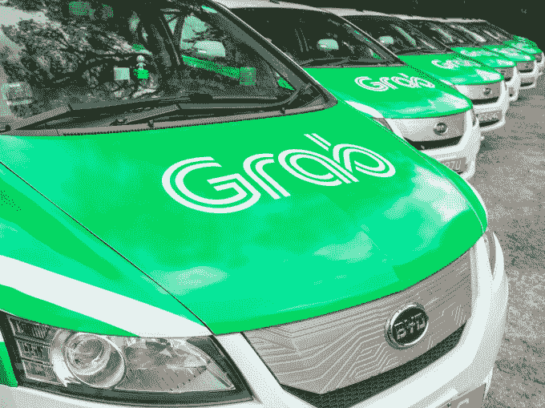

# 对优步来说，东南亚退出协议是一场胜利，而不是失败

> 原文：<https://web.archive.org/web/https://techcrunch.com/2018/03/26/southeast-asia-exit-deal-is-a-win-not-a-defeat-for-uber/>

他们在体育运动中说，最好的球队即使没有表现也能赢。从这些方面来看，优步似乎势不可挡。

今天的大新闻是，美国打车公司同意将其业务出售给当地竞争对手 Grab 后，将离开东南亚。这是事实，但声称 Grab 击败了优步可能夸大了这种情况。

通常情况下，你会把退出称为优步的损失和 Grab 的胜利，但细节决定成败。已经达成的交易对双方来说都是一个非常坚实的胜利，这不仅仅是赢家和输家之间的结盟，而是和解。

让我们考虑一下事实:

优步在一个成长中的业务中持有 27.5%的股份，最近估值为 60 亿美元。

考虑到优步今天表示，过去五年已在东南亚投资 7 亿美元，这笔价值超过 16 亿美元的股份是一笔丰厚的回报。

Grab 接管并关闭了其最大竞争对手的业务，同时引入其平台上尚未出现的任何司机和乘客，并将优步 Eats 加入其新生的送餐业务。

这对 Grab 来说是一个显著的结果，它开始只提供有牌照的出租车，并要求乘客用现金支付账单[，直到三年前](https://web.archive.org/web/20221207070947/https://techcrunch.com/2015/02/11/grabtaxi-cashless-payments/)。当优步刚来的时候，这两者差别很大，市场份额相当平均，但是现在 T4 在该地区以一定优势占据主导地位。

## 火力不足

尽管起点很低，但 Grab 在过去两年里取得了长足的进步。Grab 最初成立于马来西亚，后来搬到了新加坡。今天，它在 8 个国家提供 10 多种交通服务，包括出租车、私家车、拼车、自行车共享和自行车出租车。

你可能会读到它的本地化策略和它的重要性，当然这是令人印象深刻的。

除了送餐服务——这现在是拼车公司相当标准的扩张——它还通过其 GrabPay 服务进军金融服务，该服务允许用户线下支付商品和服务，以及[一家提供小额贷款和保险产品的新企业](https://web.archive.org/web/20221207070947/https://techcrunch.com/2018/03/13/grab-financial-services-southeast-asia/)。

Grab 专注于在拼车之外展开业务，旨在获取和吸引用户，而不仅仅是提供交通服务。理论是，这不仅使它对用户更有用，而且它引入了完全不同的(可能更有利可图的)商业机会，使公司在未来成为一个有利可图的实体。

但是——这是一个重要的警告——这种产品扩张还处于早期阶段，因此没有对 Grab 与优步的竞争产生影响。

事实上，看起来很多竞争都归结于一个常见的因素:钱。

简而言之，Grab 一直获得投资者的资金支持。

正如优步在东南亚的一名高级雇员最近向 TechCrunch 恰当地解释的那样:“他们只是不停地给他们钱！”

在过去的两年里，金钱因素似乎变得对 Grab 有利。2016 年底，它筹集了 7.5 亿美元,[随后在去年筹集了超过 25 亿美元](https://web.archive.org/web/20221207070947/https://techcrunch.com/2017/07/23/grab-raises-2b-from-didi-chuxing-and-softbank/)，从投资者那里获得了超过 40 亿美元的估值，超过 60 亿美元。

相比之下，优步在东南亚投资了 7 亿美元，你已经可以看到一个优势，当两家公司陷入持续的补贴战争时，这个优势在打车服务中尤为关键。

因此，尽管所有这些对比和精美的图表显示了优步作为一家全球企业筹集的资金总额，但它在东南亚的财务实力却很弱，可能是因为它选择了限制投资。

Grab 的钱也是战略性的。

软银和中国的“优步杀手”滴滴在最新一轮融资中提供了 20 亿美元，而丰田、现代、老虎环球、Coatue Management 和有影响力的印度尼西亚公司 Emtek 和 Lippo 等公司也在近年来加入进来。

这个网络使得 Grab 能够雇佣有经验的高管来充实其团队，其中最著名的包括明·马(Ming Maa)，一位[【交易撮合者】](https://web.archive.org/web/20221207070947/https://www.wsj.com/articles/uber-rival-grab-to-hire-deal-maker-from-softbank-1476360005)[18 个月前从软银](https://web.archive.org/web/20221207070947/https://www.grab.com/sg/press/people/grab-announces-appointment-ming-maa-president/)加盟成为公司总裁。

优步经常很快指出，它给了国家办事处建议和实施本地化政策和想法的自由，但在东南亚，它似乎缺乏整体一致性。例如，T2 在去年八月才任命了东南亚地区的负责人，这距离其首次进入已经过去了大约四年。

这象征着它在制定战略时的挣扎，直到为时已晚。这还没有提到 2017 年袭击优步公司的争议浪潮，这无疑影响了美国以外的决策..

## 双赢交易

[优步达成体面的协议，退出中国](https://web.archive.org/web/20221207070947/https://techcrunch.com/2016/08/01/ubers-deal-with-didi-is-a-win-win-for-everyone-except-the-anti-uber-alliance/)和[俄国](https://web.archive.org/web/20221207070947/https://techcrunch.com/2017/07/13/uber-yandex-combine-ridesharing-and-ubereats-in-russia-in-a-3-72b-jv/)，现在看来也是如此。

作为一家私营公司，不可能分析 Grab 的股东及其持股比例，但优步现在可能是该行业最大的投资者之一。对优步及其股东来说，这是一个理想的场景，因为东南亚预计将成为打车服务的主要增长市场，而优步现在是市场领导者。

根据谷歌最近联合撰写的一份报告，东南亚目前是 Grab 和优步的亏损地区，据说在过去两年中，打车应用的收入增加了一倍多，2017 年超过 50 亿美元。根据同一项研究，该行业预计到 2025 年将增长四倍以上，达到 200 亿美元。

[优步本可以在](https://web.archive.org/web/20221207070947/https://techcrunch.com/2018/02/22/about-grab-uber/)继续发展，增加投资，仍然取得成功，但它达成的协议允许它通过代理保持存在，同时将资源转移到全球其他市场。截至 Grab 最近一轮融资，Grab 的股份价值超过 16 亿美元，随着市场增长和 Grab 的金融科技业务取得成果，这些股份可能会随着时间的推移大幅升值。

接近这笔交易的消息人士表示，作为这笔交易的一部分，Grab 给了优步不到 1 亿美元，除了打车业务和在三个国家开展业务的 Uber Eats 之外，它还将在该地区雇佣优步大约 500 名员工。

除了运营收益，Grab 现在还可以指望优步和中国的滴滴作为投资者，优步首席执行官 Khosrowshahi 加入了董事会。那是金钱买不到的那种影响力和体验，可能对接下来的事情至关重要。

东南亚拼车的下一个阶段将是 Grab 与印尼的 Go-Jek[的竞争，后者是一家价值 50 亿美元的初创公司，由谷歌和腾讯](https://web.archive.org/web/20221207070947/https://techcrunch.com/2018/01/28/google-confirms-go-jek-investment/)等大牌公司支持。Go-Jek 在国内市场处于领先地位——它是 Grab 现在刚刚推出的金融产品和点播服务的先驱——它还雄心勃勃地从今年开始将其帝国出口到新市场。

一位接近 Go-Jek 的消息人士告诉 TechCrunch，该公司正准备在 3 月底之前在菲律宾推出产品。Go-Jek 一直非常谨慎地考虑自己的时间，但现在优步已经退出了东南亚的等式，是时候走来走去，放大战斗了。