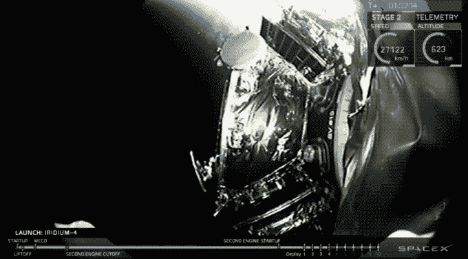

# SpaceX 以 2017 年第 18 次成功发射创纪录的一年

> 原文：<https://web.archive.org/web/https://techcrunch.com/2017/12/22/spacex-caps-a-record-year-with-18th-successful-launch-of-2017/>

# SpaceX 以 2017 年第 18 次成功发射结束了创纪录的一年

SpaceX 在 2017 年完成了第 18 次发射，标志着这家私营航天公司创纪录的一年。这是 SpaceX 在一年内发射的最多的火箭，以 10 次任务击败了之前的最好成绩。

今天的发射是为客户铱星公司进行的，为其铱星下一个通信星座将 10 颗卫星送入低地球轨道。这是 SpaceX 为该公司执行的第四次此类任务，用于此次任务的火箭是经过飞行验证的猎鹰 9 号，此前在 6 月份进行了第二次铱星任务。铱星公司也是 SpaceX 在 1 月份进行的 2017 年首次任务的客户——这是它在去年 9 月发射前发生事故后的首次飞行，事故导致它的火箭和有效载荷，一颗脸书互联网卫星。

SpaceX 从加州范登堡空军基地的发射中心发射了火箭，任务参数不包括尝试回收第一级火箭。第一级经历了一个着陆序列，就像试图回收时一样，但当它着陆时，太平洋上没有无人驾驶登陆舰抓住它。

发布会为洛杉矶和周边地区的居民带来了一些令人惊叹的视觉效果，其中许多人在 Twitter 上分享了镜头和图片:

铱星公司下一个卫星星座的目标是为实时跟踪所有正在进行的飞行提供 100%的全球覆盖，并且它还能够通过相同的技术监控穿越地球的每一艘船，使其商业客户可以获得这些信息。
T3

SpaceX 的下一个重大里程碑即将到来:该公司希望在 2018 年 1 月发射第一枚猎鹰重型火箭。这枚火箭具有巨大的载重能力，已经在佛罗里达州的卡纳维拉尔角空军基地进行发射准备——准备工作包括[装载其有效载荷，一辆原始的樱桃红特斯拉跑车](https://web.archive.org/web/20230307142252/https://techcrunch.com/2017/12/22/elon-musk-really-will-launch-a-tesla-roadster-on-the-first-falcon-heavy-rocket/)。