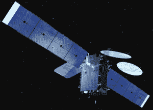

# SpaceX 继续雄心勃勃的发射计划，进行下一次任务，这是今年的第五次任务 

> 原文：<https://web.archive.org/web/https://techcrunch.com/2016/05/25/spacex-continues-ambitious-launch-schedule-with-next-mission-fifth-one-this-year/>

在他们最后一次成功任务后不到一个月， [SpaceX](https://web.archive.org/web/20221206134716/https://www.crunchbase.com/organization/space-exploration-technologies) 又回来了。猎鹰 9 号计划于美国东部时间明天下午 5:40 搭载通讯卫星 [Thaicom 8](https://web.archive.org/web/20221206134716/https://www.orbitalatk.com/space-systems/commercial-satellites/communications-satellites/docs/FS014_13_OA_3862%20Thaicom%208.pdf) 从佛罗里达州卡纳维拉尔角发射。

真正值得注意的是，明天的发射将是 SpaceX 今年的第五次发射，表明与去年相比发射频率有所增加。

2015 年，SpaceX 共进行了六次成功的猎鹰 9 号发射，发射频率约为每隔一个月发射一次。今年到目前为止，他们已经将频率提高了一倍，几乎每月一次。

今年 3 月，SpaceX 总裁格温·肖特维尔[表示](https://web.archive.org/web/20221206134716/http://spacenews.com/spacex-says-reusable-stage-could-cut-prices-by-30-plans-first-falcon-heavy-in-november)该公司实际上计划在 2016 年总共发射 18 次，这将是 2015 年发射次数的三倍。她还表示，他们计划在下一年进一步提高发射率，2017 年有望进行 24 次发射。

SpaceX 公司总裁兼首席运营官格温·肖特维尔

考虑到去年全世界只有 82 次成功的轨道发射记录，预期的增长将是显著的。这个数字比 2014 年有所下降，2014 年有 90 次成功的轨道发射，这是 20 年来最高的年度发射次数。

随着更多的猎鹰 9 号发射而来的是更多的火箭回收尝试，明天的任务也不会例外。

发射后，SpaceX 将在海上的无人驾驶船上再次尝试回收他们火箭的第一级。

SpaceX 的我当然还爱你无人机飞船/图片由 SpaceX 提供

这项任务排除了陆基回收，因为 Thaicom 8 需要插入地球静止轨道(GEO:海拔 22，000 英里以上)，这意味着这项任务将需要更高的速度和更多的燃料，而且它无法导航返回陆地。

像这样的任务正是 SpaceX 努力完善其海上着陆的原因。

发射到低地球轨道，像 SpaceX 向国际空间站(海拔约 250 英里)的商业再补给任务，不需要火箭像地球同步轨道任务那样快速移动，更有可能有足够的燃料导航返回陆地。

如果明天的回收成功，它将成为 SpaceX 的第四枚回收火箭和无人机船上的第三枚回收火箭。据埃隆·马斯克透露，至少其中一个火箭助推器将在未来几个月内获得另一次飞行机会。

当然，明天任务的真正目标是围绕 Thaicom 8，亚洲卫星运营商 [Thaicom](https://web.archive.org/web/20221206134716/http://www.thaicom.net/) 的一颗商业通信卫星。一旦进入轨道，这颗卫星将为印度、泰国和东非的部分地区提供电视和互联网服务。

Thaicom 8 卫星插图/图片由 ATK 轨道科学公司提供

SpaceX 此前在 2014 年 1 月为 Thaicom 发射了另一颗卫星，Thaicom 6 卫星，这是他们在地球同步轨道的第二次[任务](https://web.archive.org/web/20221206134716/http://www.spacex.com/news/2014/01/08/thaicom-6-mission-overview)。

明天发射的准备工作正在进行中。周二成功完成了静态点火测试，为此次任务做准备。根据佛罗里达今天的消息，在两个小时的发射窗口期间，有 90%的机会出现有利的发射条件天气。

假设发射照此进行，猎鹰 9 号的下一次任务定于 6 月 16 日，也就是短短的三周之后。

对于 SpaceX 来说，2016 年将是很有意义的一年。该公司已经做了很多工作，包括将发射次数增加两倍，首次重复使用回收的火箭助推器，以及完成猎鹰重型的首次发射(已经经历了多次[延迟](https://web.archive.org/web/20221206134716/http://spacenews.com/inmarsat-worried-about-spacex-falcon-heavy-delays-books-reservation-for-ils-proton-launch/))。

时间会证明他们是否能满足自己的这些雄心勃勃的期望。

无论结果如何，SpaceX 都计划让公众参与其中。现在，每个主要的发射都配有相对高制作价值的现场直播，由联合主持人带领观众完成任务的每一步。

按照惯例，SpaceX 将为 Thaicom 8 的发布举办一场直播。观众可以观看定于美国东部时间下午 5:40 的发射，并有可能在无人驾驶飞船上再次尝试回收火箭。