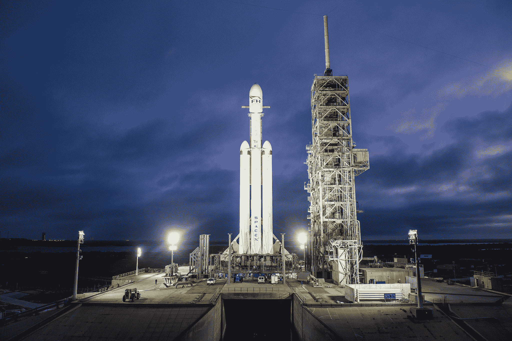

# SpaceX 可能会在几个月后发射另一枚猎鹰重型火箭(如果第一枚火箭没有炸毁发射台的话)

> 原文：<https://web.archive.org/web/https://techcrunch.com/2018/02/05/spacex-could-launch-another-falcon-heavy-in-a-few-months-if-the-first-one-doesnt-blow-up-the-launch-pad/>

# SpaceX 可能会在几个月内发射另一枚猎鹰重型火箭(如果第一枚没有炸毁发射台的话)

明天对 SpaceX 来说是重要的一天:这是该公司大型可重复使用火箭猎鹰重型号的首次飞行。

(如果一切按计划进行，这一天也是埃隆·马斯克的特斯拉跑车进入太空的日子。)

但是*会按计划进行吗？这只是一次试飞，所以没有人——甚至马斯克自己——真正确定它会如何进行。*

 *埃隆在今天下午的一次媒体电话中也说了同样的话:

> 如果它爆炸了，那将是一个巨大的打击，但希望我们已经学到了。这是一次试验任务；会出错的地方太多了。
> 
> 无论如何，我们不想设定完美的期望…如果它清理了垫子，而不是把垫子炸成碎片，我会很高兴…

如果明天发射成功，Elon 指出，他们应该能够在 3-6 个月内(后来在电话中，他说“3-4 个月”)转身准备另一次任务。

如果它摧毁了发射台，同时:

> 嗯，如果它炸毁了发射台…那将是一个真正的麻烦。这将花费我们 9-12 个月的时间让发射台恢复运行。也许 8 个月。我不知道，但这是最大的问题。不会影响生产。我们有稳定的生产线。

至于他是否认为他的跑车会幸存下来:“我希望这是我最不担心的。”

与此同时，埃隆还漫不经心地提到了更大的火箭的想法，他说他今天正在看猎鹰重型火箭，发现自己觉得“它有点小。”

“如果我们愿意，我们实际上可以再增加两个侧助推器，让**猎鹰变成超重型**。”埃隆说。“可能会获得 900 万磅以上的推力或类似的东西……这将使我们的有效载荷能力与土星五号相当，或非常接近。”*