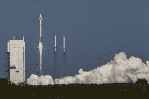

# SpaceX 获得首个国家安全合同 

> 原文：<https://web.archive.org/web/https://techcrunch.com/2016/04/28/spacex-is-awarded-its-first-national-security-contract/>

美国空军授予 SpaceX 公司一份价值 8270 万美元的合同给 T2，让他们发射 GPS-3 卫星进入轨道。这是 SpaceX 公司的第一份国家安全太空(NSS)合同，自从 ULA，唯一的另一个可行的竞争对手，[拒绝](https://web.archive.org/web/20221209165611/https://beta.techcrunch.com/2016/01/31/spacex-and-russia-change-the-rules-of-the-military-launch-market/)参与竞争以来，SpaceX 公司基本上以默认方式获胜。

> “这份 GPS III 发射服务合同在任务成功、满足操作需求、降低发射成本和重新引入国家安全太空任务竞争之间取得了平衡。”塞缪尔·格里夫斯中将，空军太空项目执行官

SpaceX 赢得了第一份竞争性采购的 NSS 合同，这证明军事发射市场的[规则已经正式改变](https://web.archive.org/web/20221209165611/https://beta.techcrunch.com/2016/01/31/spacex-and-russia-change-the-rules-of-the-military-launch-market/)。十多年来，ULA 在这些空军军事合同上享有垄断地位。然而，在过去的两年里，SpaceX、美国空军和 ULA 之间发生了很多事情，改变了这种情况。

2014 年 4 月，SpaceX [对空军提起](https://web.archive.org/web/20221209165611/https://beta.techcrunch.com/2014/04/25/spacex-files-suit-against-u-s-air-force-citing-use-of-russian-rockets-as-problematic/)诉讼，试图打破 ULA 的垄断，获得竞争国家安全相关发射的能力。

SpaceX 首席执行官埃隆·马斯克(Elon Musk)认为，ULA 对空军发射的垄断是不合理的。马斯克表示，“这份合同毫无理由地花费了美国纳税人数十亿美元，而且雪上加霜的是，使用的主要发动机是俄罗斯发动机。”

2015 年 1 月，空军同意与 SpaceX 合作，认证他们的火箭用于军事卫星发射，SpaceX 撤销了他们的诉讼。马斯克的火箭公司最终在当年晚些时候获得了空军的认证。

今天，ULA 和 SpaceX 是仅有的两家被认证竞争军事发射合同的公司。

那么，为什么 ULA 没有申办这个呢？SpaceX 具有竞争力的价格和 ULA 的火箭需要俄罗斯制造的 RD-180 发动机的事实是导致这一决定的两个主要因素。

一段时间以来，ULA 使用俄罗斯引擎发射国家安全资产一直是争论的焦点。国会甚至完全禁止购买 RD-180。

ULA 的 RD-180 动力 Atlas V 于 2014 年发射空军 GPS 资产/图片由联合发射联盟提供/ John Studwell

一些人认为这一禁令是不公平的，因为美国国家航空航天局多年来一直向俄罗斯支付数亿美元，将美国宇航员送往国际空间站。

由于采购禁令当时生效(后来被暂时解除)，ULA 拒绝竞标 GPS-3 合同，称他们无法保证 2018 年 5 月能有火箭可用。

上个月，ULA 的工程副总裁 Brett Tobey 就 ULA、他们的 RD-180 发动机以及与 SpaceX 的竞争等问题对[进行了非常坦率的采访。在其他有争议的事情中，托比暗示 ULA 没有竞标 GPS-3 合同，因为他们无法与 SpaceX 的价格竞争。](https://web.archive.org/web/20221209165611/http://qz.com/641738/this-rocket-executive-pissed-off-everyone-in-space-and-lost-his-job-the-next-day/)

> “埃隆·马斯克的到来彻底改变了游戏规则……我们不能再出价了，因为价格已经低至 6000 万美元。最好的一天，你会看到我们出价 1.25 亿美元，或者是这个数字的两倍。”布雷特·托比

托比后来被迫从公司辞职。

但是价格并不是最重要的。事实是，ULA 拥有比 SpaceX 更长更好的发射记录，就发射国家安全资产而言，这是一个非常重要的特征。

不幸的是，对 ULA 来说，他们的 RD-180 发动机将继续是一个问题，直到他们找到一个可靠的发动机来取代它。为了做到这一点，ULA [与](https://web.archive.org/web/20221209165611/http://www.ulalaunch.com/ula-and-blue-origin-partner-with-air-force.aspx)蓝色起源和 Aerojet Rocketdyne 合作，寻求美国制造发动机的两种选择。然而，可能要到 2019 年才能有一个可以发射的发动机来取代 RD-180。

本周 GPS-3 合同的卫星将于 2018 年 5 月在卡纳维拉尔角用猎鹰 9 号火箭发射。

这是美国空军九项竞争性发射服务中的第一项，因此 SpaceX 和 ULA 有更多机会正面交锋，争夺这些合同。