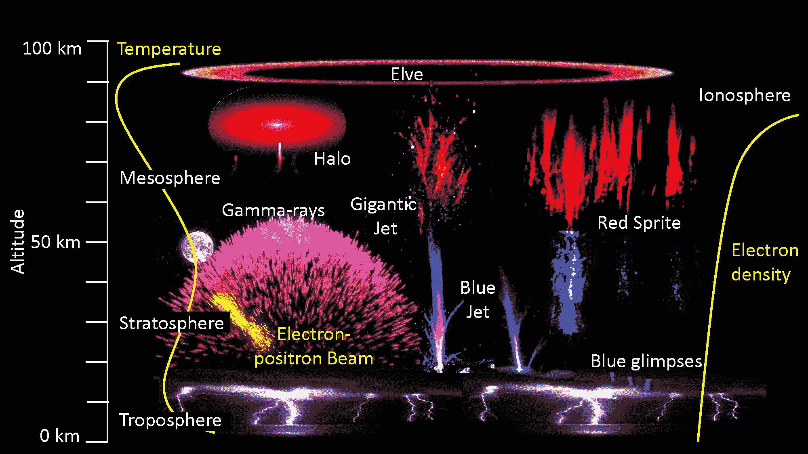

# SpaceX 的发射将为国际空间站带来科学和补给，并带着故障机器人 TechCrunch 返回

> 原文：<https://web.archive.org/web/https://techcrunch.com/2018/04/02/spacex-launch-will-bring-science-and-supplies-to-iss-and-return-with-a-glitchy-robonaut/>

# SpaceX 的发射将为国际空间站带来科学和补给，并带着一个故障机器人返回

**更新:**上线部署成功！

[SpaceX](https://web.archive.org/web/20221206222824/https://techcrunch.com/tag/spacex) 准备向国际空间站发射第 14 次[补给任务](https://web.archive.org/web/20221206222824/http://www.spacex.com/sites/spacex/files/crs-14presskit2018.pdf)，在太平洋标准时间 1:30 发射一个装满糖果的轻型龙太空舱。除了送货，这条龙还将带回一些货物:发生故障的 Robonaut 2，它显然在过去几个月的某个时候用砖砌住了自己。

这将是龙太空舱的第二次飞行，它上次访问空间站是在两年前的 CRS-8 上；它上面发射的猎鹰 9 号火箭今天也被重新用于 CRS-14。然而，这将是后者的最后一次飞行:它不会被回收。

你可以在这里现场观看发布会:

[https://web.archive.org/web/20221206222824if_/https://www.youtube.com/embed/BPQHG-LevZM?feature=oembed](https://web.archive.org/web/20221206222824if_/https://www.youtube.com/embed/BPQHG-LevZM?feature=oembed)

视频

里面是通常的食物和其他必需品，还有一些有趣的实验。大气-空间相互作用监测器将观察雷暴中有趣的电现象，如精灵、巨大的喷射流和蓝色闪光。是的，那些是真实的电现象。

“埃尔韦”

太空制造将随着一台为微重力制造的[全新惠普 3D 打印机](https://web.archive.org/web/20221206222824/https://techcrunch.com/2018/04/02/the-international-space-station-is-getting-a-new-printer/)而得到更新，同时也是一项基于烧结的增材制造实验。

微重力的挑战也延伸到了生物学领域，一项代谢跟踪项目将研究它如何影响各种药物。另一项实验着眼于向习惯了重力帮助的植物输送养分的方式。

“龙”号太空舱将在国际空间站上停留大约一个月，装卸各种物品，包括状况不佳的机器人 2 号。这个实验机器人平台[已经在那里](https://web.archive.org/web/20221206222824/https://techcrunch.com/2010/02/04/robonauts-are-go/)好几年了，但是最近出现了某种故障——可能是电路短路，美国宇航局的科学家在周日的新闻发布会上推测。

太空团队似乎没有工具或时间来解决这个问题，所以 Robonaut 2 正在回家，由其地面维护人员进行修复。它应该会在一年左右飞回来；与此同时，车站的居民将享受一点额外的空间。