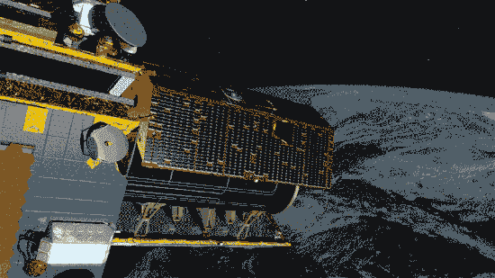

# SpaceX 火箭将在 305 英里处停留，部署美国宇航局的卫星，然后继续前进 

> 原文：<https://web.archive.org/web/https://techcrunch.com/2018/05/21/spacex-rocket-will-make-a-pit-stop-305-miles-up-to-deploy-nasa-satellites-before-moving-on/>

周二是 SpaceX 猎鹰 9 号携带两个有效载荷进入轨道的计划发射——这次发射将是特别有趣的一次。铱星公司的一组五颗通信卫星需要到达近 500 英里的高空，但美国宇航局的一项任务必须在 300 英里的标记处弹出。怎么办？事实证明，只要停一下。

当然，这不是字面上的停止——这东西将会以每小时数千英里的速度前进。但从火箭本身的参照系来看，这与再次踩油门前停车让朋友下车，然后继续驶向下一个目的地没有太大区别。

将会发生的是:火箭的第一级将带它离开大气层，然后分离，并有希望安全着陆。然后，第二级将点火，将有效载荷送入轨道。通常在这一点上，它会燃烧，直到它达到所需的高度和姿态，然后展开有效载荷。但是在这种情况下，它还有更多的工作要做。

当火箭到达 305 英里的高空时，它将向下倾斜 30 度，并稍微滚动一下，将美国宇航局的两颗 GRACE-FO 卫星放置到位。一个指向地球，另一个指向太空。一旦就位，分离系统将以大约每秒一英尺的速度将两只鸟送出，每个方向一只。

地球一侧的卫星将被送入比太空一侧略慢、略低的轨道，在它们展开到 137 英里的距离后，较低的卫星将自我提升并与另一颗同步。

这将需要几天时间，但就在它将格雷斯-福斯送上轨道 45 分钟后，猎鹰 9 号将继续它的旅程，重新点燃第二级发动机，并将铱星 NEXT 卫星带到大约 485 英里的高空。在那里，发动机将再次关闭，其余的有效载荷将被运送。

那么这些高维护的卫星有哪些是必须要有自己特殊部署的呢？

铱星 NEXT 卫星是这家天基通信公司委托进行的一系列部署中的最新一颗；他们是计划中的 75 个中的 5 个，将取代旧的星座并提供全球覆盖。三月下旬号[的最后一次发射顺利进行。这是唯一一次只有五只鸟部署的发射；之前和即将进行的发射都各有 10 颗卫星。](https://web.archive.org/web/20221207072449/https://techcrunch.com/2018/03/30/spacex-successfully-launches-iridium-5-falcon-9-mission/)

GRACE-FO 是 GRACE 重力恢复和气候实验的“后续”任务(因此称为 FO ),是与德国地球科学研究中心的合作项目。GRACE 于 2002 年发射升空，15 年来它一直在监测地球表面(和地下)淡水的存在和变化。这对气候科学家和其他人来说非常有益，后续工作将在最初停止的地方继续进行。

最初的任务是通过检测两颗卫星在经过各种特征时的微小差异来实现的——这些微小的变化表明了它们下面的质量是如何分布的，可以用来测量水的存在。GRACE-FO [增加了一个激光测距系统](https://web.archive.org/web/20221207072449/https://gracefo.jpl.nasa.gov/news/128/lasers-in-space-grace-fo-tests-new-technology/)，可以将这个过程的精度提高一个数量级。

有趣的是，将进行这一复杂机动的实际火箭与 1 月份发射命运多舛的祖玛卫星的火箭是同一枚火箭。在与第二级分离后，该有效载荷显然未能正确部署，尽管因为这是一项机密任务，没有人公开说明到底是哪里出了问题——除了证实 SpaceX [不是罪魁祸首](https://web.archive.org/web/20221207072449/https://techcrunch.com/2018/01/09/spacex-says-its-rocket-performed-exactly-as-intended-in-zuma-launch/)。

发射将于太平洋时间明天下午 12:47 在范登堡空军基地进行。如果流产了，周三还有一次机会。敬请关注这一独特发布会的直播链接！