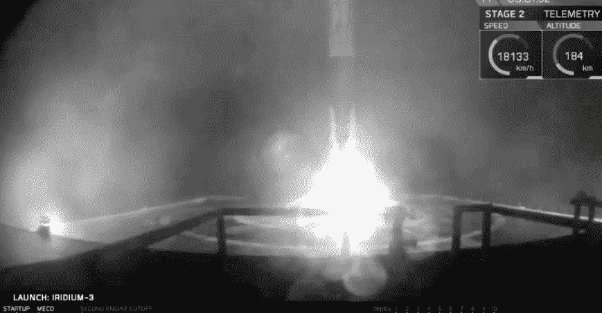

# SpaceX 在 2017 年发射第 14 枚火箭，回收第一级

> 原文：<https://web.archive.org/web/https://techcrunch.com/2017/10/09/spacex-successfully-launches-14th-falcon-9-rocket-in-2017/>

# SpaceX 于 2017 年成功发射第 14 枚猎鹰 9 号火箭

今天早上，SpaceX 从加利福尼亚州范登堡空军基地发射了 2017 年第 14 枚猎鹰 9 号火箭。该火箭携带 10 颗铱星进入轨道，这是 SpaceX 进行的第三次铱星任务，计划完成更多通信提供商的铱星 NEXT 卫星网络。

SpaceX 还回收了它用于这项任务的猎鹰 9 号火箭的第一级助推器，将用过的火箭返回到它在太平洋上的“只需阅读指令”浮动无人机船。

这项任务还包括主要目标:部署其客户的卫星。就在最初发射后一个多小时，SpaceX 公司证实，它已经成功地将每颗铱星 NEXT 卫星按计划部署到它们期望的目标轨道。

SpaceX 还将试图在 10 月 11 日发射另一枚猎鹰 9 号。这次发射是为了 EchoStar 和 SES 的联合高功率通信卫星，将在佛罗里达州的肯尼迪航天中心进行，使用 SpaceX 之前已经飞行过的猎鹰 9 号第一级，并为第二次使用进行了翻新。