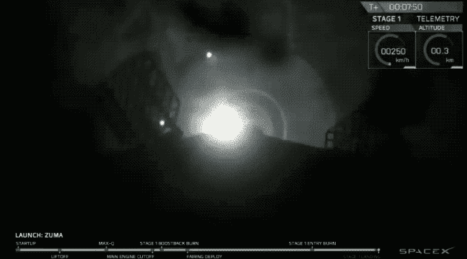

# SpaceX 成功发射绝密 Zuma 飞船 

> 原文：<https://web.archive.org/web/https://techcrunch.com/2018/01/07/spacex-successfully-launches-top-secret-zuma-spacecraft/>

# SpaceX 成功发射绝密的祖玛飞船

SpaceX 成功发射了 2018 年的第一次任务，去年在 2017 年共发射了 18 次，创下了纪录。今年的首次发射携带了一个特殊的有效载荷——Zuma，这是一个秘密的航天器，由美国政府委托执行一项未公开的任务。

SpaceX 从佛罗里达州卡纳维拉尔角的 SLC-40 发射设施发射了祖马，该发射设施被用来代替其在卡纳维拉尔角的另一个发射设施，因为该设施被用于为 SpaceX 的猎鹰重型火箭的发射做准备。

根据任务参数，有效载荷将被送到近地轨道，但我们不知道它的目的、设计或预期任务的任何其他信息，因为这都是机密。SpaceX 还为美国运输过其他敏感货物，包括空军的 X-37B 太空飞机。

这次发射还包括回收猎鹰 9 号使用的第一级助推器，猎鹰 9 号返回卡纳维拉尔角，在部署并与第二级分离后降落在 LZ-1 着陆台上。

SpaceX 现在可以期待今年的下一次重大测试了——首次发射其巨大的重型火箭。