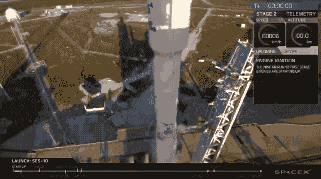

# SpaceX 首次成功重新发射轨道猎鹰 9 号火箭 

> 原文：<https://web.archive.org/web/https://techcrunch.com/2017/03/30/spacex-successfully-re-launches-an-orbital-falcon-9-rocket-for-the-first-time/>

# SpaceX 首次成功重新发射轨道猎鹰 9 号火箭

SpaceX 有史以来第一次成功地重新发射了一枚猎鹰 9 号火箭，这是有史以来第一次由任何人重新发射整个轨道级火箭。这项成就是 SpaceX 长期商业计划的一个关键组成部分，该计划旨在让企业和政府客户更负担得起和更容易获得火箭发射，从根本上改变航天经济，为更雄心勃勃的项目铺平道路，包括最终的火星之旅。

这枚火箭于去年首次使用，当时它是第一枚成功降落在 SpaceX 的一艘海上自主无人机船上的猎鹰 9 号火箭。这发生在 4 月份，在 CRS-8 任务期间，这是一项为国际空间站提供补给的任务。此后，它经历了一系列测试，以确保它准备好再次成功飞行。

“我们不是单程去火星旅行的人，我们想确保人们可以回来，”SpaceX 总裁格温·肖特维尔在发射前的采访中解释道。"这意味着你需要一个可重复使用的火箭系统."她补充说，最终，目标是在同一天着陆和重新发射——这里使用的猎鹰 9 号火箭花了大约四个月的时间重新调整用途，她补充说。

SpaceX 表示，完全可重复使用的火箭和可以快速重复使用的火箭是真正打开商业航天市场大门的关键。

SES-10 任务见证了这一破纪录的成就，它是为企业客户 SES 发射的一颗通信卫星。这是 SpaceX 为 SES 完成的第三次发射，也是 SES 将送入轨道的第 11 颗卫星。该卫星是一颗地球静止轨道卫星，这意味着一旦它被火箭运送到最终部署位置，它将保持在一个固定的位置绕地球运行。

SES-10 卫星在美国东部时间下午 6:59 成功部署，这意味着整个任务在各方面都是成功的，包括涉及付费客户的部分。哦，还有创造历史的部分。