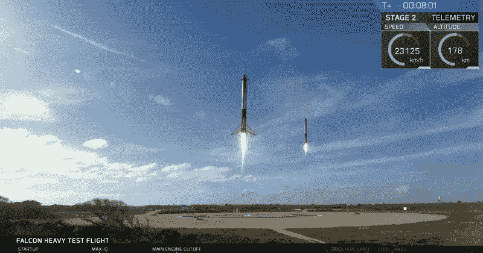

# SpaceX 历史性的猎鹰重型火箭成功发射

> 原文：<https://web.archive.org/web/https://techcrunch.com/2018/02/06/spacexs-historic-falcon-heavy-successfully-launches/>

SpaceX 公司对其猎鹰重型火箭进行了非常好的首次测试，这是一种重型轨道飞行器，在活跃的运行中，可以携带两倍于其最接近的竞争对手的重量。美国东部时间周二下午 1 点 30 分，这枚巨大的三级助推器火箭按计划从佛罗里达州卡纳维拉尔角起飞，从肯尼迪航天中心的 LC-39A 发射升空。

这对 SpaceX 来说是一个历史性的时刻，因为它自 2011 年以来一直致力于建造和发射大容量火箭。最初，计划的时间表将 2013 年作为发射窗口，但各种延迟和挫折推迟了它的首次飞行——直到今天。马斯克此前曾形容 SpaceX 早期关于建造这种火箭有多困难的观点是“天真的”，这在一定程度上解释了这一早期时间表的严重偏离。

该火箭有 27 个梅林发动机(多达 3 个猎鹰 9 号)，低地球轨道有效载荷能力高达 140，700 磅，或者它可以携带 58，900 磅到地球静止转移轨道(GTO)，或 37，000 磅到火星。这些数字都很重要，因为 SpaceX 正计划将 Falcon Heavy 作为其火星计划的关键，为一个可以在地球和红色星球之间运送货物和人员的系统奠定基础。

SpaceX 此次任务的有效载荷包括一辆前往地球-火星轨道的红色跑车，车上有一个假人穿着 SpaceX 首次宇航员任务的新机组服，以及一个装载了艾萨克·阿西莫夫经典太空三部曲的数据存储设备。还有一块刻有所有 SpaceX 员工姓名的牌匾，这样他们就可以跟随有效载荷的十亿多年旅程。

用于这项任务的肯尼迪发射中心是 SpaceX 从美国宇航局租赁的，与其最新的居民一样具有历史意义——它以前用于阿波罗计划和航天飞机，后来被 SpaceX 接管并重新配置为猎鹰重型。

SpaceX 还试图回收它在发射期间使用的所有三个第一级助推器。到目前为止，它已经恢复了其中的两个，我们正在等待 SpaceX 关于最后一个，第三个助推器的官方状态的反馈，它正在海上着陆。

那现在怎么办？从这里，火箭的有效载荷(阅读:前面提到的特斯拉，下图为鼻锥分离)将穿过[范艾伦带](https://web.archive.org/web/20230330032755/https://en.wikipedia.org/wiki/Van_Allen_radiation_belt)——一个围绕地球的带电粒子和极端辐射区。假设它通过了那次放射性撞击，它将前往地球和火星之间的日心轨道，从那里开始，它将在接下来的几亿年里飞速穿越太空。

*注意仪表板上的“不要惊慌”，这是对道格拉斯·亚当斯的《银河系漫游指南》的肯定。[据伊隆](https://web.archive.org/web/20230330032755/https://twitter.com/elonmusk/status/939005893634506752)称，手套箱里还有一条[毛巾。](https://web.archive.org/web/20230330032755/http://hitchhikers.wikia.com/wiki/Towel)*

