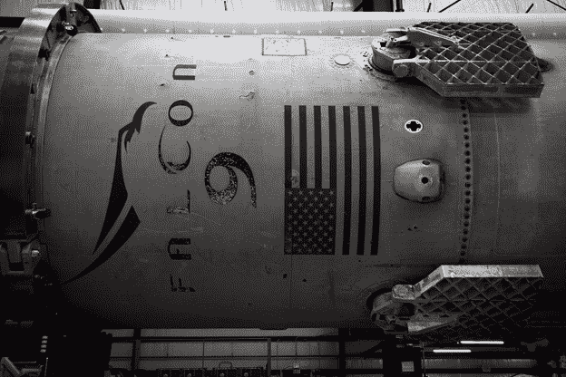

# SpaceX 迈向火箭可重复使用的下一步

> 原文：<https://web.archive.org/web/https://techcrunch.com/2016/01/06/spacexs-next-steps-toward-rocket-reusability/>

上周末，SpaceX 透露，他们回收的猎鹰 9 号没有发现任何损坏，并准备再次发射。

SpaceX 首席执行官埃隆·马斯克在卡纳维拉尔角的一个机库分享了火箭的一些首批照片。回收的猎鹰 9 号于 12 月 21 日发射到太空，并安全返回地面。许多人认为这一成就改变了火箭工业的游戏规则。

马斯克在推特上说，回收的火箭已经准备好再次发射。然而，它不太可能被用于另一次发射。相反，它将简单地用于静态防火测试。在成功着陆后的新闻发布会上，马斯克说:“我想我们可能会让这架飞机留在地面上，只是……它有点独特，这是我们带回的第一架飞机。”

对许多人来说，这枚回收的火箭是国宝，属于博物馆。对于 SpaceX 来说，这是他们在一次任务后成功带回的第一枚火箭。他们可能想彻底测试一下，以确切了解火箭发射和回收后会发生什么。这些测试可以检验火箭的性能，用它来进行下一次发射可能太危险了。如果第一枚回收的火箭在第二次飞行中失败，这将是火箭可重复使用道路上的一个巨大挫折。

静态点火测试意味着火箭将在发动机点火和分析时被压在地面上。SpaceX 将利用这项测试来验证回收的火箭在他们想用它进行第二次飞行的情况下是否能够工作。马斯克表示，在接下来的一年里，他们计划进行十几次飞行，他们“可能”会在同一时间内尝试重新飞行他们回收的助推器之一。因此，我们可能还需要一段时间才能看到回收的火箭用于第二次飞行。

对重复使用火箭保持耐心的原因是显而易见的。将一个价值数百万美元的有效载荷放在一个崭新的火箭顶部是非常危险的。未来的 SpaceX 客户在押注其有效载荷之前，会希望有不可否认的证据证明他们的太空之旅处于完美状态。返回的火箭的图像可能足以让未来的客户紧张。发射是一次紧张的经历，回收火箭的图像显示，它的大部分被烟尘覆盖。

回收的猎鹰 9 号第一级特写/致谢 [SpaceX](//web.archive.org/web/20221006160907/https://www.spacex.com/)

我们可以将这张图片与火箭发射前的照片进行比较。

发射后火箭上的深色部分是因为发射时积累的烟灰。底部干净的三角形白色空间是由发射时折叠起来的支腿创造的。

一些人提出理论认为，中间周围的清洁空间可能是因为那里有液氧(LOX)罐。液氧将保持火箭的那个部分非常冷，防止热灰烧焦或粘在那个区域。

SpaceX 并不是唯一一家致力于火箭可重复使用性的公司。去年 11 月，杰夫·贝索斯的公司蓝色起源(Blue Origin)也将他们的火箭 New Shepard 发射到太空后，以技术难度较低的着陆方式带回了地面。今年 4 月，联合发射联盟宣布了他们自己的可重复使用火箭“火神”的早期计划。

可重复使用的火箭有望将发射成本降低一半以上。马斯克表示，猎鹰 9 号的制造成本约为 6000 万美元，而燃料本身仅为 20 万美元。但是通往火箭可重复使用的道路将是漫长的，在它变得更便宜之前，它将变得更贵。火箭安全着陆只是第一步。SpaceX 将需要进行进一步的测试，以证明回收的火箭始终是可靠的。

发射后安全回收火箭(而不是把它扔进海里)有明显的成本效益。但要实现任何类型的节约，客户都需要购买回收的 SpaceX Falcon 9 的发射。在火箭进入太空后将其安全返回地球本身就令人印象深刻，但确保公司愿意将他们的产品放在重复使用的火箭上将是解锁可重复使用好处的必要关键。