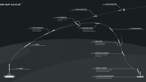

# SpaceX 的 SES-9 发射以及他们为何在海上发射火箭 

> 原文：<https://web.archive.org/web/https://techcrunch.com/2016/02/22/spacexs-ses-9-launch-and-why-they-land-rockets-at-sea/>

本周三美国东部时间下午 6 点 46 分，SpaceX 公司计划用他们的猎鹰 9 号运载火箭从佛罗里达州卡纳维拉尔角发射 SES-9 通信卫星。这项任务将标志着该公司今年的第二次发射。

周三的任务将与 SpaceX 的自主无人驾驶飞船“我当然仍然爱你”的第一阶段着陆尝试相结合这艘漂浮的驳船和它的姐妹船“只需阅读指令”一样，是以伊恩·M·班克斯晚期科幻小说中的一艘星舰命名的。

海基火箭着陆被认为比陆基着陆更困难。这是一个较小的目标区域，由于海洋的运动，无人驾驶船本身也在不断移动。一旦 SpaceX [在 12 月成功地将猎鹰 9 号第一级降落在卡纳维拉尔角的土地上，人们就有理由质疑为什么未来的所有发射都不尝试在稳定的地面上进行。](https://web.archive.org/web/20221005155914/https://beta.techcrunch.com/2015/12/21/spacex-successfully-lands-a-giant-falcon-9-rocket-for-the-first-time/)

*猎鹰 9 号第一阶段着陆 SpaceX 公司提供*

围绕 SpaceX 为什么会选择无人机飞船着陆而不是更稳定的着陆垫，有很多讨论。NBC 新闻[称](https://web.archive.org/web/20221005155914/http://www.nbcnews.com/tech/innovation/spacex-plans-drone-ship-rocket-landing-jan-17-launch-n492471)无人驾驶飞船提供了“发射时间和方式的更大灵活性”

然而，在 twitter 上，Elon Musk 表示，主要原因与将有效载荷送入轨道所需的速度有关。

这似乎是一个语义问题，但马斯克说，原因的根源是火箭需要多快才能完成任务。

对于轨道发射，有效载荷需要弧形轨迹和足够高的速度来完成绕地球的轨道。为了将第一级带回发射台，需要额外的横向机动。这是所有软式火箭着陆所需的减速机动之外的。

根据火箭的速度和有效载荷的质量，可能没有足够的燃料返回发射台。让无人驾驶飞船远离陆地，靠近火箭的轨道，可以减少着陆所需的燃料。对于某些任务，这可能是火箭回收的唯一选择。

*SpaceX 火箭着陆简介/图片由 SpaceX 提供*

当然，有时也有其他因素影响这个决定。SpaceX 发射美国宇航局的 Jason-3 卫星包括一艘无人机飞船着陆，不是因为燃料问题，而是因为该公司没有获得必要的批准将火箭带回陆地。

周三发射的有效载荷 SES-9 通信卫星需要到达地球静止轨道。地球静止轨道上的卫星(高于地球 35，786 公里)比低地球轨道上的卫星(160 公里到 2，000 公里之间)高得多，因此需要火箭提供更多的动力和燃料才能到达那里。

考虑到这一点，SpaceX 选择将他们的火箭降落在无人机上来完成这一特殊任务就不足为奇了。

周一完成了一项持续完整时间的静态点火测试，这使得 SpaceX 公司按计划于周三发射。

最近，SpaceX 在他们的发射直播上投入了大量精力。报道包括解释整个发射过程中发生的事情的共同主持人和其他采访，以提供关于这次任务的更详细的背景信息。对于周三的发射，SpaceX 将在 YouTube 上发布他们的直播。