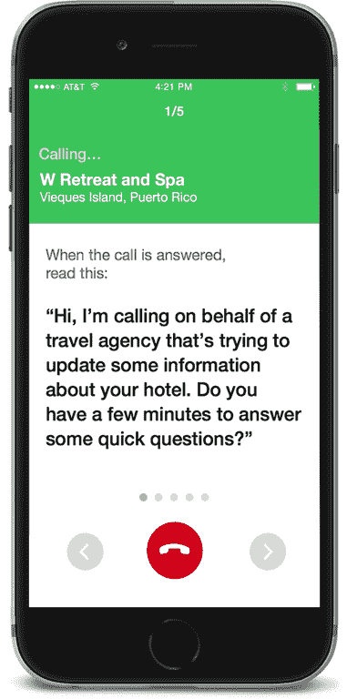

# Spare5 为其移动机械土耳其服务 TechCrunch 轮融资 1000 万美元

> 原文：<https://web.archive.org/web/https://techcrunch.com/2015/08/25/spare5-raises-10m-series-a-round-for-its-mobile-mechanical-turk-service/>

Spare5  让企业将标记和描述图像、清理数据和内容分类等琐碎工作外包给智能手机用户，这些用户想在站在公交车站时赚几分钱。它基本上是亚马逊的机械土耳其人的以移动为中心的版本，由于由 [Foundry Group](https://web.archive.org/web/20221003213818/http://foundrygroup.com/) 、 [Madrona Venture Group](https://web.archive.org/web/20221003213818/http://www.madrona.com/) 和[New Enterprise Associates](https://web.archive.org/web/20221003213818/http://www.nea.com/)(NEA)牵头的首轮融资，它现在又有 1000 万美元的银行存款。

该公司表示，它将利用新的资金来发展其“工程、设计、营销、社区管理和客户关系能力”

Spare5 说，美国人每天花几个小时在手机上，所以他们应该有一些时间来“解决计算机无法独自解决的棘手数据问题。”

Spare5 首席执行官兼联合创始人马特·本克(Matt Bencke)表示:“总会有企业仅靠计算能力无法解决的数据挑战。“我们正在利用技术来扩展人类思维的独特能力。对于我们的客户来说，这是一种快速且经济高效的方式，可以实现其他方式无法实现的结果。无论你是在网上销售，发布丰富的内容，还是训练机器学习引擎，你都需要知道人们在想什么。我们以改变游戏规则的质量和价值来传递这些知识。”

该公司不愿告诉我人们通过其服务赚了多少钱(但这可能远远低于我们许多评论者的家庭成员每月从谷歌获得的 8354 美元，尽管他们每天只工作几个小时)。

一位公司发言人告诉我们:“ Spare5 不是一份工作，也不渴望它成为一份工作。”。“根据任务的复杂程度、质量和生产率，人们的收入差异很大。我们不愿意从小时工资的角度来考虑，但社区里的人已经赚了几百美元。把 Spare5 更多地看作是一个市场和小吃大小的任务平台，而不是一份工作，甚至是工作补充，这可能会有所帮助。”

在亚马逊的土耳其机器人上，大约 50%的员工在美国，40%在印度。Spare5 告诉我，大约 90%的用户在美国，男女比例相当。大多数用户都在 30 岁以下。

Spare5 告诉我，它要求新用户填写一份入职调查，并通过脸书进行连接，以确保质量控制。然后根据用户的技能和爱好分配任务。

当我问 Spare5 如何处理质量控制时，该公司表示:“我们使用我们专有的质量算法(其中包括学者们公布的许多最佳实践)来确定最佳答案，汇总这些答案，并将其提供给我们的企业客户。”。

Spare5 能否说服足够多的用户花时间标记照片，而不是玩愤怒的小鸟，还有待观察。除非它向用户支付足够的费用，否则大多数人可能只是尝试一下，然后很快又会继续玩《精武门》。