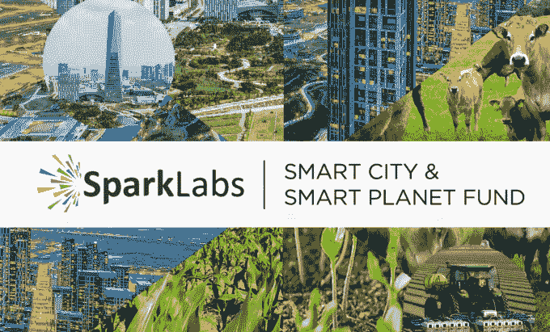

# 风险投资公司 SparkLabs 推出安全令牌，让任何人都可以投资其加速器项目 

> 原文：<https://web.archive.org/web/https://techcrunch.com/2018/05/11/sparklabs-security-token/>

狂热的加密爱好者认为 ico 和加密货币将取代风险投资，但如果风险投资者将加密纳入他们现有的运营中会怎样？

这是一家美韩公司 [SparkLabs](https://web.archive.org/web/20230217015848/http://www.sparklabsglobal.com/) 的论点，该公司经营着多个全球基金和早期加速器项目，今天推出了安全令牌 T2，对这一论点进行了检验。该公司表示，其目标是通过本质上允许任何人通过令牌购买他们的两个加速器计划来“民主化”投资机会，这将本质上让他们成为类似 LP 的投资者。

SparkLabs 的团队过去的成功包括 Siri ( [卖给了苹果](https://web.archive.org/web/20230217015848/https://techcrunch.com/2010/04/28/apple-siri-200-million/))和 DeepMind ( [卖给了谷歌](https://web.archive.org/web/20230217015848/https://techcrunch.com/2014/01/26/google-deepmind/))，它声称有来自 60 多个国家的 160 多家初创公司的投资组合。该公司的加速器项目已经让 80 多家公司毕业，其中 80%的公司表示已经筹集了平均 350 万美元的资金。

[实验](https://web.archive.org/web/20230217015848/https://sparklabs.tokenhub.com/)涵盖了 SparkLab 的两个新加速器项目:[一个在韩国智能城市松岛开展的为期六个月的以 IOT 为重点的项目](https://web.archive.org/web/20230217015848/http://www.sparklabsiot.com/en/index.php)和 [Cultiv8](https://web.archive.org/web/20230217015848/http://www.sparklabsiot.com/en/index.php) ，一个澳大利亚农业和食品技术加速器。

该公司已经为这两个项目筹集了资金——cultiv 8 560 万美元，IOT 项目 50 万美元——但它的目标是通过代币筹集至少 600 万美元。这是最低销售额，而硬性上限是 3000 万美元。

SparkLabs 正在与两个加密平台合作，在 KYC、运营和挖掘受众方面处理代币销售。它们是 [Argon Group](https://web.archive.org/web/20230217015848/https://argongroup.com/) 和 [Swarm](https://web.archive.org/web/20230217015848/https://swarm.fund/) ，前者拥有一个秘密投资者社区，后者是一个将散户投资者与私募股权和风险投资基金中的秘密机会联系起来的平台。

在美国，ico 和代币的地位岌岌可危，SEC 正在对通过 ico 融资的公司和支持它们的投资者进行调查。出于谨慎，SparkLabs 主要面向非美国投资者，但它表示，该令牌对美国的合格投资者开放..

与传统的有限合伙人不同，他们等待基金的生命周期，除非他们可以偷偷进行二次股票销售，否则不会看到财务回报，SparkLabs 计划未来通过在证券交易所上市来引入流动性。这样它就可以交易了。但该公司不建议美国投资者进行交易，因为这几乎肯定会违反法律。

尽管存在法律灰色地带，该公司仍热衷于试验代币，自 2014 年以来通过传统股权投资支持了许多基于加密的公司，并且[还推出了其 SparkChain 基金](https://web.archive.org/web/20230217015848/http://www.sparkchaincapital.com/)。

SparkLabs 联合创始人兼合伙人吉米·金(Jimmy Kim)在接受 TechCrunch 采访时表示:“我们认为 ICO 市场将会存在，这是一个融资渠道，我们认为这将是 B 轮和 C 轮融资的补充。”“作为一家基金公司，我们相信这个领域，我们认为不妨尝试一下。”

今年早些时候，一些 500 家初创公司最近联合起来[提供他们自己的安全令牌](https://web.archive.org/web/20230217015848/https://medium.com/crypto-oracle/security-tokens-are-a-thing-22x-fund-is-tokenizing-a-venture-capital-portfolio-cca05cc486e5)，但 SparkLabs 可能是第一家正式采用该策略的老牌公司。Kim 说，已经看到加密对冲基金和寻求分散加密资产的个人的强烈兴趣，但这一理论还没有经过测试，所以看看它如何被更广泛的市场接受将是有趣的。

当然，这可能是许多事件中的第一个。

“我们正在向我们通常不会接触的投资者敞开大门，”金解释道。“如果效果不错，我们显然会在未来用其他基金来做这件事。”

*注:作者拥有少量加密货币。足以获得一种理解，不足以改变一种生活。*