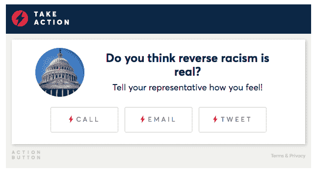

# Speakable 的“联系你的代表”按钮让用户可以直接从新闻文章中表明立场 

> 原文：<https://web.archive.org/web/https://techcrunch.com/2017/09/07/speakables-contact-your-rep-button-lets-users-take-a-stand-directly-from-a-news-article/>

# Speakable 的“联系你的代表”按钮可以让用户直接从新闻文章中表明立场

随着我们深入特朗普总统任期和这些动荡的政治时代，人们比以往任何时候都更关注新闻。但是，许多人离开他们的新闻狂欢感到无助，没有太多他们可以做的来解决他们在这个世界上看到的许多问题。

但 Speakable 是一个让新闻读者就他们最关心的问题采取行动的平台，它正在向该平台引入一个名为“联系你的代表”的新工具。

“联系你的代表”是一个插件，位于出版商的网站上，可以通过几行代码添加。该按钮根据位置自动识别谁可能是你的国会代表(如果你在旅行，也可以手动输入)，并提供给该代表打电话、发推特或发电子邮件的选项。

Speakable 创始人乔丹·休森(Jordan Hewson)说:“我们看到的是，人们真的在关注政治内容。“它被高度消费、高度分享，而且非常吸引人。所以我们想为读者提供一种不可知的赋权工具，无论他们是左派还是右派。”

[gallery size = " TC-article-featured-image-wide " ids = " 1537211，1537212"]

Speakable 于 2016 年 10 月首次亮相，推出了动作按钮。像联系你的代表一样，行动按钮存在于出版商网站上，并使用机器学习将文章的主题与可以提供帮助的非政府组织配对。行动按钮让用户无需离开文章页面就可以对他们关心的问题采取行动(捐款)。

Speakable 表示,“行动按钮”存在于 7 个出版商网站上，有近 100 个非政府组织合作伙伴。该公司还表示，点击行动按钮采取行动的人的完成率为 71%。