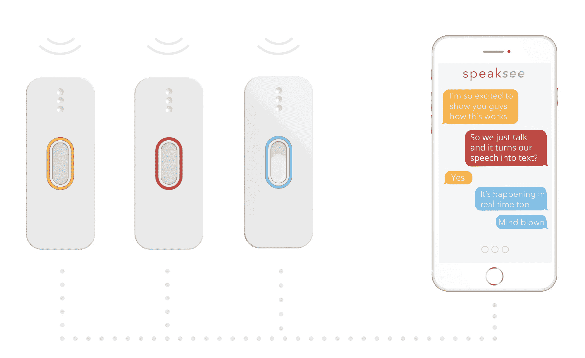
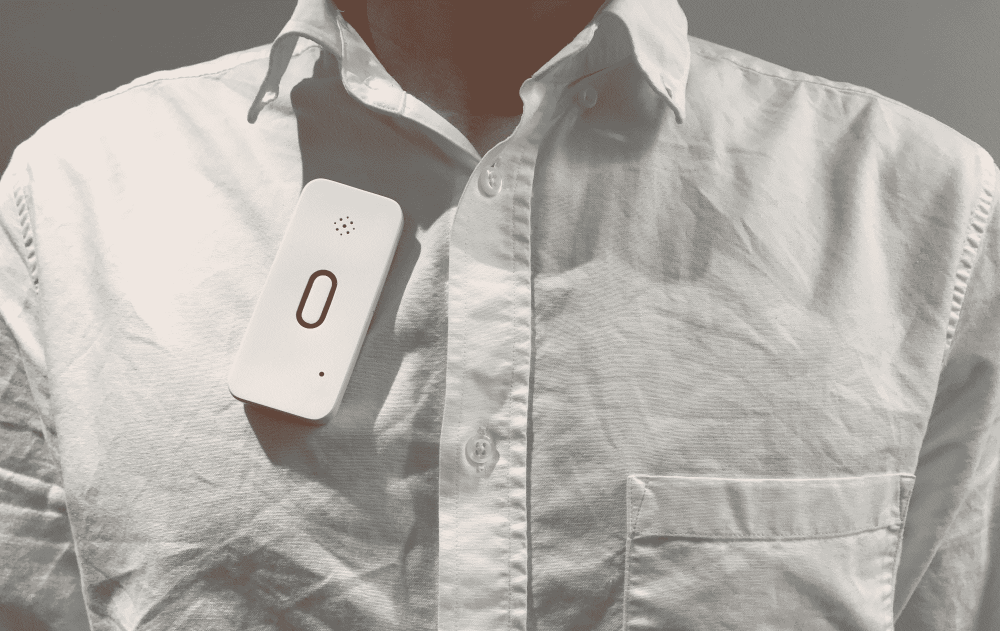

# SpeakSee 让聋人加入群组对话变得简单 

> 原文：<https://web.archive.org/web/https://techcrunch.com/2018/06/18/speaksee-makes-it-simple-for-a-deaf-person-to-join-a-group-conversation/>

在语音识别和“物联网”领域有很多活动，但这两者的一个自然应用相对来说还没有出现:帮助聋人和重听人参与日常对话。 [SpeakSee 的目标是通过一个巧妙的硬件设计来做到这一点](https://web.archive.org/web/20221208100108/https://www.speak-see.com/)(当然是在[众筹](https://web.archive.org/web/20221208100108/https://www.indiegogo.com/projects/speaksee-be-part-of-the-conversation-apps-bluetooth)之后)，将设置摩擦降至最低，让每个人都能自然地交流。

这是为了在重听人需要与少数人交谈的情况下使用——开会、吃饭时聊天、问路等等。有语音到文本的应用程序可以转录某人正在说的话，但它们并不真正适合这个目的。

“许多聋人在要求人们下载应用程序并将手机放在嘴边时遇到了巨大的障碍。SpeakSee 首席执行官兼联合创始人 Jari Hazelebach 解释说:“界面的这些限制意味着没有人会一直使用它。“但因为我们设计了自己的硬件，我们能够根据它的使用情况对它进行定制。”

SpeakSee 使用起来很简单:一组夹式麦克风放在一个小充电器盒中，当用户想要进行对话时，他们将这些麦克风交给将要说话的人。该保护套充当麦克风的无线集线器，并将音频传输到与之配对的智能手机。这些音频被发送出去，在云中的某个地方快速转录，然后显示在失聪用户的手机上。

重要的是，每个话筒还能智能地、局部地考虑扬声器和背景噪音。

Hazelebach 说:“麦克风自然可以接收多人的讲话。“所以我们安装了传感器，告诉麦克风声音来自哪个方向，然后麦克风交换这些值。因此我们可以确定哪个麦克风应该拾取哪个人的语音。”

结果是快速转录的语音按说话者划分，快速交付，并具有相当的准确性(在周转时间和过程之间总是有一个权衡)。除了戴着麦克风，其他人什么都不用做。(他们正在申请这个多麦克风系统的专利。)

Hazelebach 的父母是聋子，他在成长过程中看到他们在普通情况下的互动能力是如何受到限制的。

麦克风并不小…但这就是你如何知道他们是真正的工作硬件，而不是想象的。

“你可以想象，我的父母是第一个验证这一点的人，”他说。“起初我们有很多问题，但很快我们开始与他人合作。我们在一个聋人博客上写了一个帖子，不知从哪里冒出来 200 人注册了。因此，我们一直在美国、英国和荷兰的团队中进行实地测试。”

目前，英语语音识别远远领先于荷兰语和其他语言，因此前者的转录会更好，但即使如此，这些设备也应该可以与云服务支持的 120 种语言中的任何一种语言兼容。每月 5 小时的音频转录是免费的，之后是每月 10 美元的订阅。但是如果成功的话，它可能会物有所值。

该团队已经完成了原型，但正在寻求众筹以启动生产。“我们需要改进电子设备以满足规格，例如电池寿命。我们预计在 2019 年 2 月发货，”Hazelebach 说。一个坞站和三个麦克风的预购价格为 350 美元。

当支持 Indiegogo 类型的活动时，通常的警告(主要是“买者自负”)是适用的——但至少，在与创作者交谈后，我非常确定这是一个真实的工作产品，只需要推动它进入市场。