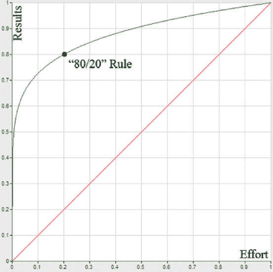
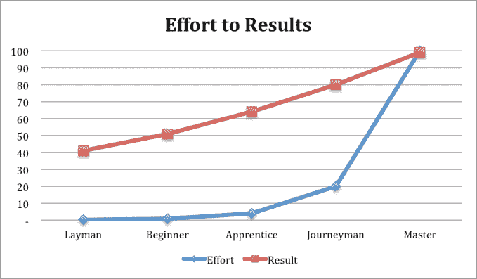

# 趋同经济中的专业化、博学和帕累托原则

> 原文：<https://web.archive.org/web/https://techcrunch.com/2015/10/17/specialization-polymaths-and-the-pareto-principle-in-a-convergence-economy/>

More posts by this contributor

经济学家告诉我们，人类劳动的历史是一部不断专业化的历史。在狩猎采集的时代，部落的每个成员都应该对每项工作有一定的熟练程度。

随着我们沿着经济连续体的发展，从狩猎采集到农业和工业，现在进入后工业经济，劳动力变得更加分散，工人拥有越来越多的专业技能。

从历史上看，专业化是通往繁荣的道路。虽然专业化有一定的经济优势，但在技术融合的时代，受过良好教育的通才将是最有价值的人。是“文艺复兴人”复兴的时候了。

文艺复兴时期出现了“文艺复兴人”或博学的想法，这种想法认为，任何人只要努力，都可以在诗歌、艺术、科学、数学、体育和任何其他引起他们注意的领域表现出色。

文艺复兴时期的思想家既认识到个人的潜力，也认识到全面发展的巨大价值。不幸的是，在这个过程中的某个地方，涉足多个领域的人的想法失去了文化吸引力，我们开始赞美那些寻求深入主题专业知识的人。

> 从历史上看，专业化是通往繁荣的道路。

我们现在生活在一个世界里，以前独立的行业之间的差异正在消失，真正的增长机会是在这些行业交叉的地方。利用这些 21 世纪的机会需要那些“样样精通，样样不精通”的人，或者更准确地说，精通博物学的人。

在现代经济中，博学不仅是一种优势，而且效率极高。许多人都熟悉帕累托原则，或者更普遍的说法，80/20 法则。80/20 法则是幂律的一种具体表达，它说，在许多情况下，80%的输出是 20%的输入的结果。

研究人员发现，帕累托原则在许多经济和自然现实中发挥着作用，包括财富分配、员工生产率、来自客户的收入、应用参与度，甚至农业产量。80/20 法则也是可分的，这意味着在 80/20 法则适用的情况下，20%的输入(4%)产生 80%的输出(64%)，以此类推。

虽然 80/20 的动力足够强大，但随着它的发展，它只会变得更加不平衡。例如，考虑一下，只有三个步骤，你就可以得到 0.16%的投入，却产生了惊人的 41%的产出。图 1 展示了帕累托原理导致惊人的力量倍增的速度。

| **输入** | **输出** | **比值** |
| 20 | 80 | 4X |
| 4 | 64 | 16X |
| 0.8 | 51 | 64X |
| .16 | 41 | 256X |
| .03 | 33 | 1024X |
| .006 | 26 | 4096X |

*T3 图 1*

80/20 规则的含义是强大的。例如，许多组织可以专注于仅满足 20%客户的需求，同时仍然保持 80%的收入。想象一下，这些企业可以用他们节省的所有资源做什么。作为人类，我们倾向于线性思维，这使得幂律分布的含义很难内在化。

图 2 对比了 80/20 世界和想象世界中努力和结果之间的关系，在想象世界中，每单位投入产生相同的边际产出。曲线下方的区域基本上代表了应用帕累托原理所提供的机会。简单的方法是:不要把你的头撞在人物最右边的墙上。

***图 2***

## 学习中的 80/20 法则

我认为帕累托原则最有趣的地方在于思考我们人类自身的增长潜力。想象一下，如果你有 100 个学习单元(比如角色扮演游戏中的经验点)来分配你一生中的各种技能。您应该如何使用这些积分？您是否会将所有时间都花在一个主题上，并努力成为一名真正的主题专家？或者你是否多样化你的技能，试图让自己成为一个全面的人？

这些问题是我们作为人类面临的一些最基本的问题。我们想成为谁，我们想在生活中做什么？帕累托原则说，如果你把这些点分散开来，你将会得到更多的回报(见图 3)。

***图 3***

让我们假设掌握一门学科需要 20 年的专门训练，并从那里开始应用 80/20 规则(见图 4)。在运用 80/20 法则发展自己的过程中，我们看到 80%的精通可能在 20%的时间内实现。

直觉上，这感觉是对的。如果有人花 20 年(12 天)的 0.16%专注于某个主题的学习，他们应该能够在鸡尾酒会上掌握该主题。类似地，一个人花了 20 年的 0 . 80 %,或者大约两个月的时间，专注于一个主题的研究，仍然应该被认为是一个新手，但是可以准备开始在这个领域的职业生涯。一个很好的例子是外行能够进入编码训练营，几个月后毕业，准备作为软件开发人员进入就业市场。

| **类别** | **输入** | **输出** | **掌握一门学科的时间** | **等同于** |
| **主人** |  百分之百 | 99% | 20 年 | 某个领域的专家，独到的见解。 |
| **熟练工** | 百分之二十 | 百分之八十 | 48 个月 | 在某个领域有独特见解的熟练工。 |
| **学徒** | 4% | 64% | 十个月 | 掌握一个领域的基本概念。 |
| **初学** | 0.80% | 51% | 两个月 | 对广泛概念和领域基础的工作理解。 |
| **外行** | 0.16% | 41% | 12 天 | 田野里的鸡尾酒会会话。能提出聪明的问题。 |

***图 4***

虽然图 3 中的数字与我自己的观察非常接近，但我不想暗示这些数字是世界的精确表示。虽然帕累托原则通常是 80/20，但也有很多 70/30 或 90/10 的例子。关键是，由于学习遵循帕累托分布，无论你插入哪个数字，多样化你的技能都是有价值的。

## 为什么我们需要更多的技术专家

技术领域最激动人心的事情发生在各个领域交汇的地方。医疗、纳米技术、合成生物学、汽车、农业、食品和其他创业公司之间的壁垒正在迅速恶化。过去，初创公司显然属于一个垂直领域，但现在情况越来越不一样了。合生元这样的合成生物公司其实是软件公司，汉普顿克里克这样的食品公司其实是合成生物公司。

为了建立未来的跨学科公司，我们需要一批跨学科的专家学者。自动驾驶汽车不仅仅需要汽车工程师，还需要了解软件、交通工程、驾驶员心理和监管流程的人。

> 以前独立的行业正在瓦解，真正的增长机会出现在这些行业交叉的地方。

组建跨领域公司的团队有两种方式。你可以雇佣几个博学的人，也可以雇佣一个庞大的专业专家团队。不幸的是，后一种策略有两个巨大的局限性。

首先，集合一群不同的主题专家来建立一个跨学科公司的策略会招致组织上的困境。如果没有足够多的博学者作为这些专家之间的粘合剂，这些类型的团队很难朝着同一个方向前进。

第二，也是更重要的一点，组建一个由不同主题的专家组成的大型团队的时间和金钱成本比雇佣一个博学的团队要高得多。这些高成本将使企业家更难成为未来跨学科公司的驱动力。随着跨学科公司在创新中所占的比例越来越大，创新将成为 R&D 企业部门的专属领域。

如果我们希望企业家——而不是 R&D 企业——继续成为美国经济的最大驱动力，我们需要一个“文艺复兴(Wo)人”的复兴

## 将帕累托法则运用到你的生活中

对于我们如何生活，帕累托原则有四个非常实际的含义。

让你的学习多样化。如果你放弃在中短期内(20 年)掌握任何一门课程的想法，你可以在 3 门课程中(12 年)达到熟练水平，在 6 门课程中(5 年)达到学徒水平，在 18 门课程中(3 年)达到初学者水平。重申一下，初级水平还是相当于 2 个月的协同学习。

在现代世界，一份非常普通的工作可能需要某人成为社交媒体专家、公共演说家、作家和数据分析师，博学的人会胜出，而深奥的主题专家会退居幕后，成为其他人的资源。作为一名投资者，如果我要挑选一个完美的团队，那将是一群拥有单一主题专家作为资源的摇滚明星学者。

**永远不会太迟。**帕累托原则的一个特别令人振奋的含义是，开始新的生活永远不会太晚。一个花了 30 年时间漫游世界的人可以致力于新的研究领域，并在相对较短的时间内达到与其他致力于同一主题的人相差不远的水平。

> 如果你不掌握自己的命运，你会越来越被束缚。

举个例子，一个人可以把网络安全作为一门专业，花 4 年时间在这个主题上(大约达到神奇的 10，000 小时)，并拥有终身专家 80%的熟练程度。在科技领域更是如此；因为它们进化得如此之快，旧的倾向已经过时了。

**公平竞争。**对于比别人学得慢的人，可以应用帕累托原理来平整竞技场。当其他人努力在某个领域获得最后的洞察力时，玩这个游戏的学习者可以快速积累一系列技能和洞察力，帮助他们在生活中取得成功。一旦你的智商超过了某个基线，智商和成功之间的相关性就很小了。

**用心学习。**最后，有目的地学习很重要。许多人在生活中从一个地方跌倒到另一个地方，只是让他们的职业有机地发展。这是一个可怕的“策略”，因为随着时间的推移，我们的文化倾向于增加专业化。如果你不掌握自己的命运，你会越来越多地被束缚在你的事业和生活中。

人们计划他们的周末，他们计划他们的午餐，他们计划他们孩子的运动日程——但是他们很少计划他们自己的生活。花几个小时；写下你现在的状况，以及 5 年或 10 年后你想达到的目标，然后规划出实现目标的方法。我敢打赌，这将涉及学习相当多的新技能。

如果你曾经想知道为什么教授们经常无法将他们自己的领域和现实世界联系起来，或者经常在社交方面无能，那是因为他们牺牲了大量对世界的潜在理解，以便他们可以对他们选择的一两个主题获得相对次要(但重要)的更深入的理解。

相比之下，有一个特征通常将世界上的权势人物团结在一起，那就是对消费各种主题内容的贪得无厌的需求。那些自觉或不自觉地将 80/20 法则应用于自身发展的人会成为商业、政治和社会领袖。这些人似乎有先见之明，能够将不同的群体团结在一个共同的事业之下。这些人将在可预见的未来建设美国经济。