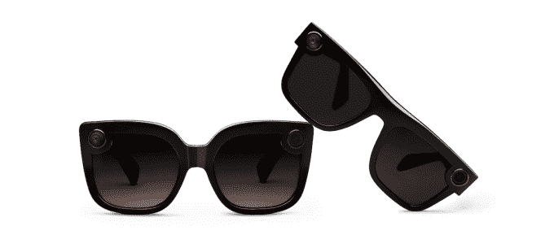
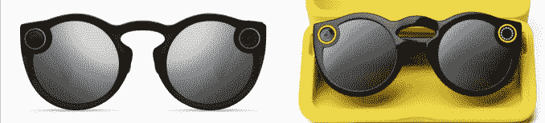
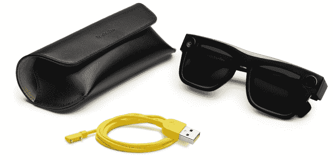

# Snapchat 增加了新的风格，Spectacles V2s 的使用量比 V1 多 40%

> 原文：<https://web.archive.org/web/https://techcrunch.com/2018/09/05/spectacles-v2-nico-veronica/>

Snapchat 没有透露其 Spectacles 相机太阳镜版本 2 的销售数字，但至少它们不会像版本 1 一样被遗忘在抽屉里。该公司告诉我，V2 车主比 v1 车主多拍了 40%的照片。

今天，Snapchat 将推出两种新的黑框潮人风格的 V2 眼镜——way farer 式的 Nico 模型和迷人的大镜片 Veronica 模型。两款手机都配有更薄的半软黑色手机套，而不是笨重的老式三角形黄色手机套，并且首次采用了偏光设计。与滑稽、活泼的 v1 相比，它们看起来更像普通的太阳镜，因此它们可能会吸引更成熟、更时尚的观众。它们今天在美国和欧洲以 199 美元的价格出售，并将于今年晚些时候在 Neiman Marcus 和 Nordstrom 出售，而旧款式仍然是 149 美元。

新款眼镜(左起):维罗妮卡和尼科

眼镜 V2 原创风格(左)和 V1(右)

Snap 还试图让用户实际发布他们拍摄的内容，因此它正在计划一个自动策划的亮点故事功能，这将帮助您将最佳规格内容转化为精彩的内容来分享。这可以解决 GoPro 用户中常见的问题，即拍摄大量酷镜头，但从不编辑以供显示。

问题是 V1 非常不受欢迎，那些买了它们的人。Snap 只发货了 22 万双，据报道还有几十万双在仓库里积灰。它冲销了 4000 万美元，其硬件“相机公司”战略受到质疑。Business Insider 报告称，不到 50%的买家在一个月后继续使用，而“相当大”的比例在一周后停止使用。

新款式配有更薄的半软便携包

这意味着获得 40%使用增长的门槛相当低，特别是考虑到 v2 可以拍照，可以在水下工作，有一个更薄的充电盒，并且没有 V1s 在相机镜头周围的亮黄色环，这表明你在脸上戴着一台迷你电脑。Snap 很聪明，最终让你[以非圆形格式](https://web.archive.org/web/20230323163258/https://techcrunch.com/2018/05/17/snapchat-spectacles-tests-non-circular-landscape-exports/)导出，这对 Snapchat 之外的分享很有用，并让你自动将快照保存到相机胶卷，而不仅仅是其应用程序的记忆功能。

我用 v2 的次数肯定比用 v1 的多，因为它们更离散、更通用。随着围绕技术的隐私规范不断放松，我还没有遇到人们担心被拍摄的恐惧或焦虑。

但即使有了改进的硬件、新的风格和即将推出的功能，Spectacles V2 看起来也不像是在为 Snapchat 移动针头。在上个季度用户数量减少后，Snap 的股价已跌至仅比历史低点高几美分。鉴于大多数用户都是囊中羞涩的青少年，即使眼镜很酷，他们也不会买。在 Instagram 的故事和短命信息复制猫入侵后，该公司需要专注于如何让它的应用程序对每个人都更有用，更有特色。

无论这意味着为 Discover 获取 tentpole 优质视频内容，重新设计故事以消除空隙以获得更好的后仰观看效果，还是开发增强现实游戏，Snap 都不能坚持到底。尽管它有硬件方面的野心，但它本质上是一家软件公司。它必须弄清楚是什么让这个软件与众不同。