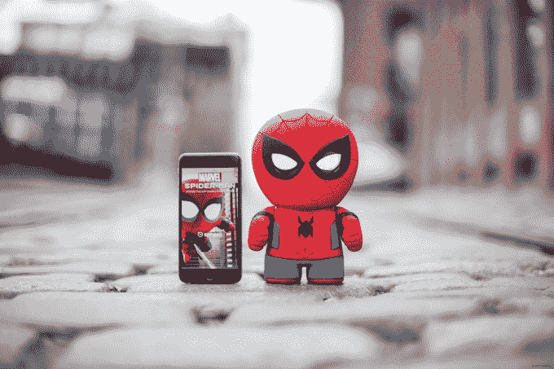

# Sphero 的新玩具是一个健谈的蜘蛛侠 

> 原文：<https://web.archive.org/web/https://techcrunch.com/2017/06/15/spheros-next-toy-is-a-chatty-spider-man/>

今天，Sphero 继续与迪士尼合作，推出了一款基于漫威超级英雄蜘蛛侠的新玩具。但是在 [BB-8](https://web.archive.org/web/20221204132243/https://beta.techcrunch.com/2015/09/03/sphero-bb8/) 和[闪电麦昆](https://web.archive.org/web/20221204132243/https://beta.techcrunch.com/2017/05/24/sphero-ultimate-lightning-mcqueen/)可以在房间里移动的地方，蜘蛛侠更加静止——他的真正力量包括进行对话。

这个蜘蛛侠能做的最简单的事情就是讲笑话——他似乎有无穷无尽的眼球转动。如果你只是请他聊天，他会开始一个关于学校或约会等随机话题的对话。正如 Sphero 联合创始人兼首席软件架构师 Adam Wilson 所说，他也是“一个讲故事的人”，向孩子们描述他的冒险经历，并邀请他们参与关键时刻。

你可以在上面的视频里看到一些我和蜘蛛侠的互动。我们鼓励用户尝试不同的提示，发现新的互动模式——尽管很多时候蜘蛛侠会回答一个不同于我所问的问题，或者只是静静地坐在那里。

这个玩具包括富有表情的 LCD 眼睛、麦克风、扬声器和加速度计——所以如果你抱起他，假装和他打架，他会提供热情的评论。甚至还有一个红外传感器，让蜘蛛侠进入“警卫模式”，警告任何进入主人卧室的入侵者。

除了使用第三方语音识别技术，威尔逊说蜘蛛侠的对话引擎是“从零开始”构建的——本质上，他是一个超级英雄形状的玩具中的“完整的安卓设备”。(虽然你的主要互动将通过语音进行，但你也需要一个 iOS 或 Android 应用程序来控制他。)

威尔逊还强调了隐私和安全的重要性。他说，蜘蛛侠只是在他胸前的蜘蛛亮起时才在听，用户的声音从来不会被存储或分享。(安全措施由[应用信任](https://web.archive.org/web/20221204132243/https://www.appliedtrust.com/)认证。)

值得注意的是，虽然《蜘蛛侠》的上映时间是在 7 月 7 日《T2》的《蜘蛛侠：英雄归来》上映前几周，但他并不应该代表这个角色的电影版本，而且他也没有由《T4 归来》的演员汤姆·赫兰德配音。(*归乡*将由索尼影业发行，而不是迪士尼，这一事实可能与该玩具缺乏电影联系有关。)不过，威尔逊说，这个蜘蛛侠有“超过 100 本漫画书的内容”，还将提供“数吨复活节彩蛋”

至于价格，这款玩具售价 149.99 美元。