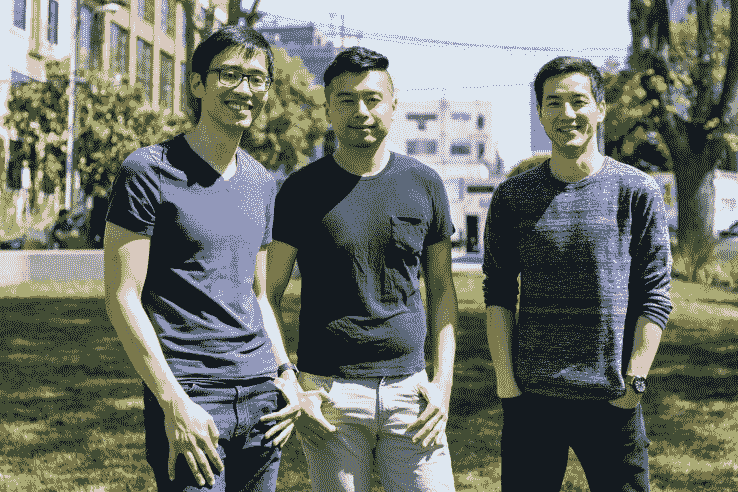

# 随着美国自行车共享大战的升温，Spin 筹集了 800 万美元 

> 原文：<https://web.archive.org/web/https://techcrunch.com/2017/05/25/spin-raises-8-million-as-bike-sharing-battle-heats-up-in-the-us/>

跟随中国的趋势，自行车共享在美国发生了转变。新的模式是“无码头”，公司在城市或校园内分发自行车，每次出行都可以租用，而不是从一个车站分发。这些自行车通过 GPS 跟踪，用户可以使用智能手机定位、付款和解锁。最重要的是，当骑车人用完这些自行车后，他们可以把它们停在任何方便(合法)的地方。

正如 TechCrunch 此前报道的那样，风险投资者正在向初创公司投入大量资金，试图让无人驾驶自行车共享在国内获得成功。这些企业正面临分散的监管和来自资金更雄厚的中国企业进入北美的竞争，以及像 [Motivate Co.](https://web.archive.org/web/20230131162751/https://www.motivateco.com/) 这样的现有企业，这家基于 kiosk 的自行车共享公司已经与全国各地的城市签署了协议。

最新获得一轮融资的是 [Spin](https://web.archive.org/web/20230131162751/https://www.spin.pm/) (注册名称为 Skinny Labs Inc .)，这是一家由科技界资深人士创办的初创公司:首席执行官 Derrick Ko、总裁 Euwyn Poon 和首席技术官郑在壮。Spin 刚刚完成了一轮 800 万美元的首轮风险投资，由 [Grishin Robotics、](https://web.archive.org/web/20230131162751/http://grishinrobotics.com/)领投， [Exponent 参与。风投](https://web.archive.org/web/20230131162751/http://www.exponent.vc/)、 [CRCM](https://web.archive.org/web/20230131162751/http://www.crcmvc.com/) 以及天使投资人马特·布雷兹纳和查理·契弗。

Euwyn Poon 表示，现在它已经锁定了 A 轮融资，Spin 将增加招聘，并与不同的市政当局进行谈判，以在全国范围内推出自行车共享服务，而不会引起不满。

无码头自行车共享公司引起了人们的担忧，担心自行车会塞满人行道，对行人构成威胁，并造成市容不佳。为了让他们的公司在监管机构和城市中保持良好的声誉，Spin 聘请了 Airbnb 政策团队的创始人[莫莉·特纳](https://web.archive.org/web/20230131162751/https://www.crunchbase.com/person/molly-turner)作为顾问。

旧金山的 Spin 联合创始人

Grishin Robotics 的创始人 [Dmitry Grishin](https://web.archive.org/web/20230131162751/https://techcrunch.com/tag/grishin-robotics/) 说，他相信城市会希望有 Spin 的自行车，因为它们有可能减少污染和交通，并增加用户的健康。这位投资者表示，“让我感到惊讶的是，打车应用并没有显著减少旧金山等地的交通堵塞。交通状况一直在恶化。我们需要增加更系统的方法来解决短途旅行。让自行车在城市里更容易使用会有所帮助。这对通勤者和游客都很好。所以这是一个巨大的市场机会。”

Spin 的竞争对手包括其他几家受资助的初创公司。社交自行车，第一家在美国提供无亭自行车共享的公司，已经筹集了 700 万美元，并且已经实现盈利。另一家早期自行车共享公司 [Zagster](https://web.archive.org/web/20230131162751/https://www.crunchbase.com/organization/zagster) 在 1 月份宣布完成了 1000 万美元的 B 轮融资。今年春天早些时候， [LimeBike](https://web.archive.org/web/20230131162751/https://techcrunch.com/2017/03/15/limebike-raises-12-million-to-roll-out-bike-sharing-without-kiosks-in-the-us/) 完成了由 Andreessen Horowitz 牵头的 1200 万美元 A 轮融资。

Lyft 前产品经理德里克·科(Derrick Ko)表示，Spin 将通过骑行舒适、自锁的自行车和易于使用的应用程序来区分其产品。虽然 Spin 允许用户使用 Apple Pay 和 Android Pay 支付，或者通过将他们的信用卡信息输入到该公司的应用程序中，但这家初创公司将寻求整合其他支付技术。

Spin 首席技术官郑在庄表示:“我们的目标之一是为所有可能没有信用卡和智能手机的社区带来公平的自行车共享。我们在台湾已经看到了这样的例子。它们让人们很容易乘坐火车，当他们下车时，骑自行车继续他们的旅程。”(事实证明，用你在地铁里用过的同一张卡来支付自行车的费用会很方便。)

联合创始人说，Spin 将于今年 6 月在西雅图推出自行车。但他们没有透露今年将在该市场或其他城市投放多少自行车。