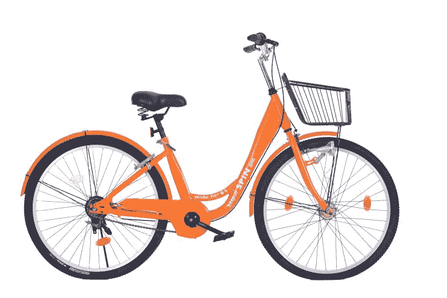

# Spin 希望将无码头自行车共享引入美国 

> 原文：<https://web.archive.org/web/https://techcrunch.com/2017/01/25/spin-wants-to-bring-dock-less-bike-sharing-to-the-us/>

美国的自行车共享计划主要由信息亭或车站组成，用户可以在那里解锁自行车，从架子上取下自行车，使用自行车，并在完成差事或骑行后归还自行车。有些只允许订户，有些按小时收费。与此同时，在中国，自行车共享项目已经从基于信息亭的系统发展成完全不同的系统。

在中国，像[摩拜单车](https://web.archive.org/web/20230131162752/http://mobike.com/sg/)、 [Ofo、](https://web.archive.org/web/20230131162752/https://www.crunchbase.com/organization/ofo)、 [Bluegogo](https://web.archive.org/web/20230131162752/https://angel.co/bluegogo) 等风险投资支持的公司，更不用说那里的许多模仿者了，都是没有码头的。他们使用的自行车可以通过蓝牙低能耗、GPS 和 2G 无线系统进行跟踪，并配有集成锁，因此他们可以在城市中安全地独立停放。中国这些较新的自行车共享公司在人口密度和交通问题令大多数美国城市相形见绌的城市地区销售他们的产品。用户可以启动一个应用程序来定位最近的自行车，并可以轻松地使用它们进行单程旅行，在目的地附近有空闲空间的地方锁定它们。

一家名为 Spin 的美国初创公司正试图从旧金山开始，将无人售货亭的自行车共享概念引入美国。Spin 的注册名称为 Skinny Labs Inc .,由前 Lyft 软件工程师兼产品经理 Derrick Ko、Euwyn Poon 和投资人 Euwyn Poon 以及 Spin 董事长 [Exponent](https://web.archive.org/web/20230131162752/http://www.exponent.vc/) 和前 Disqus 软件工程师负责人 Zaizhuang " Z " Cheng 共同创建。

*Skinny Labs Inc .又名 Spin 的联合创建团队*

联合创始人告诉 TechCrunch，他们的“V.0 自行车”，或者说是他们系统的第一次试点测试的自行车，将拥有印有二维码的车牌。用户可以将二维码扫描到旋转移动应用程序中，以解锁自行车并启动计价器。价格应该是大约每 30 分钟 1 美元。这些自行车将是亮橙色的 6 速自行车，有 26 英寸的车轮，车架锁，一个步进式车架，一个附加的篮子，以及发电机轮毂供电的灯(不需要电池工作)，防盗螺钉和实心泡沫轮胎。

Ko 和 Poon 说，使用实心轮胎的想法是让用户乘坐舒适，但保持 Spin 的维护成本较低。泡沫轮胎不会漏气，所以旋转工人就不必追踪松动的自行车并检查气压。性能方面，一般来说，实心轮胎比不上充气轮胎。这就是为什么你在环法自行车赛或摩托车和汽车上看不到“无气轮胎”的原因。但在中国，摩拜单车在实心轮胎方面取得了成功，表明普通骑手愿意使用它们。

Spin 计划今年在美国推出 10 万辆自行车。对美国来说，这是一个荒谬的野心，即使这已经在中国发生了。美国自行车共享巨头之一 [Motivate](https://web.archive.org/web/20230131162752/https://www.motivateco.com/) 与旧金山湾区的大都会运输委员会(Metropolitan Transportation Commission)达成了一项独家协议，将在旧金山、伯克利、奥克兰和圣何塞从去年的 700 辆自行车增加到 2018 年的 7000 辆，并在其最大的市场纽约拥有大约 1 万辆自行车。

 *骑行者可以用二维码和手机 app 解锁动感单车。*

另一个竞争对手 Social bikes 生产自己的智能自行车，并为在美国不需要售货亭的自行车共享计划提供支持，它已经在 5 个国家和 30 个城市部署了大约 7000 辆自行车，积累了大约 25 万用户，并记录了超过 190 万次出行。但是 SoBi，正如它的昵称，从 2010 年开始运营。

根据 Ko 的说法，Spin 计划随着规模的扩大与政府当局合作，而不是简单地在一个城市投放自行车，看看它如何发展。“请求原谅而不是许可”，这可能是硅谷的方式。但是中国的 Bluegogo 最近[遭到旧金山市官员的一记耳光](https://web.archive.org/web/20230131162752/http://www.sfexaminer.com/sf-threatens-legal-action-bikeshare-company-rumored-launch-city-streets/)据报道，它宣布计划在旧金山周围分发[数万辆自行车](https://web.archive.org/web/20230131162752/http://www.bizjournals.com/sanfrancisco/news/2017/01/18/sf-supervisors-bluegogo-bike-sharing.html)。

在中国，无售货亭自行车共享项目已经被证明几乎和它们的流行一样成问题。骑车人把自行车停在消防车道和其他禁止通行的区域。当局已经围捕并没收了大批自行车。在某些情况下，堆积如山的自行车给中国城市带来了很大的麻烦，因为它们阻碍了行人，造成了视觉障碍和潜在的安全隐患。(想象一辆自行车从十英尺高的堆上掉下来，砸在你头上？)

在旧金山，城市官员提到了对自助自行车共享的安全、行人和交通影响的担忧。值得注意的是，MTC 之前与 Motivate 和福特达成了一项在湾区共享自行车的独家协议[。未经市政府批准就进入市场的破坏者可能会违反该协议。](https://web.archive.org/web/20230131162752/https://techcrunch.com/2016/09/09/ford-backs-massive-bike-share-expansion-in-the-san-francisco-bay-area/)

Ko 强调，Spin 已经聘请了一位与旧金山市长办公室关系密切的政府关系代表，为顺利推出铺平道路，并有望主导国内市场。

更新: *在我们刊登了这篇报道后，Bluegogo 的一名代表出面反驳了之前关于该公司及其在旧金山交易的报道。他说:*

Bluegogo 已经在旧金山正式推出了 100 多辆无底座自行车。我们从未发布任何关于将在全市投放的自行车数量的声明。几十万的数字被错误地报道了。我们当然能够扩大规模以满足消费者的需求。”