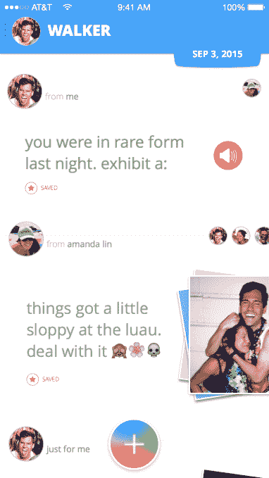

# Spindle 是一款社交应用，它鼓励你自私地使用你的内容

> 原文：<https://web.archive.org/web/http://techcrunch.com/2015/09/04/spindle-is-a-social-app-that-encourages-you-to-be-selfish-with-your-content/>

虽然社交媒体平台理论上是记录生活中特殊时刻的好地方，但现实是，社会压力经常迫使我们为他人策划和过滤我们的内容，而不是关注我们自己。

上周推出的 [Spindle](https://web.archive.org/web/20230315064840/https://itunes.apple.com/us/app/spindle-your-socialish-journal/id970237649?ls=1&mt=8) 是一款社交日志应用，它通过强调让用户为自己创建内容，并在事后与朋友分享来解决这个问题。

以下是 Spindle 的工作方式:用户首先捕捉照片、文本或声音片段，将其添加到自己的时间线中。

默认设置是内容将只与你自己分享，允许你创建一个你自己的经历的日志，你可以通过应用程序的时间旅行功能重新访问。

通过将用户从大量追随者的压力中解放出来，Spindle 希望他们可以训练用户提高他们内容的真实性。

用户仍然可以选择与朋友分享，这将导致他们的内容出现在朋友自己的时间线中。然后，这位朋友可以查看该消息并让它消失，或者将其作为永久条目保存在自己的日志中。

然而，这并不意味着你可以急于在 Spindle 上添加你的所有朋友。事实上，Spindle 没有好友或关注组件，该公司解释说这是为了消除与传统社交媒体的类比。
相反，如果你想将帖子分享到朋友的时间线上，你只需输入他们的名字，只要他们在你的通讯录中，你就可以向他们发送帖子。

Spindle 的联合创始人亚历克斯·沃克和阿曼达·林解释说，当用户在社交平台上拥有大量受众时，他们的内容往往会变得不那么真实。沃克和林希望，通过让用户专注于为自己创造内容，Spindle 将能够成为一个用户不必在发布内容之前进行第二次猜测或策划的平台。

就其设计而言，Spindle 用表情符号、草图和徽章进行了有趣的装饰，用户可以收到这些符号来保持与平台的良好互动。虽然一开始有点令人困惑，但用户界面会奖励好奇的用户复活节彩蛋和其他惊喜。

虽然像 [Beme](https://web.archive.org/web/20230315064840/https://techcrunch.com/2015/07/28/a-week-in-casey-neistats-new-app-beme-has-1-1m-videos-shared/) 这样的应用程序也旨在从社交媒体中移除隐喻过滤器，但 Spindle 是第一个如此重视告诉用户可以创建不完美的内容，只是保留在他们的私人时间线内。

总的来说，在试图解决社交媒体当前真实性问题的新趋势中，Spindle 是一个独特的转折。

Spindle 现在可以在 [iOS 应用商店](https://web.archive.org/web/20230315064840/https://itunes.apple.com/us/app/spindle-your-socialish-journal/id970237649?ls=1&mt=8)下载。