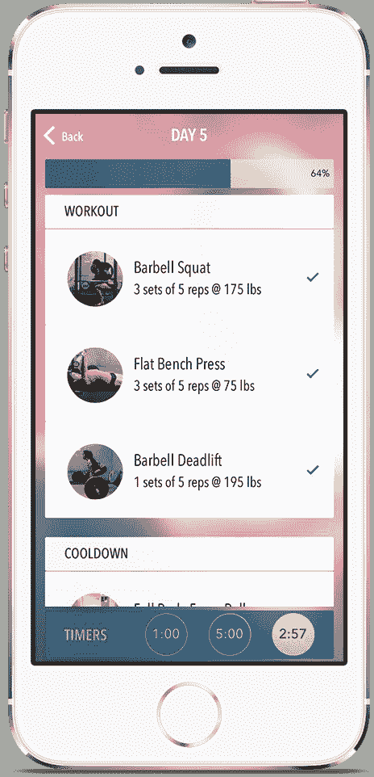

# Spitfire 的深度健身疗法针对准备挑战极限的女性 

> 原文：<https://web.archive.org/web/https://techcrunch.com/2014/04/07/spitfire-is-a-workout-app-that-turns-women-into-spitfires/>

一切都是从一个派对上的一瓶蛋白粉开始的。艾琳·帕克(Erin Parker)毕业于斯坦福大学，是“比基尼健美”的热情支持者，她拿着一些蛋白粉参加一个朋友的聚会。事实证明，这些氨基酸相对不受其他与会嘉宾的欢迎，但活动中的另一个人至少对这个拿着蛋白质的女人很好奇。

Nidhi Kulkarni 是麻省理工学院计算机科学毕业生，也是一名竞技赛艇运动员，他走到帕克面前，开始询问关于这种粉末的问题，例如如何使用它更有效地增加高质量的体重。两人建立了友谊，几个月后，他们联手开发了一款名为 Spitfire 的女性健身应用。

帕克和库尔卡尼的使命是为女性提供一种非常不同类型的锻炼应用程序，这些应用程序选自她们作为力量训练者和运动员的经历。Spitfire 没有展示几个无效的练习，而是展示了全面的“计划”,教女性如何达到她们的长期目标，即使她们需要做大量的工作。每个计划的灵感都来自一个真实的女性，应用程序中的图像都没有使用模型(事实上，许多都是创始人自己的)。

他们的希望是鼓励女性相信，通过对未来步骤更现实的描述，她们可以实现难以置信的困难挑战，并在这个过程中建立“喷火”。

艾琳·帕克

他们看到了这种体验的巨大市场空间。尽管苹果应用商店里有大量的女性运动应用，但很少有显示出高性能所需强度的应用。尤其是，“有这样一幅画面，一个女人拿着粉红色的小杠铃在做这些运动”，这让帕克非常恼火。“有很多应用程序承诺在 5 或 7 分钟内有结果，”但这些应用程序接着显示“女人在地板上抬起腿几次，这些练习完全是假的。所有真正能给你带来结果的合法东西都不会被展示出来。”

然而，就像这款应用的核心目标一样，这两位联合创始人自己也有很长的路要走，才能看到他们的愿景到达应用商店。Parker 曾经决心成为一名投资银行家，但在过去的两年中，他一直在学习 Ruby on Rails 和 iOS 开发，同时继续进行高强度的锻炼。Kulkarni 是麻省理工学院计算机科学系的顶级毕业生之一，他也加入了该大学的船员团队，在 I 级比赛中竞争了几年。通过 Spitfire，他们希望将自己的勇气注入到一个世界各地的女性都可以使用的应用程序中。

胡晓虹，国家级举重运动员

## **演习计划**

Spitfire 的主要任务很简单:设定一个目标，并选择正确的计划来实现它。当用户第一次登录该应用程序时，他们会被问一系列关于他们想做什么的问题。首先，要求用户设定一个目标。今天，有两个选项，力量和体格，但创始人希望在以后的更新中添加其他选项，如耐力，力量，灵活性和敏捷性。

接下来，他们必须选择是关注健身器材还是只关注身体锻炼。一旦回答了这些简单的问题，该应用程序将从五个最匹配的计划中推荐一个。

这些计划是产品的核心。在每个计划中，有几周内每天都要完成的任务，点击这些天会提供锻炼技巧和照片，以指导锻炼新手完成任何复杂的动作。当你完成任务时，一个进度条会显示出来，你可以为每项任务填写注释，比如你的杠铃重量或重复次数。

每个计划都是由一个真实的人启发的，你可以阅读他们的传记。希望向用户展示，帕克和库尔卡尼推广的高强度力量训练没有什么“精英”可言，而是任何人都可以进行这样的练习。“我们想揭开这个过程的神秘面纱，”帕克说。

例如，一个力量训练计划的灵感来自一位名叫艾米丽的全国公认的举重运动员，而另一个计划的灵感来自一位名叫帕梅拉的软件开发人员，她通过自己的锻炼方法减掉了 50 磅。创始人目前开发自己的内容，但随着时间的推移，他们希望应用程序中大约一半的计划将来自用户自己，鼓励他们分享自己实现各种目标的方法。

## **里面的喷火**

对帕克来说，创业创始人的旅程相当曲折。2007 年来到斯坦福，她专注于在她梦想的工作中获得一个职位，即投资银行家。大二时，她在 JP 摩根获得了一份令人垂涎的实习机会，却发现那里的环境令人窒息。

“每次我被要求做比较时，我都会努力让模型变得更好，但我的老板只是不停地告诉我按他说的做。”

虽然帕克在大学时有参与创业的导师，但关键时刻出现在[一个被称为 Rails Bridge](https://web.archive.org/web/20221007071414/http://railsbridge.org/) 的周末，该周末通过电子邮件鼓励女性学习如何编程。在那里，Parker 学会了如何使用流行的 Ruby 生态系统构建一个基本的应用程序，并发现她有编码的天赋。第二年，她专注于编程，同时做各种兼职来支付账单，同时继续进行高强度的健身养生。当她的一个健身演示应用程序开始通过 TestFlight 获得关注时，她知道自己发现了一些特别的东西，但需要一位联合创始人来推动它向前发展。她在库尔卡尼找到了那个人。

库尔卡尼长期以来一直对计算机科学充满热情。她第一次接触这个领域是在高中，并在麻省理工学院继续她的研究。除了第六球场繁重的工作之外，Kulkarni 还走进了女子摄制组，在那里她经常在黎明醒来练习。这种严格的时间表并没有阻止她在学校达到学生表现的顶峰，并毕业进入 Okta 的一份工程工作，这是一家企业身份管理系统初创公司。她对最初几个月的工作非常满意，甚至在公司加速客户整合的过程中得到了提升。然而，随着时间的推移，她想尝试一些新的东西，并开始寻找其他选择。当她看到 Spitfire 的设计时，她就着了迷，去年 11 月她和 Parker 正式开始合作。

当然，Spitfire 仍处于早期阶段。创始人希望在接下来的几个月里增加几个功能，包括让用户开发自己完全可定制的计划的能力，以及为力量训练女性提供更多的社交功能以找到彼此。该公司在继续试验产品和商业模式的同时，也是完全自力更生的。就像 Spitfire 的计划一样，这两位联合创始人对女性应该如何建立她们的日常锻炼有很大的抱负。只是不要指望任何粉红色的小杠铃会出现。