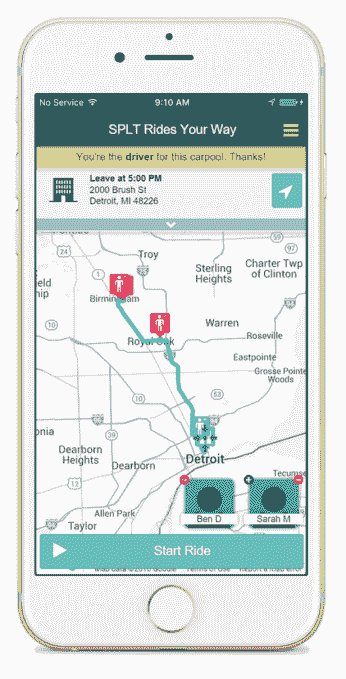

# SPLT 为您和您的同事带来拼车技术

> 原文：<https://web.archive.org/web/https://techcrunch.com/2016/03/10/splt-corporate-ridesharing/>

# SPLT 给你和你的同事带来了拼车

优步和 Lyft 都很好，但对于你的日常通勤来说，与同事一起乘坐可能更容易。SPLT 正试图通过将拼车引入企业界来做到这一点。

最初在底特律推出，作为 [TechStars Mobility](https://web.archive.org/web/20221204164910/http://www.techstars.com/programs/mobility-program/) 的一部分，SPLT 本周在三藩市推出，开始了它的扩张计划。

SPLT 就像优步，除了你和你的同事分享

SPLT 不是将你与碰巧同路的陌生人配对，而是针对大型组织，帮助缓解在家和工作场所之间来回切换带来的物流和环境影响。在这个过程中，该公司旨在最大限度地发挥其服务的副作用，例如鼓励导师会议以促进内部员工的成长，或者将不同部门的员工联系起来，希望创造一个分享和开发新想法的机会。

启动市场业务的最大挑战之一是以相同的速度增加供应和需求，但 SPLT 模式的巧妙之处在于，初始位置对用户来说是双赢的:当一家公司签约 SPLT 的服务时，它开始时司机供过于求——反正他们会通勤上班——但随着公司越来越多的人开始使用 SPLT 的平台，供应和需求应该会稳定下来，并找到司机和乘客数量“正确”的平衡。

该平台还包括更多高级功能，如允许用户与位于类似地区或公共走廊沿线的公司共享乘车服务。

“该产品是 21 世纪的智能拼车服务，为寻求为员工提供急需的交通解决方案的雇主服务，”SPLT 首席执行官安雅·巴比特说。“该平台记录减少的二氧化碳排放量和节省的里程，帮助公司满足 CSR 要求。”

SPLT 正试图改变人们的行为，将拼车作为一种额外津贴，并建议注册这项服务的公司为承诺拼车的人提供奖励。