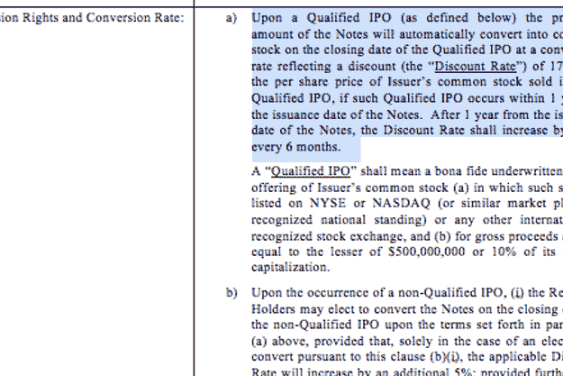

# Spotify 正以 IPO 股票折价发行可转换票据，再融资 5 亿美元

> 原文：<https://web.archive.org/web/https://techcrunch.com/2016/01/27/spotify-500-million/>

流媒体音乐公司 [Deezer](https://web.archive.org/web/20230404054620/http://www.deezer.com/) 宣布其[从现有投资者那里又筹集了 1 . 09 亿美元](https://web.archive.org/web/20230404054620/https://techcrunch.com/2016/01/20/deezer-100/)一周后，有消息透露其更大的竞争对手 [Spotify](https://web.archive.org/web/20230404054620/http://www.spotify.com/) 也在再次筹集资金。根据瑞典报纸 [Svenska Dagbladet](https://web.archive.org/web/20230404054620/http://www.svd.se/hemligt-dokument-avslojar-spotifys-borsplaner) (瑞典文)的报道，这家总部位于斯德哥尔摩的公司的音乐流媒体服务在 58 个国家开展，该公司正寻求以可转换票据的形式从投资者那里获得额外的 5 亿美元。如果该公司上市，这笔投资将转化为该公司的折价股票。

最新一轮融资将以贷款的形式进行，Spotify 将支付 4%的借款利息。由于这不是一轮股权融资，那些为 5 亿美元融资做出贡献的人将能够在未来将这笔贷款转换为 Spotify 股票，折扣取决于 IPO 的时间。如果在一年内发生，他们将获得 17.5%的股份折扣；如果超过一年，折扣将每半年增加 2.5 个百分点。

报道称，IPO 可能会在斯德哥尔摩和美国联合上市。

需要澄清的是，这并不是 Spotify 已经为任何 IPO 进程设定了日期的信号——我们联系了一位发言人进行评论，但一位消息人士告诉我们，没有关于日期的消息。值得注意的是，该公司正在利用公开募股的想法作为筹资努力的一部分。

*(SvD 发布的文件节选)*

据一位消息人士称，据我们了解，该公司目前不需要筹集更多资金，但正在“投机取巧”地进行。筹资文件没有详细说明 Spotify 计划如何使用新资金，只是指出它可以利用这些资金在新市场寻找机会。尚不清楚这是为了收购还是为了营销自己的服务。

报告指出，高盛和 Nordea 正在处理新的资金筹集，但至少在开始时，一切都不会按计划进行。

同一份出版物中的另一份独立报告指出，该公司一直受到被接洽参与此轮投资的投资者的冷遇。报告称，这些投资者提到了侵蚀性的竞争:据推测，他们指的不仅仅是 Deezer 等纯播放流媒体服务，还有 Apple Music 等更大的平台，Apple Music 可能会以亏损领先的地位运营其音乐服务，从而让人们获得真正的奖励:购买苹果昂贵的硬件。

该报告还称，这些投资者更倾向于标准的 IPO 流程，以提高 Spotify 财务和创收潜力的透明度。(他们怎么敢！我们谈论的是一家初创公司。)据了解，该公司还没有在全球范围内盈利，尽管一些个别市场似乎正在[走向黑暗](https://web.archive.org/web/20230404054620/http://www.hollywoodreporter.com/news/spotify-profitable-france-751042)。

这并不令人感到意外:可转换债券的投资者往往不那么厌恶风险。它对该公司的看法将不再像一个希望获得 10 倍回报的风投，而更像是一个在 IPO 早期介入的人。

可转换票据中资金的性质意味着，它们不会自动转换为公司股票，但如果 Spotify 在公开发行前需要更多现金，并且私人风险投资市场可能变得更难获得新一轮股权，那么 Spotify 就有可能在公开发行前利用这些资金。这将与我们从创始人那里听到的许多谈话相吻合，他们担心随着经济环境的变化，未来的融资会像现在一样容易。

所有这些也意味着不清楚该公司的估值是否会随着这一轮而改变。

Spotify 最近一次估值超过 85 亿美元，是在 2015 年 6 月的一轮 5 . 26 亿美元融资之后。该公司迄今已向[筹集了超过 10 亿美元的资金](https://web.archive.org/web/20230404054620/https://www.crunchbase.com/organization/spotify#/entity)，该公司的[投资者](https://web.archive.org/web/20230404054620/https://www.crunchbase.com/organization/spotify/investors)包括瑞典运营商 Telia、Accel、DST、Creandum、Fidelity、Founders Fund、KPCB 和 Northzone 等。

Spotify 如今是领先的音乐流媒体服务，共有 1 亿用户，其中约有 2800 万人付费(注意:这些是瑞典报纸报道中的更新数字，高于 Spotify 一直报道的 7500 万免费用户和 2000 万付费用户)。目前，约 60%的消费者首次使用流媒体服务。

但其他人正在努力吸引下一波用户，或者只是为了吸引 Spotify 的客户。它们包括 Deezer 这样的公司，也包括苹果和谷歌这样的大型平台公司。最近有消息称，Soundcloud 在一轮债务融资中又筹集了 3200 万€。

后者是基于用户上传的音频内容(类似于 YouTube 上的视频)的流媒体服务，拥有约 1.75 亿用户，仅在基本数据上远远领先于 Spotify。然而，它还没有任何订阅模式，目前只在美国市场投放广告。

与此同时，Spotify 正在[中加入更多服务](https://web.archive.org/web/20230404054620/https://techcrunch.com/2016/01/12/spotify-teams-with-genius-to-annotate-music-tracks/)和[功能](https://web.archive.org/web/20230404054620/https://techcrunch.com/2016/01/20/spotify-buys-cord-project-and-soundwave/)。该公司本周在英国、美国、丹麦和瑞典增加了安卓视频。Spotify 发言人向 TechCrunch 证实，它将于下周开始在 iOS 上出现。