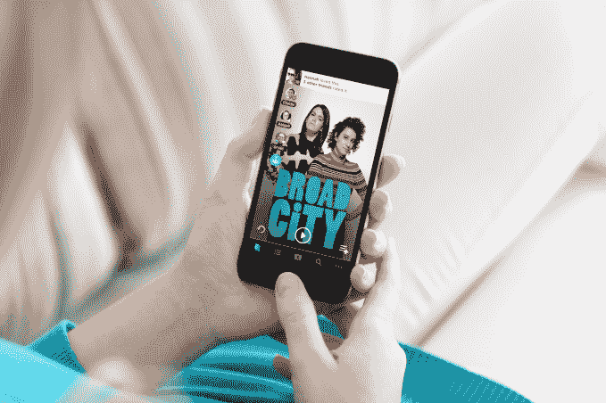

# Spotify 收购内容推荐初创公司 MightyTV 

> 原文：<https://web.archive.org/web/https://techcrunch.com/2017/03/27/spotify-acquires-content-recommendation-startup-mightytv/>

Spotify 今天早上[宣布了](https://web.archive.org/web/20230404173226/https://news.spotify.com/us/2017/03/27/27467/)其扩大营销和广告视野的最新举措:它收购了[并关闭了](https://web.archive.org/web/20230404173226/http://mighty.tv/)内容推荐服务 [MightyTV](https://web.archive.org/web/20230404173226/https://www.crunchbase.com/organization/mightytv) ，这是一家专注于视频推荐的初创公司(顾名思义)，其应用程序使用 Tinder 风格的滑动界面来帮助引导你选择符合你自己口味的电视和电影。作为交易的一部分，MightyTV 的创始人兼首席执行官布莱恩·亚当斯将成为 Spotify 的技术副总裁，专注于其营销和广告平台。

该公司拒绝透露交易条款。据 CrunchBase 报道，该公司不到一年前推出了，刚刚筹集了 400 多万美元。这笔交易包括 MightyTV 的八人团队，他们将驻扎在 Spotify 的纽约市、多伦多和斯德哥尔摩办事处。

[亚当斯](https://web.archive.org/web/20230404173226/https://www.crunchbase.com/person/brian-adams#/entity)是 AdMeld 的联合创始人兼首席执行官，AdMeld 是一个面向出版商的广告优化平台，据报道于 2011 年被谷歌以 4 亿美元收购。然后，他加入谷歌，运营 Doubleclick Publisher 平台，并于 2015 年离开谷歌，再次创办自己的公司。

MightyTV 的 Tinder 风格的 iOS 和 Android 手机应用程序[让你快速表明你是否喜欢或不喜欢某个给定的标题，这有助于根据你的个人品味定制 MightyTV 的建议。与 Tinder 一样，这个想法是，随着时间的推移，你使用该产品越多，应用程序的推荐就会越好。](https://web.archive.org/web/20230404173226/https://techcrunch.com/2016/09/29/mightytvs-tinder-style-tv-recommendation-app-comes-to-android/)

从消费者的角度来看，让 MightyTV 有趣的不一定是它类似 Tinder 的界面——尽管这很有趣——而是它结合了不同的方法来提出建议，既结合了来自聚合用户评级的建议，也结合了更好地了解个人口味的建议。

Spotify [本月早些时候收购了另一家科技初创公司，Sonalytic](https://web.archive.org/web/20230404173226/https://techcrunch.com/2017/03/07/spotify-acquires-audio-detection-startup-sonalytic/) ，该公司也有改善推荐的想法。像一个改进的 Shazam 一样，它的技术可以识别歌曲片段，甚至是现场活动中播放的歌曲。但它也有一项机器学习音乐推荐技术，可以帮助你在给定的背景下找到你喜欢的音乐，例如公路旅行或健身房锻炼。

改善推荐是当今所有流媒体服务的战场，因为它们试图将用户群从早期采用者扩大到更随意的听众，这些听众可能并不总是知道他们想听什么。

但除此之外，Spotify 对 MightyTV 及其领导地位的兴趣还与该公司希望如何发展其[程序化音频广告](https://web.archive.org/web/20230404173226/https://brandsnews.spotify.com/us/2016/07/20/spotify-launches-programmatic-audio-globally/)和本土品牌广告有关，该公司的公告指出。

Spotify [去年夏天在全球推出了](https://web.archive.org/web/20230404173226/https://brandsnews.spotify.com/us/2016/07/20/spotify-launches-programmatic-audio-globally/)节目音频，允许广告商根据年龄、性别、流派和播放列表实时锁定受众。

Spotify 尚未说明它计划如何在节目播放中使用 MightyTV 的技术，但一个选项可能是 Spotify 可以为用户创建工具，帮助他们发现新音乐，然后使用这些工具收集用户的更多有趣数据，并使用这些参数向他们提供广告。

这些都可以是音频广告，类似于 Spotify 已经呈现给用户的广告类型，但它也可以用来代表唱片公司和艺术家向最容易接受的听众推广音乐(和相关产品，如音乐会或商品)。

为唱片公司和艺术家建立一个更大的市场来销售基本音乐之外的商品和服务，对 Spotify 来说是有意义的。流媒体音乐的利润率很低，甚至是负数(正如我们在[报道的](https://web.archive.org/web/20230404173226/https://techcrunch.com/2017/03/18/dictate-top-40/)，Spotify 正试图改变[的现状](https://web.archive.org/web/20230404173226/https://techcrunch.com/2017/02/02/sources-spotify-may-delay-ipo-to-2018-as-it-rethinks-licensing-deals/))。

但推广其他产品的程序化广告等服务，将 Spotify 展示为一个更可持续的流媒体音乐业务的推动者和平台，面向所有人、Spotify 本身以及与之合作的艺术家和版权所有者。(Spotify 去年进行的其他几笔收购也是为了建立更广泛的平台和社区，包括 [Preact](https://web.archive.org/web/20230404173226/https://techcrunch.com/2016/11/02/spotify-acquires-preact-to-boost-its-subscriber-story/) 、 [Cord Project](https://web.archive.org/web/20230404173226/https://techcrunch.com/2016/01/20/spotify-buys-cord-project-and-soundwave/) 和[声波](https://web.archive.org/web/20230404173226/https://techcrunch.com/2016/01/20/spotify-buys-cord-project-and-soundwave/)以及 [CrowdAlbum](https://web.archive.org/web/20230404173226/https://techcrunch.com/2016/04/27/spotify-buys-photo-aggregator-crowdalbum-to-build-more-marketing-tools-for-artists/) 。)

Spotify 产品副总裁杰森·里奇曼在一份声明中表示:“MightyTV 建立的内容推荐系统与我们对广告技术和营销个性化的看法惊人地一致。”。“Brian 和他的团队将帮助我们继续在免费货币化方面进行创新，并扩大我们在节目音频领域的领导地位。”

“Spotify 为粉丝和创作者建立了领先的市场，”亚当斯说。“对我和我的团队来说，这是一个巨大的机会，可以帮助创造本土品牌体验，忠实于数百万人喜爱的产品。”