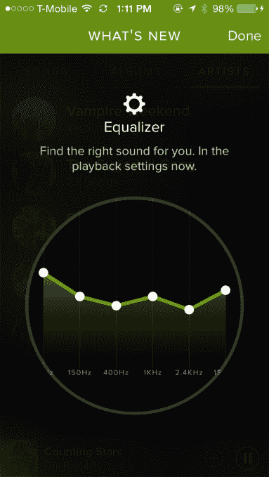

# Spotify 增加了均衡器，因此您可以调高低音 

> 原文：<https://web.archive.org/web/http://techcrunch.com/2014/07/29/spotify-adds-an-equalizer-so-you-can-turn-up-the-bass/>

Spotify iOS 应用程序的一个小而显著的更新肯定会让音乐迷们高兴:该公司刚刚推出了一个新的均衡器功能，让你从几个预设中选择一个来调整音乐，或者用手指拖动图表中的点来进行更精确和个性化的设置。

该应用在最新版本中还增加了一些其他功能，包括在 iPad 上重新设计的艺术家页面，其中包含最新的发布信息和商品列表，以及“发现”部分的新位置，该位置已被移到“浏览”中。

但均衡器的加入是最重要的变化，也是唯一一个 Spotify 在用户下载新更新后第一次启动应用时提醒用户的变化。

要使用均衡器，你访问“设置”，然后“播放”，然后点击“均衡器”打开新的屏幕。

从这里，您可以使用提供的开关打开或关闭该功能，然后向下滚动以查看一系列可供选择的预设，包括以下选项:声学、低音增强器、低音减弱器、古典、舞蹈、深度、电子、扁平、嘻哈、爵士、拉丁、响度、休息室、钢琴、流行、R&B、摇滚、小扬声器、口语、高音增强器、高音减弱器和人声增强器。

你可能还记得，该功能模仿了 iTunes 的旧设置，例如，它还包括爵士乐、小扬声器和高音增强器等功能。

点击您的选择后，图表将更新，反映您选择的设置，然后您可以退出屏幕或使用手指上下拖动图表对其进行进一步调整。

该功能将对那些使用耳塞耳机收听 Spotify 的人有所帮助，因为他们可能会在爵士乐出现时找到更温暖的声音，或者他们可能想将低音调高一点。或者，如果您使用较小的扬声器，您可能想要使用高音减压器。

Spotify 产品副总裁斯登冲锋枪·加马克在公司的官方声明中表示:“我们的许多用户要求内置均衡器已经有一段时间了，这是目前我们在 iOS 上要求最多的功能之一。”

该功能目前仅在 iOS 上可用，但 Android 版本应该很快就会推出。更正:Android 用户报告称该功能已经可用。