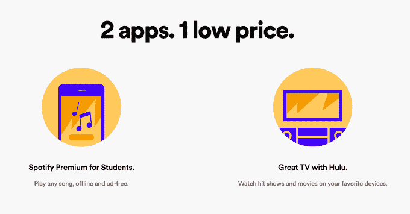
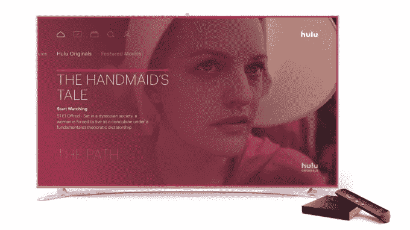
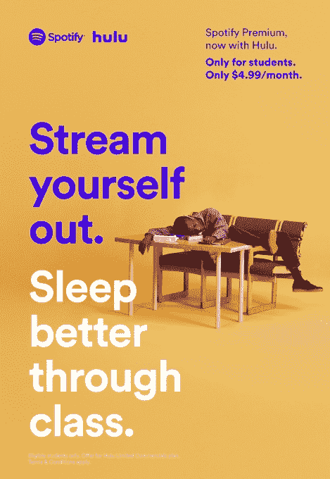

# Spotify 和 Hulu 合作推出打折娱乐套餐，首先面向学生

> 原文：<https://web.archive.org/web/https://techcrunch.com/2017/09/07/spotify-and-hulu-partner-on-a-discounted-entertainment-bundle-first-aimed-at-students/>

Hulu 和 Spotify 今天宣布了一项合作伙伴关系，这两家公司将合作营销提供这两种服务的娱乐捆绑包，并将通过单一订阅计划联合销售。最初，这个捆绑包将针对美国大学生，每月费用仅为 4.99 美元，与 Spotify 现有的学生计划相同。该套餐包括 Spotify Premium、该公司的点播音乐服务和 Hulu 的“有限商业”计划。

这些公司表示，他们将在未来提供其他捆绑包，以瞄准更广泛的市场，但目前没有宣布这些计划的细节。

选择购买捆绑包而不是单独购买服务的用户将继续使用品牌的现有应用程序——也就是说，这不是一种技术集成，例如，你会在 Spotify 的应用程序中看到 Hulu 节目。

这是 Spotify 首次与这样的流媒体电视和电影服务合作，而且它是在该公司重新思考自己现有的视频产品时达成的。上周，有消息称 Spotify 的视频和播客负责人汤姆·卡尔德龙(Tom Calderone)将因内容战略的转变而离开公司。

Spotify 一直在向原创视频等其他类别扩张，但在卡尔德龙退出的消息传出后，Spotify 证实其方式将会改变。展望未来，Spotify 表示将专注于扩大 Spotify 播放列表上的视频产品，如 Rap Caviar、Rock This 等。

正如[彭博当时也提到的](https://web.archive.org/web/20230404080358/https://www.bloomberg.com/news/articles/2017-08-31/spotify-says-head-of-video-and-podcasting-operations-is-out)，在 YouTube TV、Hulu、Vue 和其他公司到来之前，Spotify 曾试图在欧洲为直播视频服务独立安排一系列电视频道。但它未能达成必要的交易，因此放弃了这些计划。

换句话说，Spotify 知道，如果它试图从零开始建立一个像 Hulu 一样的服务，以扩大用户的视频选择，它将面临的挑战。很明显，它觉得与现有的服务合作会更好，比如 Hulu，让它的订阅更有吸引力。

就 Spotify 与 Apple Music 的斗争而言，这一举措也意义重大。

Spotify 有超过 6000 万的付费用户，大约是苹果音乐的两倍，截至 6 月，苹果音乐在 T2 有 27 个用户。到目前为止，这两种服务都没有令人信服的视频产品来配合他们的流媒体音乐。事实上，Spotify 的一些原创作品[非常无聊。与此同时，苹果一直在慢慢进入这个领域，但它的节目，如“拼车卡拉 ok:系列”或“应用星球”，](https://web.archive.org/web/20230404080358/https://techcrunch.com/2016/08/11/spotifys-first-original-videos-are-boring-behind-the-music-cartoons/)[不是你在网飞或 HBO 上看到的必看内容，也绝对不是人们订阅的理由。](https://web.archive.org/web/20230404080358/https://techcrunch.com/2017/08/09/carpool-karaoke-debuts-on-apple-music-for-some-reason/)

然而，Hulu 不仅提供主要网络和电影公司的电影和电视节目，它现在还通过对原创内容的投资，拥有了自己的艾美奖提名系列电影《女仆的故事》。这使得它的内容比 Spotify 自己制作的任何东西都更有吸引力。

Spotify 首席高级商务官 Alex Norstrom 在一份声明中说:“通过将 Spotify 和 Hulu 结合在一起，我们现在能够以最简单的方式让学生——无论是已经在 Spotify Premium 上注册的数百万人还是初次接触 Spotify 的人——获得世界上最好的音乐、电视和电影内容。”。“我们很高兴与 Hulu 合作，Hulu 是一家想法相似的公司，和我们一样专注于提供高质量的流媒体内容，”Norstrom 补充道。

上图:Spotify 新捆绑包的营销材料

鉴于新的捆绑价格与 Spotify 之前的学生定价相同(分别是 T2 的苹果音乐和最近 T4 的亚马逊音乐无限服务)，这两家公司似乎都不会在新的联合产品上赚多少钱。

我们知道有收入分成协议，但很明显利润空间很小。

相反，这种捆绑似乎是一种方式，在学生离开大学后，最终将高付费用户引回他们的服务。

不过，在 Spotify 的例子中，它会自动将毕业的学生用户切换到每月 9.99 美元的普通 Spotify Premium。

对于 Hulu 来说，这个想法是学生可以选择直接注册，这已经成为他们几年来看电视的习惯和一部分。

在推出时，在美国 Title IV 认证的学院或大学注册的本科生，已经是 Spotify Premium for Student 订户，可以访问他们的 Spotify 帐户，以便将他们的计划切换到“Spotify Premium for Students，now with Hulu，”这是捆绑包的名称。 Spotify 将负责营销，包括通过广告牌和数字活动为服务做广告，并将通过其在[spotify.com/us/student.](https://web.archive.org/web/20230404080358/http://spotify.com/us/student)的网站销售捆绑包

*更正:Spotify 告诉 TechCrunch，其网站的新计划出现了错误。当学生不再有资格享受学生价格时，他们会转向常规的 9.99 美元/月计划，而不是网站最初所说的 4.99 美元/月计划。由于我们对这一细节的质疑，Spotify 已经更新了其网站。我们现在也更新了我们的帖子来纠正这个问题。*