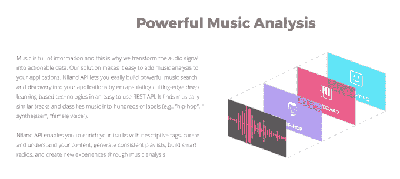

# Spotify 收购人工智能初创公司 Niland，开发其音乐个性化和推荐

> 原文：<https://web.archive.org/web/https://techcrunch.com/2017/05/18/spotify-buys-ai-startup-niland/>

# Spotify 收购人工智能初创公司 Niland，以开发其音乐个性化和推荐

Spotify 在[宣布](https://web.archive.org/web/20230404095455/https://press.spotify.com/co/2017/05/17/niland-team-joins-spotify/)人工智能初创公司 Niland 加入其行列后，进行了今年的第四次收购。

总部位于巴黎的 Niland 提供了一个基于 API 的产品，专注于为音乐提供更准确的搜索和推荐选项。Spotify 表示，这家法国公司将加入其位于纽约的 R&D 团队，帮助完善其为用户提供的个性化和推荐功能。

Spotify 在一份声明中说:“Niland 改变了人工智能技术如何优化音乐搜索和推荐功能的游戏，并分享了 Spotify 在正确的时间向正确的用户提供正确内容的热情。”

尼兰德的创始团队在其网站上写道:“我们将继续致力于更好地理解音乐的新方法，以创造更好的创新聆听和发现体验。”。

Spotify 已将个性化作为其服务的一个关键部分，推出了像 Release Radar 和 Discovery Weekly 这样的定制播放列表。[后者在第一年就达到了 4000 万用户](https://web.archive.org/web/20230404095455/https://techcrunch.com/2016/05/25/playlists-not-blogs/)，凸显了易用性和智能发现的价值。

流行音乐流媒体服务[在 3 月](https://web.archive.org/web/20230404095455/https://techcrunch.com/2017/03/02/spotify-50-million/)达到了 5000 万付费用户，如果算上使用免费版本的用户，它总共拥有超过 1 亿的听众。紧随其后的竞争对手[苹果音乐在 12 月](https://web.archive.org/web/20230404095455/https://techcrunch.com/2016/12/07/apple-music/)达到了 2000 万用户，所以有理由推测它接近 3000 万。

Spotify 可能会将备受期待的首次公开募股推迟到 2018 年，该公司今年一直忙于提升其技术水平，并通过收购增加新功能。仅 1 月份以来，就接棒了[区块链创业公司 Mediachain](https://web.archive.org/web/20230404095455/https://techcrunch.com/2017/04/26/spotify-acquires-blockchain-startup-mediachain-to-solve-musics-attribution-problem/) 、[内容推荐创业公司 MightyTV](https://web.archive.org/web/20230404095455/https://techcrunch.com/2017/03/27/spotify-acquires-content-recommendation-startup-mightytv/) 和[音频检测创业公司 Sonalytic](https://web.archive.org/web/20230404095455/https://techcrunch.com/2017/03/07/spotify-acquires-audio-detection-startup-sonalytic/) 。

Niland 成立于 2013 年，从法国投资者那里筹集了未披露的资金。它毕业于巴黎的加速器项目。