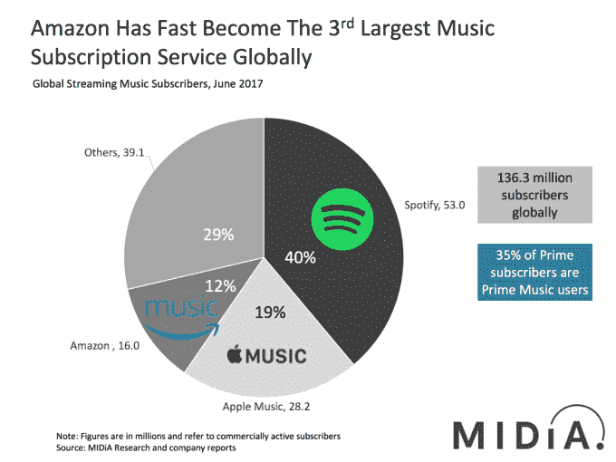
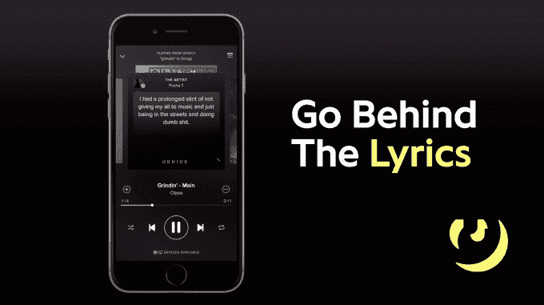
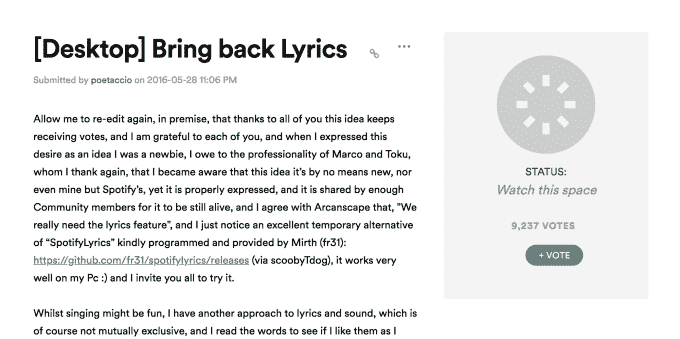
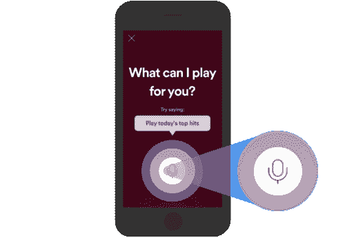
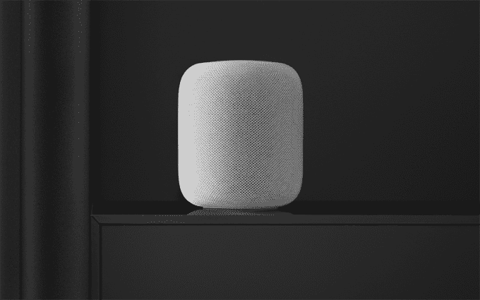

# Spotify 在歌词和语音方面落后了

> 原文：<https://web.archive.org/web/https://techcrunch.com/2018/08/15/spotify-is-falling-behind-on-lyrics-and-voice/>

Spotify 缺乏完整的歌词支持，对语音的关注也很少，这开始成为流媒体服务的问题。该公司一直专注于其个性化技术的开发和播放列表的编程，忽视了其竞争对手——包括苹果、谷歌和亚马逊——今天提供并正在利用的关键功能。

例如，苹果音乐的[更新版本](https://web.archive.org/web/20230404080359/https://appleinsider.com/articles/18/06/05/apple-music-in-ios-12-adds-song-search-by-lyrics-new-artist-pages)将于今年秋天推出 iOS 12，用户不仅可以像以前一样访问应用程序中的歌词，还可以根据歌词进行搜索，而不仅仅是艺术家、专辑或歌曲名称。

在这方面，Apple Music 实际上正在追赶亚马逊。

已经悄然成长为[第三大音乐流媒体服务](https://web.archive.org/web/20230404080359/https://musicindustryblog.wordpress.com/2017/07/14/amazon-is-now-the-3rd-biggest-music-subscription-service/)的亚马逊音乐，允许用户[在歌曲播放](https://web.archive.org/web/20230404080359/https://www.amazon.com/gp/help/customer/display.html?nodeId=201482770)时查看歌词，而[将其与](https://web.archive.org/web/20230404080359/https://techcrunch.com/2018/05/24/amazon-musics-app-adds-hands-free-listening-courtesy-of-alexa/)其 Alexa 语音平台联系起来。拥有 Alexa 设备的亚马逊音乐用户也可以通过歌词搜索歌曲，只需说*“播放那首歌……”*。

该公司提供这种功能已经将近两年了。虽然它最初是 Alexa 的[隐藏的宝石之一，但今天](https://web.archive.org/web/20230404080359/https://lifehacker.com/alexas-search-by-lyrics-is-one-of-the-echos-best-lesser-1819185440)让 Alexa 根据歌词调出一首歌被认为是一个标准功能。

尽管谷歌在音乐方面落后于苹果、Spotify 和亚马逊，但它聪明的谷歌助手[也能按歌词搜索](https://web.archive.org/web/20230404080359/https://www.cnet.com/how-to/google-home-complete-list-of-commands/)。另外，它还可以像 Shazam 一样识别附近正在播放的歌曲。

随着基于语音的计算的兴起，像用口头命令要求歌曲或通过语音查询歌词数据库这样的功能现在是预期的功能。

Spotify 在这个问题上的立场是什么？

到目前为止，谷歌只在日本推出了歌词搜索，并拒绝提供何时在其他市场优先推出这一服务的时间表。甚至在应用程序代码中还隐藏了歌词测试的参考资料，这些测试只在泰国和越南的非美国市场进行。

我们从消息来源了解到，这些测试从今年年初就开始了。但对这些测试的关注微乎其微——Spotify 目前没有衡量用户对歌词功能的参与度。我们听说，Spotify 首席执行官丹尼尔·埃克甚至不知道他的团队正在进行这些歌词测试，这意味着管理层对这款产品缺乏关注。

与此同时，苹果和亚马逊等竞争对手拥有专门的歌词团队。

我们多次询问 Spotify 目前是否正在美国测试歌词(例如，你可以在这里看到一个人声称他们获得了访问权。)但是公司一直没有回复我们的问题。

*图片来源:Imgur via Reddit 用户[spalatidium](https://web.archive.org/web/20230404080359/https://www.reddit.com/r/spotify/comments/95bl5d/did_spotify_just_launched_lyrics_only_in_mobile/)*

一些主要听流行音乐的 Spotify 客户可能会对应用程序中缺乏完整的歌词产品感到困惑。这是因为 Spotify [在 2016 年与 Genius](https://web.archive.org/web/20230404080359/https://techcrunch.com/2016/01/12/spotify-teams-with-genius-to-annotate-music-tracks/)合作推出了“歌词背后”，在其目录的一部分提供歌词和音乐琐事。但是当音乐播放时，你看不到这首歌的所有歌词，因为它们被事实和关于这首歌的其他背景信息、歌词的含义或艺术家打断了。

同年，Spotify 也与一直为其提供歌词支持的 musix match(T2)断绝了关系，因为两家公司(T3)无法再达成协议(T4)。用户期望歌词会在某个时候回归——但只有“歌词背后”出现来填补空白。

不过，对真正的歌词功能的需求依然强劲。用户定期在社交媒体[和 Reddit](https://web.archive.org/web/20230404080359/https://www.reddit.com/r/spotify/comments/934n9g/lyrics/) 上发布关于这个话题的帖子。

要求歌词回归也是 Spotify 用户反馈论坛上投票率最高的产品创意之一。它有 9237 个“赞”，成为第二大热门请求。

(这个想法被贴上了“关注这个空间”的标签，但它被贴上这样的标签已经太久了，它不再是对即将到来的事情的承诺。)据我们所知，目前还没有内部解决方案，也没有与第三方达成新协议。

缺少歌词也正在成为其他领域的一个问题，因为竞争对手正在推出通过语音命令进行搜索的功能。

事实上，总的来说，Spotify 在解决用户对语音辅助的兴趣方面做得比较晚——尽管音乐聆听的主要使用场合是在旅途中——比如在车里、外出散步或慢跑、在健身房、骑自行车等。

今年春天它才开始测试语音搜索选项，可以通过一个新的应用内按钮进入。现在在 Spotify Premium 上向移动用户推出了[语音搜索产品，通过长按应用程序中的搜索按钮即可](https://web.archive.org/web/20230404080359/https://support.spotify.com/us/listen_everywhere/voice_assistants/spotify-voice/)工作。然后，您可以要求 Spotify 播放音乐、播放列表、播客和视频。

但是这个功能仍然不可靠。首先，将它隐藏为长按触发选项意味着许多用户可能不知道它的存在。(而且切换到搜索时弹出的浮动按钮很难够到。)其次，它没有解决用户希望通过语音搜索的主要原因:免提收听。

同时，iPhone/HomePod 用户[可以用免提命令告诉 Siri 播放音乐](https://web.archive.org/web/20230404080359/https://support.apple.com/en-us/HT208279#music)；[谷歌助手/](https://web.archive.org/web/20230404080359/https://assistant.google.com/) 谷歌家庭用户可以指示助手播放他们的歌曲——即使他们只知道歌词。亚马逊音乐的 Alexa 集成在 Echo 扬声器上直播，在其音乐应用程序中[可以免提使用。](https://web.archive.org/web/20230404080359/https://techcrunch.com/2018/05/24/amazon-musics-app-adds-hands-free-listening-courtesy-of-alexa/)

甚至像 Pandora 这样的第三方音乐服务也在利用语音平台的功能提供歌词搜索。例如， [Pandora Premium 本周在 Google Home 等 Google Assistant 设备](https://web.archive.org/web/20230404080359/https://techcrunch.com/2018/08/14/pandora-premium-comes-to-google-assistant-powered-speakers-and-screens/)上推出，提供 Google Assistant 支持的歌词搜索。

Spotify 无法在其应用程序中提供原生的歌词搜索功能，更不用说使用语音命令选项进行歌词搜索了，因为它甚至没有功能完整的歌词。

语音和歌词并不是 Spotify 未来面临的唯一挑战。

Spotify 也缺乏像自己的 Echo 或 HomePod 这样的专用硬件。鉴于基于语音的计算和语音助手的崛起，该公司有可能放弃部分市场，因为消费者最终会购买主要科技公司提供的更大的生态系统:Siri/HomePod/Apple Music vs . Google Assistant/Google Home/Google Play Music(或 YouTube Music)vs . Alexa/Echo/Amazon Music(均由 Prime 推广)。

目前，Spotify [与合作伙伴](https://web.archive.org/web/20230404080359/https://support.spotify.com/us/listen_everywhere/voice_assistants/)合作，以确保其服务在他们的平台上运行，但[苹果并没有友好回应。](https://web.archive.org/web/20230404080359/https://techcrunch.com/2018/06/01/apple-needs-to-play-nice-with-spotify/)

在其他地方，Spotify 可能会播放—[甚至通过语音播放](https://web.archive.org/web/20230404080359/https://www.amazon.com/gp/help/customer/display.html?nodeId=201601830)——但不会像原生解决方案那样功能齐全。例如，由于 Spotify 是 Echo 设备上的默认服务，Alexa 并不总是能找到命令，指示它根据歌词、活动或情绪播放音乐——当然，这些命令在亚马逊音乐上运行良好。

Spotify 统治地位的其他缺陷也开始显现。

由于在四个主要市场，美国、日本、德国和英国的采用，亚马逊音乐取得了令人印象深刻的增长..如今，它占据了音乐流媒体市场 12%的份额，成为了在亚马逊与 Spotify 之战的讨论中基本被忽视的黑马。但现在还不一定要算出来。

YouTube 音乐，虽然是全新的，但已经设法抓住了 Lyor Cohen 作为其全球音乐负责人，而 T2 Spotify 的最新头条是关于失去 Troy Carter。

与此同时，苹果首席执行官蒂姆·库克[刚刚在最后一次收益电话会议上宣布，苹果音乐在北美已经领先于 Spotify。在最近的一次采访中，他还警告](https://web.archive.org/web/20230404080359/https://seekingalpha.com/article/4192790-apple-aapl-q3-2018-results-earnings-call-transcript?part=single)不要将太多的控制权交给算法，为保持音乐在我们生活中的“精神角色”提出了一个明智的论点。

“我们担心音乐中的人性被耗尽，担心它变成一个零零碎碎的世界，而不是艺术和工艺，”库克沉思道。

苹果在音乐流媒体方面起步较晚，因为它与下载业务联系如此紧密。但它也有充裕的时间来做好这件事，因为它知道自己强大的 iPhone 平台意味着它推出的任何产品都有内在优势。(它还准备将电视节目作为其订阅的一部分，这可能是一个进一步的吸引。)

Spotify 需要多少时间才能恢复正常？

尽管有这些担忧，Spotify 还不需要恐慌——它在音乐流媒体业务中仍然拥有更多的听众、更多的付费客户和更多的消费者份额。它有受欢迎的播放列表和个性化功能。它有它的 RapCaviar。但它需要堵塞漏洞，以跟上市场的发展方向，否则在未来几个月里，客户可能会流失到更大的平台。