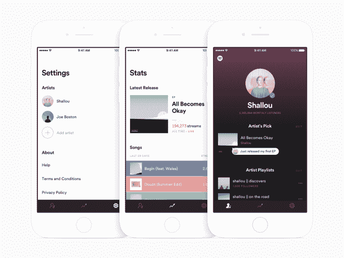
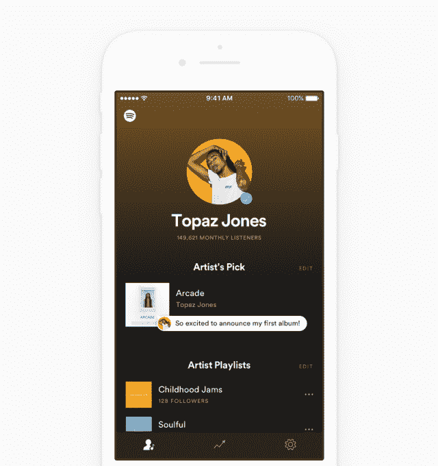
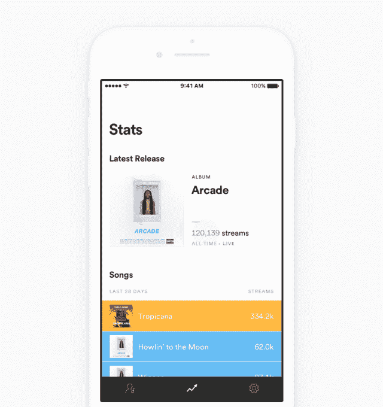
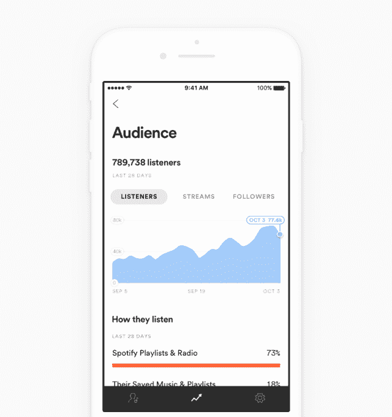

# Spotify 为艺术家推出一款应用，提供实时流媒体数据、观众人口统计数据

> 原文：<https://web.archive.org/web/http://techcrunch.com/2017/10/12/spotify-launches-an-app-for-artists-with-real-time-streaming-data-audience-demographics/>

在音乐流媒体时代，获取数据才是王道。艺术家们想知道他们的音乐是如何被发现的，谁在听，在哪里，有多少人已经发布了他们的音乐，以及他们的粉丝还喜欢什么，等等。今天，Spotify 为艺术家发布了一款应用，旨在回答这些问题，同时也为艺术家提供了一种在旅途中更新个人资料和与听众联系的方式。

从本质上来说，这款新的“艺术家 Spotify”应用程序是今年早些时候退出测试版的 Spotify 艺术家仪表板的移动版本。关键的区别在于移动访问的便利性 Spotify 产品经理 Miles Lennon 说这是最大的需求。

“我们努力实现的第一件事是满足艺术家对流动性的需求，”他说。他们没有办公室工作。虽然我们有台式机产品，但他们无法使用。"

像 web dashboard 一样，该应用程序允许艺术家在服务上更新他们的个人资料，包括他们的简历、他们的艺术家选择和他们的播放列表。这些精选和播放列表是 Spotify 上的艺术家吸引粉丝的方式之一——例如，通过告诉他们正在听的最喜欢的新歌，或者通过展示他们最喜欢的歌曲。

我们被告知，上传新照片到艺术家个人资料的功能目前还不支持，但在未来的应用版本中将会支持。

然而，Spotify for Artists 应用程序的关键功能是获得对流媒体数据的原生移动访问，包括新发布的实时数据。

只要有新版本发布，该应用就会随着曲目的播放而即时更新。Spotify 表示，在新单曲、EP 或专辑发布后的第一周，这种情况将持续下去。

Lennon 解释说，这个功能是手机独有的，利用了谷歌的云基础设施。选择一周的时间框架部分是因为扩展这样一个功能的挑战，但也因为这是最关键的跟踪时期。然而，这一时限将来可能会延长。

像这样的数据对艺术家来说是至关重要的，他们今天竞争的是粉丝的关注和流的数量，而不是专辑的销量。在 Spotify 上，一半的用户通过播放列表或收音机发现音乐，T0 公司在 T1 之前已经说过。因此，如果一个新版本下降，但没有得到支持，艺术家们会立即知道这一信息，然后采取相应的行动——例如，让他们的歌曲出现在正确的 Spotify 播放列表上，或者让其他艺术家在他们自己的个人资料上展示他们的音乐。

此外，该应用程序将提供对听众人口统计数据的访问，包括性别、年龄、位置等信息，甚至他们播放的内容、他们如何收听以及他们喜欢的其他内容。

同样，这也是 Spotify for Artists dashboard 在网络上包含的数据，但这里的重点是移动的便利性与数据的力量相结合。这是一种深入粉丝群的方式，可以将休闲彩带从更专注的粉丝中分离出来，并了解更多关于音乐在哪里以及如何被接收的信息。

“艺术家们总是希望了解我推出的下一张唱片是把我带到了粉丝的新高度，还是这种新声音改变了观众的构成？”列侬说。“我的观众性别构成变了吗？他们的年龄变了吗？或者甚至是国家或城市？…艺术家告诉我们，这对他们来说非常重要。”

这些人口统计数据也可以帮助艺术家在 Spotify 之外推广他们的音乐——比如在脸书通过社交广告——或者计划巡演。

[gallery ids="1554225，1554224，1554223，1554222，1554221，1554220，1554219，1554218，1554217，1554216，1554215，1554214，1554213"]

如今，Spotify 的电子邮件定位项目 Fans First 也使用了艺术家最虔诚听众的数据，该项目让艺术家可以向顶级粉丝提供特别优惠，例如预售音乐会门票。据说，这些活动的效果优于传统电子邮件营销者，后者预计只有四分之一的收件人会打开他们的电子邮件。与此同时，Spotify 表示，其电子邮件打开率为 40%,点击率为 17%。

如今，Spotify for Artists 应用程序还没有将获取数据和根据这些发现采取行动联系起来。但那是在路线图上。

“这也是我们正在努力并密切关注的事情，”列侬说。

“启发‘最新发布’功能的一个因素是，应用程序应该知道对你来说什么是重要的，并突出显示在其他事情之上，”他谈到应用程序今天在新发布版本下降后突出显示实时流的方式。“这是我们将继续推进的一个主题:让艺术家们知道他们应该关注什么，为什么要关注，并给他们行动的方法。”

当被问及这些未来的推荐是否会成为优质功能时，列侬说不会。目前没有对这些见解收费的计划。

在今天 iOS 上发布之前，Spotify for Artists 应用程序已经与 100 多名测试人员进行了几个月的测试。

Android 版本预计将在几周内推出。