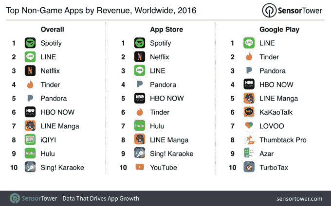
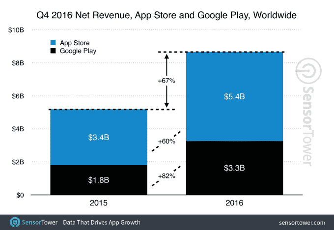
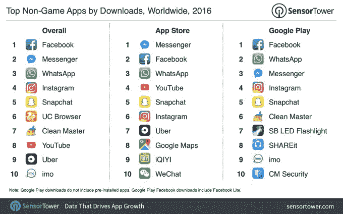

# Spotify、网飞、LINE、Pandora 和 HBO 现在是 2016 年收入最高的应用 

> 原文：<https://web.archive.org/web/https://techcrunch.com/2017/01/13/spotify-netflix-line-pandora-hbo-now-top-the-list-of-2016s-biggest-apps-by-revenue/>

根据 Sensor Tower 的一份新的年终报告详细介绍了 2016 年的顶级应用，流媒体服务在游戏之外的应用中占据主导地位，这些应用在过去一年中获得了最多的收入。排名第一的是 Spotify，它不仅在 iTunes 应用商店上排名第一，而且在两个平台上都是第一大收入来源，包括 App Store 和 Google Play。

与此同时，由于聊天应用 LINE 对 Android 的吸引力，它在总收入方面排名第二，其次是网飞、Tinder、Pandora，然后是 HBO NOW。

Hulu 也榜上有名，总收入排名第九，在 App Store 排名第七。

该榜单表明，削减开支的趋势——将注意力从线性电视转移到流媒体服务——仍然强劲，基于订阅的流媒体音乐的增长也是如此。

话虽如此，在 App Store 的收入排行榜上名列前茅是一回事，但将其转化为盈利业务仍是一个挑战。

例证:本周早些时候， [Pandora 宣布将在美国裁员约 7%](https://web.archive.org/web/20221207093424/https://beta.techcrunch.com/2017/01/12/pandora-is-laying-off-7-of-its-workforce/),尽管其业务已经发展到拥有超过 430 万付费用户。但这家老牌音乐流媒体服务如今面临着来自苹果音乐(Apple Music)和 Spotify 等公司的新竞争。

在视频流媒体市场，更新的顶级服务 HBO NOW 也仍在努力实现盈利。截至 3 月，[的订户刚刚超过 100 万](https://web.archive.org/web/20221207093424/https://www.bloomberg.com/news/articles/2016-03-08/time-warner-says-hbo-now-service-nearing-1-million-subscribers)，HBO 现在可能已经成为收入最大的应用之一，但每月 15 美元的价格仍然让许多客户，包括千禧一代，敬而远之。

为了使这项服务更有吸引力，HBO 在 12 月[表示，它将把原来的节目增加 50%到每年 600 小时，并且它已经把最新的电视流媒体服务 DirecTV Now 的服务费用削减到仅仅 5 美元。](https://web.archive.org/web/20221207093424/https://www.bloomberg.com/news/articles/2016-03-08/time-warner-says-hbo-now-service-nearing-1-million-subscribers)

在收入排行榜上的其他地方，是 2015 年推出的热门漫画 LINE Manga，LINE 的漫画阅读器和店面。这款应用同时出现在三张榜单上 Google Play 排名第五，App Store 排名第八，综合排名第七。

由于新设备的假期销售，第四季度在历史上是一个重要的收入来源。2016 年依然如此，两个平台的应用和游戏的全球净收入达到 87 亿美元。这比 2015 年第四季度的 52 亿美元增长了 67%。

该报告还调查了下载量最高的非游戏应用，这导致了更少的惊喜。

正如其他人之前报道的那样，脸书、Messenger、WhatsApp、YouTube、Snapchat 和 Instagram 等应用程序登上了 2016 年热门应用程序的[榜单，他们再次登上了 Sensor Tower 的榜单。](https://web.archive.org/web/20221207093424/https://beta.techcrunch.com/2016/12/28/facebook-google-dominate-the-list-of-2016s-top-apps/)

这里最引人注目的是优步，在美国和全球更多地区扩张一年后，它在整体上排名第九，在 App Store 上排名第七。

该报告称，全年新应用下载总量超过 800 亿次。

这些名单是由应用商店情报公司 Sensor Tower 编制的。它的发现可能最终会与 App Annie 等竞争对手不同，因为这些公司生成数据的方式不同。然而，这将是一个有用的比较点，因为更多的年终名单将在未来几周继续出现。