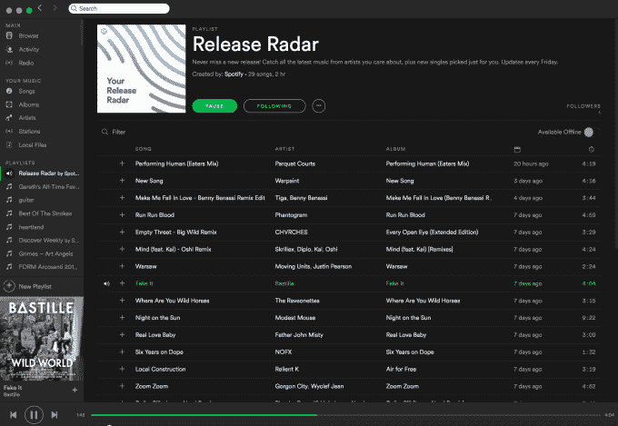

# Spotify 跟随《发现周刊》发布个性化新品播放列表

> 原文：<https://web.archive.org/web/https://techcrunch.com/2016/08/05/spotify-release-radar/>

# Spotify 跟随《发现周刊》推出个性化的新发布播放列表

Spotify 正在加倍努力，通过大数据驱动的个性化播放列表(如《发现周刊》)击败苹果音乐，这是一个巨大的成功，第一年就有 4000 万用户。今天，[推出了](https://web.archive.org/web/20230404154747/https://news.spotify.com/us/2016/08/05/release-radar-your-personalized-playlist-of-the-newest-releases/) Release Radar，这是一个 2 小时的算法化个性化播放列表，每周五更新，其中包含每个用户已经听过的艺术家新发布的歌曲。

Release Radar 将出现在用户播放列表集合的顶部，而不是像 Spotify 现有的用于查找新发布内容的主页一样，隐藏在以图形方式组织的浏览标签中。播放列表的格式更加熟悉，用户可以很容易地打开它，继续他们的一天，而不是在每首歌曲结束时选择不同的内容来播放。

“就像《发现周刊》能够让 Spotify 从其他音乐服务中脱颖而出一样，我们试图证明 Spotify 比任何人都更了解用户，”该产品的首席工程师爱德华·纽特告诉我。“我认为，随着时间的推移，我们会看到其他音乐服务公司打造《发现周刊》的复制品，但我认为 Spotify 仍有优势。我们是第一个解决这个问题的人。在流数据方面，我们是最大的，为实现这一功能提供了必要的个性化服务。”

本周，我演示了 Release Radar 播放列表,并对其推荐的准确性感到震惊。虽然《发现周刊》有目的地向你展示你没有听说过的艺术家，但 Spotify 的算法质量更容易根据发行雷达来判断。它能够显示我过去经常播放但最近不再播放的艺术家的歌曲，这使它成为 Spotify 搜索框的一个很好的补充，而 Spotify 搜索框可能令人生畏。

随着点播流媒体战争全面展开，Spotify 2014 年收购音乐个性化数据提供商 Echo Nest 看起来是一个越来越聪明的举动。自 2015 年 7 月[推出](https://web.archive.org/web/20230404154747/https://techcrunch.com/2015/07/20/why-browse-when-you-can-play/)以来，Discover Weekly 在头 10 个月获得了 50 亿次歌曲播放，至少有一半的用户每周保存一首歌曲。

它正在工作。超过一半的 Discover Weekly 用户至少保存了一首歌，每周至少听 10 首歌，下周再回来。25 岁至 34 岁的年龄组使用它最多，纽特说这是因为现在是“大学毕业后的几年”，你的社交网络已经发生了变化，你渴望像过去一样接触新的音乐，因为“发现音乐不那么容易了”

以下是主要参与者及其优势和劣势:

*   **Spotify**——一家个性化的公司——领先一步，拥有 1 亿听众，包括 3000 万付费用户，广告支持层有助于吸引用户，Echo Nest 和历史收听数据为《探索周刊》和 Release radar 等播放列表中的建议提供深度个性化，这是一家长期专注于音乐产品的初创公司的强大功能，但作为一家风险投资公司，它在营销方面的支出无法超过苹果，并且缺乏值得头条报道的独家新闻
*   **苹果音乐**——有钱的那个 iPhones 上预装的大规模安装基础，与你现有的 iTunes 图书馆的集成，以及由于其雄厚的财力而获得的一些独家服务。但它推出较晚，尽管它在努力追赶时已拥有 1500 万付费用户，但一直被批评为令人困惑，并且缺乏免费的广告支持层。
*   潮人(Tidal)——有独家报道的那家——高质量的独家报道或提前获得碧昂斯和坎耶·韦斯特(Kanye West)的发布，但起步晚，功能有限，没有广告支持层。
*   YouTube——拥有用户的网站——其免费、广告支持的默认服务帮助 YouTube 发展到超过 10 亿用户。音乐视频一直吸引着大批观众，尤其是青少年。它最近推出了无广告的 YouTube Red 订阅，提供独家视频内容，为它和创作者赚更多钱，但它的界面不是为听音乐而建的，频繁的前置广告比在 Spotify 上听到的音频广告更具干扰性。
*   有 DJ 的 SoundCloud 拥有音乐的合法灰色区域，包括非官方混音和数小时 DJ 混音，feed 格式促进发现，自我发布的能力使其成为独立行为中最受欢迎的。但 SoundCloud 缺乏大量流行音乐，可能会感觉杂乱无章，一些艺术家和 DJ 对他们的音乐因侵犯版权的样本而被删除感到愤怒，其 SoundCloud Go 订阅服务似乎没有增长，因为该公司遭受了巨大的财务损失，不得不接受肮脏的融资。
*   **Pandora**——只有收音机的那家——是互联网上收音机的同义词，低广告负载使其免费层对不想做 DJ 的人来说很棒，音乐基因组计划和收听数据帮助它做出个性化的歌曲推荐。但用户在潘多拉上发现艺术家后，渴望听他们的点播。它从收购的 Rdio 的尸体上重新推出点播服务的速度很慢，其他服务正在使个性化广播成为他们提供的服务中的一项功能——然而它刚刚拒绝了 Sirius XM radio 母公司的收购要约，尽管趋势与潘多拉相反。

虽然 YouTube 拥有市场的重要部分，但专用音乐流媒体服务之战正在成为 Spotify 和 Apple Music 之间的战争。为了击败硬件巨头在营销和独家新闻上的支出，Spotify 将不得不依靠其免费层来吸引非流媒体用户，然后使用 Release Radar 等个性化产品功能来锁定他们，并说服他们购买订阅。