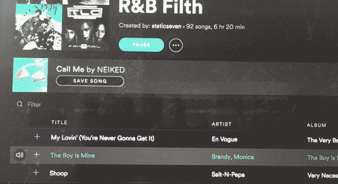
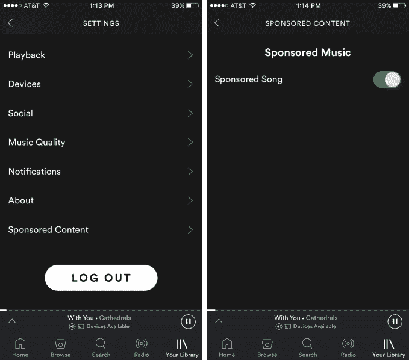
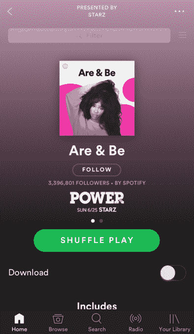

# Spotify“赞助歌曲”让唱片公司为播放付费 

> 原文：<https://web.archive.org/web/https://techcrunch.com/2017/06/19/spotify-sponsored-content/>

Spotify 最近出现了一个神秘的“赞助内容”选择退出设置，现在这家流媒体巨头已经向 TechCrunch 证实了它的内容。Spotify 现在正在测试一个新的“赞助歌曲”广告单元，公司发言人告诉我们，这是“唱片公司在免费层推广单曲的产品测试。”

唱片公司可以付费让赞助歌曲出现在你关注的播放列表上，或者可能出现在服务的其他地方，而不是像 Spotify 现有的广告那样出现在明显的广告横幅上。这些可以有针对性地以匹配的收听口味呈现给用户，以便与他们的其他音乐一起播放。这些赞助歌曲将立即播放和保存，而不需要先点击广告。

目前还不清楚 Spotify 是根据每次印象、行动、收听还是其他方式向唱片公司收费。你可以在下面看到一个赞助歌曲设计的例子，由 Liam Maloney 发现，它显示 NEIKED 的歌曲 Call Me 单独出现在播放列表中的歌曲上方。

“NEIKED call Me”作为赞助歌曲出现在此播放列表上方

Spotify 告诉我，如果测试成功，赞助歌曲广告可以正式推出，但只会向免费用户显示。Spotify 设置菜单中赞助商内容下的选择退出选项可以让人们隐藏这些广告，尽管尚不清楚该选项是否可供不支付无广告 Spotify Premium 的用户使用。

赞助内容可以帮助 Spotify 从其广告支持的免费听众身上榨取更多的美元，这些听众的收入不如付费用户多。如果这些人不想付费，Spotify 必须找到更多的方法来赚钱，同时又不会让他们太烦，以至于放弃流媒体应用。

与此同时，赞助歌曲让人回想起[电台贿赂](https://web.archive.org/web/20221206003557/https://en.wikipedia.org/wiki/Payola)的黑暗时代，唱片公司付钱给电台的 DJ，让他们播放艺人的歌曲。国会在 20 世纪 50 年代末和 21 世纪初取缔了这种做法。显然，将赞助歌曲标记为广告可以让 Spotify 和标签遵守规则，但同样会降低播放列表(或电台)上的音乐质量，以利于赚取额外的钱。

除了内部指向新专辑或外部指向任何商业网站的传统横幅广告，Spotify 去年开始让企业赞助其最受欢迎的播放列表。这使得他们可以在顶部添加一个标志，并包括免费层用户可以同意观看的视频广告，以换取 30 分钟的无广告收听。

Spotify 最近在设置菜单中增加了对赞助歌曲的选择退出

赞助歌曲可以直接进入 Spotify，而不会中断收听体验。如果目标明确，用户可能甚至不会注意到一首歌得到了赞助。但唱片公司希望他们能记住这首曲子，保存到他们的 Spotify 图书馆，与朋友分享，回来听更多这位艺术家的音乐，并最终通过购买音乐会门票或商品直接为音乐家和唱片公司赚钱。

从这个意义上说，赞助歌曲从 Spotify 最受欢迎的产品功能中得到启示:探索周刊。《发现周刊》没有试图让人们通过 Spotify 中笨重的博客式浏览界面来寻找新歌，而是使用了[一个个性化的每周更新的播放列表](https://web.archive.org/web/20221206003557/https://beta.techcrunch.com/2016/05/25/playlists-not-blogs/)，其工作方式就像用户自己创建的熟悉的播放列表一样。

Spotify 的 Are & Be 播放列表由电视频道 STARZ 赞助，拥有超过 330 万订户

在 Spotify 运营的播放列表上购买赞助歌曲的需求证明了 [Spotify 获得对唱片公司影响力的战略的有效性](https://web.archive.org/web/20221206003557/https://beta.techcrunch.com/2017/03/18/dictate-top-40/)。

如果 Spotify 能让自己的播放列表成为该应用程序上最具影响力的时尚引领者，而不是艺术家对粉丝的信息传递或病毒式分享，它就能决定哪些歌曲会成为热门歌曲，或者传到墙外的前 40 家电台。例如，它的 Rap Caviar 播放列表有超过 700 万订户。然后，如果唱片公司想要获得成功，他们必须与 Spotify 合作——要么与 Spotify 签订友好的版税协议，要么直接通过赞助歌曲支付费用，以获得这些播放列表的曝光率。

这都是 Spotify 推动 IPO 的一部分。它需要赚更多的钱，这样才能向唱片公司支付版税，并仍有足够的资金来支付运营费用并实现盈利。 [Spotify 在 2016 年从其 1.4 亿总用户和 5000 万付费用户中获得了 33 亿美元的收入](https://web.archive.org/web/20221206003557/https://beta.techcrunch.com/2017/06/15/spotify-tops-140m-users-revenue-jumps-over-50-percent/)，但由于版税和增长投资，它仍然损失了 3.9 亿美元的运营费用。它甚至同意在接下来的两年里支付 20 亿美元给唱片公司来降低版税。

在利润微薄的流媒体业务中，Spotify 与苹果和亚马逊等不依赖音乐的巨头竞争，Spotify 必须尽其所能生存下去。通过不懈地推广自己的播放列表，让用户订阅，Spotify 在其应用程序中建立了广受欢迎的子属性，可以出售广告空间。