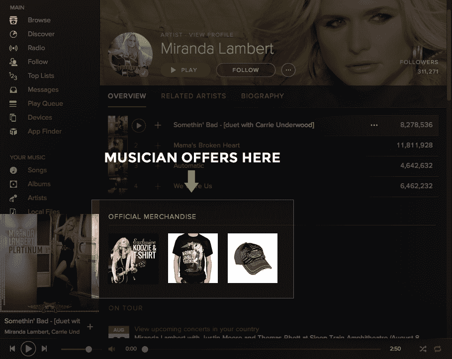

# Spotify 与 BandPage 合作，更深入地研究艺术家商品

> 原文：<https://web.archive.org/web/https://techcrunch.com/2014/08/13/spotify-teams-up-with-bandpage-to-jump-deeper-into-artist-merchandising/>

据报道，随着 Spotify 的首次公开募股日益临近，该公司继续将其作为一个电子商务平台，为艺术家们推销自己，创造基本音乐版税以外的收入。今天，它开始与 BandPage 进行整合和合作，band page 是一家让音乐家为自己创建档案，然后向他们的粉丝出售商品、秘密演出门票、体验和其他产品的公司。

在今天之前，[band page](https://web.archive.org/web/20230404203359/http://www.crunchbase.com/organization/rootmusic)—[最初是一个名为 RootMusic](https://web.archive.org/web/20230404203359/https://techcrunch.com/2012/07/24/bandpage-everywhere/) 的脸书专属营销平台，已经与其他一些平台整合，如 [Rdio](https://web.archive.org/web/20230404203359/http://www.crunchbase.com/organization/rdio) 、 [Soundcloud](https://web.archive.org/web/20230404203359/http://www.crunchbase.com/organization/soundcloud) 、YouTube 等——但考虑到 [Spotify](https://web.archive.org/web/20230404203359/http://www.crunchbase.com/organization/spotify) 如今超过 4000 万活跃用户的受众规模远远超过大多数其他纯音乐流媒体公司，这家初创公司加入这家总部位于瑞典的公司是向前迈出的一大步

Spotify 的营销工作于去年年底启动，并于 2014 年 1 月向所有艺术家开放，提供免佣金服务，这意味着艺术家和他们使用的任何电子商务后端服务都可以分享收入。

Spotify 目前[与 TopSpin](https://web.archive.org/web/20230404203359/http://musically.com/2014/01/20/spotify-opens-up-merchandise-selling-feature-to-all-artists/) 等公司合作，为艺人销售提供动力。但从我们通过小道消息得知，现在苹果已经收购了 Beats(以及 TopSpin)，与 Artist Link (TopSpin 的直接面向消费者的商品销售服务)的交易以及与 TopSpin 的关系将被逐步取消。

因此，BandPage 将是取代它的一个步骤。如今，BandPage 的服务包括各类“产品”(商品+ VIP 体验)，外加 50 万艺术家的附加数据。他们[包括](https://web.archive.org/web/20230404203359/https://www.bandpage.com/fans)伊吉·阿德利亚、蕾哈娜、碧昂斯、米兰达·兰伯特、魔力红和乔治·克林顿，这些人[会给你打电话并设置你的语音邮件。](https://web.archive.org/web/20230404203359/https://www.bandpage.com/georgeclinton/store/george-clinton-calls-you-and-sets-your-voicemail-message/317873162383605760)

(顺便 50 美元我来做，我真的很机智。)

与其他营销整合一样，Spotify 不会对通过其平台销售的产品收取任何费用。BandPage 和 Spotify 之间的交易也没有任何财务条款，也没有投资。(总部位于旧金山的 BandPage 迄今已从包括 Mohr Davidow、GGV 资本和 Northgate 在内的风投公司筹集了约 2760 万美元。)

“对于 Spotify 来说，这种合作关系旨在为艺术家提供更多机会，让他们能够在 Spotify 上与粉丝和关注者互动。Spotify 的艺术家服务总监马克·威廉姆森(Mark Williamson)表示:“我们不会从 BandPage 的艺术家那里收取任何佣金或费用。“对 BandPage 来说，Spotify 代表了一个庞大的受众群体，他们的客户也可以通过 Spotify 来整合他们的业务。这对我们双方都有利，对艺人和粉丝都很好。”

事实上，虽然 Spotify 继续试水哪种风险投资可能在其音乐分发平台上做得最好——也有 [Spotify for Business](https://web.archive.org/web/20230404203359/https://techcrunch.com/2014/05/20/ex-beats-spotify-execs-team-up-to-stream-spotify-in-a-bar-without-breaking-the-law/) 的问题，这是另一种 B2B 风格的努力，在公共场所提供 Spotify 流媒体，Spotify 也没有得到任何分成——但看看它最终是否决定将这种活动以及从中赚到的钱掌握在自己手中将是有趣的。

以下是优惠信息的显示方式:

图片: [Flickr](https://web.archive.org/web/20230404203359/https://www.flickr.com/photos/jasonparis/6094148333/in/photolist-a22vkG-6V7Key-ays1KX-a1YzfP-Rse3-9WJ6dJ-9yQQoL-QmZvd-dSPekm-4wF86v-umQ41-6vph7G-ftnmrh-46YbjT-7wYT66-dvcvj7-793Pkn-3pzKHj-94M4F4-6uxQk9-4T1NTS-hhtdo-3GvWZR-ahw6YZ-4AxPUZ-4psect-cPJCem-9Fu1f-aU1ZMg-5UavLY-5TpMKa-eYBiiW-7jr5X2-9N4Wc7-6yhiVg-9N4Pby-9hkeex-cmAaR9-885FzK-F8mUS-885GBR-ecBkbB-7974XW-6Hpn7-dNiQBa-8pdynY-9v34g9-7NCR5D-5qJuj6-5qJuXP)