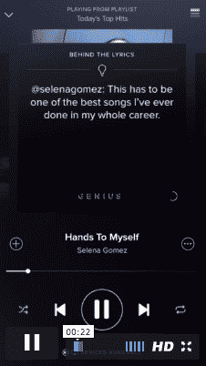

# Spotify 和 Genius 团队在音乐曲目上播放背景故事

> 原文：<https://web.archive.org/web/https://techcrunch.com/2016/01/12/spotify-teams-with-genius-to-annotate-music-tracks/>

拥有 7500 万用户的流行音乐流媒体应用 Spotify 希望提升其作为不仅仅是音乐欣赏平台的形象。为此，[将](https://web.archive.org/web/20230404080352/https://news.spotify.com/us/2016/01/12/go-behind-the-lyrics-with-spotify-and-genius/)与 [Genius](https://web.archive.org/web/20230404080352/http://www.genius.com/) 联系起来，后者是一家注释音乐歌词和[其他在线内容的初创公司](https://web.archive.org/web/20230404080352/https://techcrunch.com/2016/01/11/amazon-to-stream-obamas-final-state-of-the-union-lyrics-site-genius-to-power-annonations/)，当你在 Spotify 上播放歌曲时，它会弹出背景故事和评论。该合作将从一个免费的嘻哈播放列表开始，[歌词背后(嘻哈)](https://web.archive.org/web/20230404080352/https://open.spotify.com/user/spotify/playlist/2Fd6UiLzCkgCuodfRFd4OQ)，下周将扩展到歌词背后(点击)和更多。Genius 注释最初只能在 Spotify 的 iPhone 应用程序上使用(并且只能在 iPhone 4/4s 之后的机型上使用)。

Genius 的首席执行官汤姆·雷曼写道，该视频流来自其名为 Fact Tracks 的服务的调整版本，也通过桌面运行该体验的版本，但有点麻烦。确保你在后台打开了 Spotify 应用程序，你可以导航到 Genius.com 上的一个单独页面，从那里选择歌曲和流媒体。

在 Spotify 的应用程序上，当你播放歌词列表后面的一首歌曲时，就会触发 Genius 注释。因此，你现在将看到屏幕上出现的不是简单的 Selena Gomez 的照片，而是她的歌曲的歌词，突出显示单词，然后用评论进行扩展，以及 Selena 和其他人的其他深刻或有趣的观察。

想退出天才笔记吗？Spotify 告诉我，不要听播放列表，在平台上以另一种方式找到曲目，因为注释会自动出现在歌词曲目后面。

这似乎部分是因为 Spotify 上流媒体注释的限制。虽然您可以通过不点击高亮显示的单词来有效地屏蔽 Genius 上的注释，但在这里您似乎别无选择。一个高亮显示的单词，至少在我们看到的演示中，是较少交互的，更多的是在下一个屏幕中将要解释的信号。

随着所有用户都可以免费和付费使用歌词背后的播放列表，Spotify 体验的新内容是一个有趣的发展。

现在很多人都非常喜欢使用 Spotify 作为后台应用。戴上它，做你的其他事情，无论是锻炼还是清洁，或者思考你的猫坐在那里盯着你看时可能在想什么。

添加歌词和不断变化的信息转盘是将你的注意力拉回 Spotify 本身并让你的眼球停留在那里的一种方式。就像 Spotify 进军视频领域一样，这是该公司保持用户粘性和参与度的一种方式。这给了 Spotify 一个利用它的其他目的的方法，比如广告，提供关于[的其他信息，比如音乐会](https://web.archive.org/web/20230404080352/https://techcrunch.com/2015/11/12/spotify-turns-its-recommendation-engine-to-concerts/)或[销售商品](https://web.archive.org/web/20230404080352/https://techcrunch.com/2014/08/13/spotify-teams-up-with-bandpage-to-jump-deeper-into-artist-merchandising/)。

然而，目前看来，Spotify 并没有变得更像 Soundcloud。用户将无法在平台上自己给歌曲添加注释，尽管他们可以去 Genius 的网站，成为那里众包数据工作的一部分。

但它也给艺术家提供了一种与听众进行更多对话的方式。

“Spotify 和 Genius 在另一个层面上创造了我和我的粉丝之间非常酷的联系，这是我通常无法与他们联系的，”Tinashe 说，他是首批音乐获得 Genius 待遇的艺术家之一。“他们不仅能听到音乐，看到歌词，而且还能理解我写歌词的时候是从哪里来的，并能进入我的大脑，这真的很酷。”

对 Genius 来说，这一转变标志着该公司及其用户群仍牢牢扎根于其音乐根基之中。该公司由安德森·霍洛维茨(Andreessen Horowitz)等人支持，最初以说唱天才(Rap Genius)的名义推出，但后来放弃了说唱，并通过 API 和其他合作伙伴关系扩展到涵盖所有类型的内容。就在几天前，该公司宣布将为奥巴马总统今天播出的最后一次[国情咨文](https://web.archive.org/web/20230404080352/https://techcrunch.com/2016/01/11/amazon-to-stream-obamas-final-state-of-the-union-lyrics-site-genius-to-power-annonations/)提供解说。

此外，Genius 花了很大力气在它的可嵌入注释选项上，让任何网站都可以添加解释，比如在 Genius.com 的。该功能未能成功，让 Genius 寻找新的方式向人们展示其价值。

为了在歌词搜索结果页面的竞争中脱颖而出，它需要让人们知道它会给他们带来比 AZlyrics、metro lyrics——或 Musixmatch 更好的东西，musix match 是一个歌词网站，已经与 Spotify 进行了桌面集成，并在上个月增加了一个移动集成。Musixmatch 也看到了歌词是如何让人们保持注意力的。

musix match 创始人 Max Ciociola 在 Spotify 移动整合时表示:“我们正在为流媒体带来一种新的体验，因为歌词，我们更注重视觉，而不是听觉。”。

(郑重声明，如果你像有些人一样好奇，Spotify 表示，在 Genius 合作之后，它不会改变与 Musixmatch 的协议。“Spotify 与 Genius 的合作是对 Musixmatch 的补充，musix match 为 Spotify 上的广泛目录提供原始歌词，”一位发言人告诉 TechCrunch。“我们没有取代 Musixmatch 的计划；我们在歌词背后添加了一层新的背景，以在粉丝和他们最喜爱的艺术家之间建立更深层次的联系。”)

当被问及与 Genius 的合作是否涉及音乐播放方面的投资或收入分成时，Spotify 不愿就交易的任何财务条款置评。由于所有 Spotify 用户都可以免费或付费使用带注释的播放列表，因此它尽可能广泛地发布了这一功能。

乔希·孔斯蒂纳补充报道