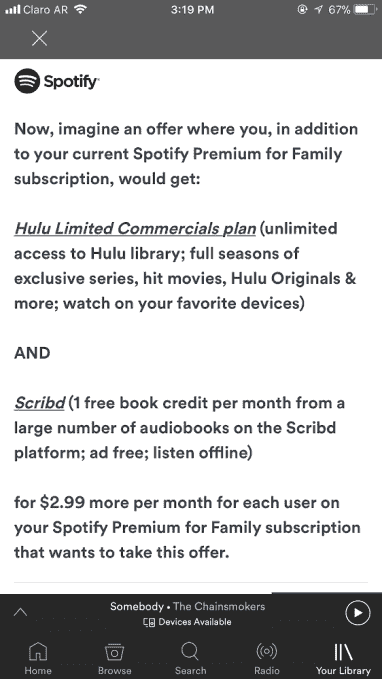
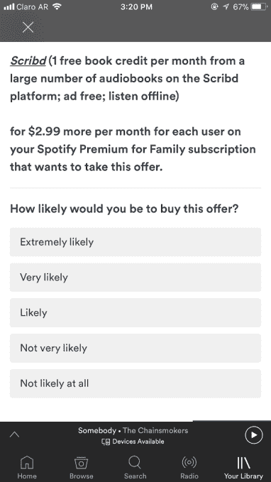

# Spotify 测试消费者对 Hulu 和 Scribd 有声读物的兴趣 

> 原文：<https://web.archive.org/web/https://techcrunch.com/2018/05/03/spotify-tests-consumer-interest-in-a-bundle-with-both-hulu-and-scribds-audiobooks/>

今年 4 月，Spotify 和 Hulu 联手推出每月 12.99 美元的折扣捆绑服务[，此前](https://web.archive.org/web/20221206153627/https://techcrunch.com/2018/04/11/spotify-and-hulu-launch-a-discounted-entertainment-bundle-for-12-99-per-month/)[去年秋天也推出了针对学生的类似服务](https://web.archive.org/web/20221206153627/https://techcrunch.com/2017/09/07/spotify-and-hulu-partner-on-a-discounted-entertainment-bundle-first-aimed-at-students/)。现在，流媒体服务似乎正在考虑扩大其娱乐捆绑产品，以包括 Scribd 有声读物服务。

在 Spotify 移动应用程序最近弹出的一项消费者调查中，该公司询问了许多关于有声读物的问题，更具体地说，是关于 Spotify、Hulu 和 Scribd 的捆绑销售。

该调查从阅读或收听非音乐内容的媒体消费习惯问题开始，如客户在过去三个月中是否听过有声读物或播客，或者他们是否读过实体书、杂志或电子书。

然后，它会询问客户如何收听有声读物，多久收听一次，使用哪种形式——下载、借阅、CD 或订阅。

[图库 ids="1633497，1633496，1633495，1633494，1633493，1633492，1633491，1633490，1633489，1633488，1633487，1633486，1633485，16333484 "]

在一个关于订阅的问题中，Spotify 问*“你主要使用哪种有声读物订阅服务？”*

然后，调查者可以从以下网站中选择: *Playster、Scribd、亚马逊 Prime、倾盆大雨、奥托、Audiobooks.com、Kindle unlimited、Audible、Kobo* 和*其他。*

但最有趣的问题是 Spotify 试图感受消费者对 Spotify/Hulu/Scribd 捆绑包的兴趣。

调查解释说，该捆绑包将在现有的家庭订阅的 Spotify Premium 的基础上每月增加 2.99 美元，目前的价格为 14.99 美元。就像 Hulu/Spotify 的交易一样，它将提供 Hulu 的有限商业计划以及 Spotify 的付费订阅——然而，在这种情况下，是其家庭计划。但是每月多付 2.99 美元——总计每月 17.98 美元——顾客就可以从 Scribd 的有声读物图书馆每月获得 1 次免费图书积分。(Scribd 通常是每月 8.99 美元无限量图书)。

调查指出，这些有声读物没有广告，可以离线收听。

当然，调查问题并不意味着当前存在或正在向客户提供交易。这甚至不意味着 Spotify 会继续与 Scribd 达成交易。但这是一个关于 Spotify 计划的有趣信号——特别是考虑到它最近与 Hulu 的合作，以及[它早先的评论](https://web.archive.org/web/20221206153627/https://techcrunch.com/2017/09/07/spotify-and-hulu-partner-on-a-discounted-entertainment-bundle-first-aimed-at-students/)关于在未来探索不同的捆绑包，这是在它的第一个捆绑包推出后做出的。

Hulu 和 Spotify 的服务面临的问题——就此而言，Scribd 也是如此——是与亚马逊、苹果和谷歌等平台巨头的战争，这些巨头已经通过亚马逊 Prime 捆绑了音乐、视频和书籍、杂志和有声读物的流媒体服务。

据报道，苹果也在探索杂志订阅服务[；其](https://web.archive.org/web/20221206153627/https://techcrunch.com/2018/04/17/apple-to-launch-a-premium-news-subscription-service-report-says/)[即将推出的免费电视服务](https://web.archive.org/web/20221206153627/https://9to5mac.com/2018/01/22/netflix-apple-competitor-content/)预计将与苹果音乐捆绑销售。与此同时，谷歌正计划改造其音乐订阅服务，将 YouTube 视频整合进来。

这意味着 Spotify、Hulu 和 Scribd 等竞争对手将不得不以自己的交易进行反击，甚至可能在某个时候通过 M&A 进行整合。

Spotify 发言人回应道:“我们不断测试新产品和新功能，为用户提供更好的平台体验。这并不意味着双方即将合作。”

这个时候。没错。注意到了。