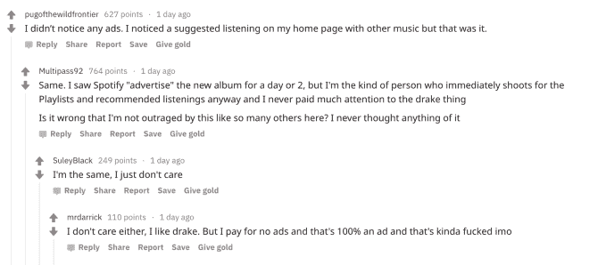
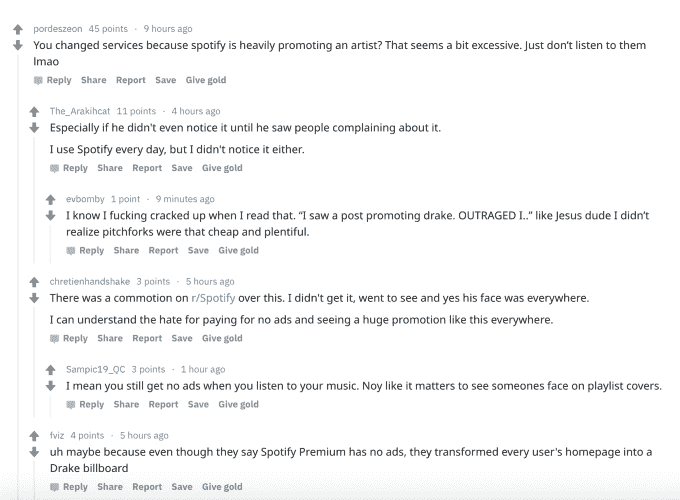

# Spotify 用户对过分夸张的德雷克促销进行反击

> 原文：<https://web.archive.org/web/https://techcrunch.com/2018/07/03/spotify-users-push-back-at-the-over-the-top-drake-promotion/>

根据来自 [Billboard](https://web.archive.org/web/20230315022544/https://www.billboard.com/articles/columns/hip-hop/8463896/spotify-drake-subscribers-refunds-scorpion-playlist-marketing) 的报道，一些 Spotify 用户对最近的德雷克促销非常恼火，他们要求退款并获得了退款。这家流媒体服务公司大力推广了这位艺术家的最新专辑《蝎子》(Scorpion)，甚至在播放列表中使用了他的图像，而播放列表甚至不包含他的音乐，例如《大规模舞蹈热门》(Massive Dance Hits)、《英国最佳》(Best of British)和《快乐流行热门》(Happy Pop Hits)。

这场被称为“Scorpion SZN”的推广活动是有史以来第一次全球艺术家接管 Spotify 的服务，也是第一次一名艺术家在同一天接管多个 Spotify 播放列表。

虽然艺术家在 Spotify 上获得推广并不罕见，但一些人认为德雷克的推广太过了——专辑和德雷克的图像在浏览和播放列表等栏目中随处可见。

一位 Reddit 用户[分享了](https://web.archive.org/web/20230315022544/https://www.reddit.com/r/Music/comments/8vf204/spotify_will_refund_this_month_if_you_contact/)他们是如何从客服那里获得退款的，这个帖子很快就火了起来。迄今为止，他们与支持代表聊天的[截图](https://web.archive.org/web/20230315022544/https://imgur.com/ehxzIcq)已经被观看了近 12000 次。这份记录并没有表明 Spotify 在这方面的任何官方政策，而是一名客服代表帮助保留个人业务的努力。

然而，他们说，其他几个人也尝试了类似的策略，也能得到退款。

Spotify 没有对用户的抵制发表官方评论，但 Billboard 声称退款的数量很少。

显然，流媒体服务注意到了这些投诉，但它在 Twitter 上回应用户，澄清事情很快就会恢复正常。

虽然 Spotify 从未向对促销不满意的客户退款，但更大的新闻不是这些退款带来的财务损失，甚至不是退款发生了，而是这对 Spotify 的声誉造成的损害。

对于那些抱怨的人来说，问题不仅仅是他们不是德雷克的粉丝(尽管这显然是其中的一部分)，而是他们觉得当他们为 Spotify 的免费服务付费时，他们正在观看广告。

此外，像这样大力度的促销活动，与 Spotify 将自己定位为一项符合用户音乐品味的个性化服务的愿望背道而驰。

随着德雷克出现在 Spotify 播放列表和推荐中，总体效果是忽视用户自己的兴趣——那些抱怨的人可能不是德雷克的粉丝，甚至可能不是嘻哈音乐的忠实听众。结果，他们觉得 Spotify 试图强迫他们听他们不喜欢的音乐。

虽然德雷克是一个非常受欢迎的艺术家，但可能没有一个艺术家能够承受这样的推广。只是太多了。毕竟，对一张专辑的发行感到兴奋和宣传它，以及往人们脸上推东西之间有一条细微的界限。Spotify 越过了这条线。

Billboard [指出](https://web.archive.org/web/20230315022544/https://www.billboard.com/articles/columns/hip-hop/8463896/spotify-drake-subscribers-refunds-scorpion-playlist-marketing)一些人甚至将此与苹果/iTunes 丑闻相提并论，当时该公司在 2014 年未经用户同意的情况下下载 U2 的《天真之歌》,从而将该歌曲送人。但也没那么糟糕。问题不在于偷偷下载内容到你的设备上，这更是一种侵犯。

也就是说，用户的愤怒感觉类似:*我不喜欢这首音乐，你为什么要强加给我？*

Spotify 的初衷是用更好玩的方式宣传德雷克的专辑和这位艺术家。它让德雷克登上了其最大的说唱、R&B、流行和心情播放列表的封面，包括 [RapCaviar](https://web.archive.org/web/20230315022544/https://open.spotify.com/user/spotify/playlist/37i9dQZF1DX0XUsuxWHRQd) 、[野兽模式](https://web.archive.org/web/20230315022544/https://open.spotify.com/user/spotify/playlist/37i9dQZF1DX76Wlfdnj7AP)、[被&成为](https://web.archive.org/web/20230315022544/https://open.spotify.com/user/spotify/playlist/37i9dQZF1DX4SBhb3fqCJd)、[夏日派对](https://web.archive.org/web/20230315022544/https://open.spotify.com/user/spotify/playlist/37i9dQZF1DX5Ozry5U6G0d)、[今日热门单曲](https://web.archive.org/web/20230315022544/https://open.spotify.com/user/spotify/playlist/37i9dQZF1DXcBWIGoYBM5M)、[早晨通勤](https://web.archive.org/web/20230315022544/https://open.spotify.com/user/spotify/playlist/37i9dQZF1DX2MyUCsl25eb)等。

在这些情况下，德雷克的形象被用于播放列表，而不是他的音乐，这个想法是，这将展示艺术家的个性。但是这些努力显然失败了。用户感到困惑的是，为什么德雷克会出现在毫无意义的播放列表上——比如那些播放不同流派音乐的播放列表。

从纯粹的数字角度来看，Spotify 的促销活动是成功的。

据 Billboard 报道，这张专辑[在三天内打破了](https://web.archive.org/web/20230315022544/https://www.billboard.com/articles/columns/chart-beat/8463661/drake-scorpion-breaks-one-week-us-streaming-record-three-days)一张专辑的美国一周流媒体记录，Spotify [说](https://web.archive.org/web/20230315022544/https://twitter.com/Spotify/status/1012766423930851329)这张专辑在发行的那个周末每小时被播放超过 1000 万次。这张专辑预计在 7 月 5 日的跟踪周结束时，在美国的播放量将超过 7 亿次。

不是每个人都认为升职是件大事。

一些人说，虽然他们注意到了这些建议，但他们只是绕过这些建议，照常听自己的音乐。但即便如此，一些人还是同情那些抱怨这感觉像是一个本应无广告服务的广告的人。

Spotify 与艺术家合作促销——德雷克收购的细节没有透露。(事实上，从金融投资的角度来看，这甚至不是最大的提升。)因此，Spotify 可能会将此归因于一次学习经历，这可能有助于它在未来策划更好的促销活动，而不会涉及太多的过度行为。