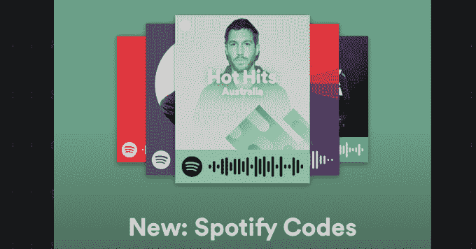
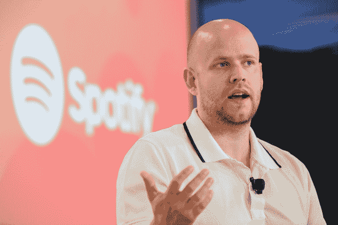

# Spotify 准备上市，拥有 6000 万用户，超过苹果 

> 原文：<https://web.archive.org/web/https://techcrunch.com/2017/07/31/spotify-vs-apple-music/>

Spotify 对音乐的专注让它比附带流媒体应用的 iPhone 公司更快地增加了用户。Spotify 在不到一年的时间里增加了 2000 万付费用户，而 Apple Music 花了一年半多的时间才取得这样的进展。Spotify 现在有 6000 万用户，相比之下苹果音乐有 2700 万用户(截至 6 月)。

Spotify 有能力在来自可以说是世界上最强大的公司的竞争中加快其增长率，这是对其所建立的产品和社区的证明。

Apple Music 提供三个月的免费试用，预装在 iPhones 上，并为独家提前获得顶级专辑支付大笔费用。这些优势可能有助于苹果音乐赢得特定艺术家的粉丝，加上主流听众最终从 MP3 转向。然而，Spotify 仍然是音乐爱好者的首选流媒体服务。

Spotify 正在为所谓的“直接上市”做准备，该公司打算在不进行 IPO 的情况下上市。将向股市出售股票的是内部人士，而不是公司。

这是一个极不寻常的举动，遭到了广泛的质疑。尽管许多公司害怕 IPO 过程，即银行家召集机构投资者并确定上市价格，但这是一个为公司融资的机会。

跳过这一步，Spotify 可能会错过数亿美元的 IPO 收益，但它可以在晚些时候进行二次发行来筹集现金。据说 Spotify 有望在年底前完成这项工作，这是《T2》之前由华尔街日报报道的。

Spotify 的增长得益于几项重要的产品开发:

**探索周刊:** Spotify 广受欢迎的每周更新的[个性化播放列表](https://web.archive.org/web/20230206164846/https://techcrunch.com/2016/05/25/playlists-not-blogs/)已经使其成为试图寻找新歌和新艺人的音乐迷的[首选](https://web.archive.org/web/20230206164846/https://techcrunch.com/2016/08/05/spotify-release-radar/)。该播放列表第一年就有 4000 万用户，Spotify 随后推出了专门针对新曲目的 Release Radar。像苹果和 SoundCloud [这样的竞争对手已经](https://web.archive.org/web/20230206164846/https://techcrunch.com/2016/06/22/soundcloud-improves-music-discovery-with-new-suggested-tracks-feature/) [尝试](https://web.archive.org/web/20230206164846/https://techcrunch.com/2017/05/03/soundclouds-the-upload-uses-machine-learning-to-help-you-find-new-tracks/)[复制《发现周刊》](https://web.archive.org/web/20230206164846/https://techcrunch.com/2016/09/05/apple-rolls-out-its-new-personalized-playlists-to-apple-music-subscribers-on-ios-macos-betas/)，但是 Spotify 正在巩固自己作为品味创造者的成熟流媒体服务的地位。

Spotify 最近推出了分享音乐的二维码

**招募拒不合作的艺人:**虽然最初因没有向音乐人支付足够的版税而受到指责，但随着 Spotify 用户群的增加，支付额也大幅增长。现金，加上 Spotify 已经建立的影响力，如果艺术家想要一张热门唱片，Spotify 已经成为一个必不可少的分销渠道，已经吸引了像泰勒·斯威夫特这样的顽固分子采用 Spotify。公开亮相可能会加强 Spotify 在音乐行业的地位，并让坚持己见的艺术家和听众相信它会长久存在。

**Google Home + Spotify vs 亚马逊 Alexa:** 声控音乐是一种不可思议的体验，听众正在通过亚马逊和谷歌的智能扬声器购买访问权限。虽然亚马逊 Alexa 更喜欢自己的亚马逊 Prime 音乐服务，但 Spotify 是谷歌 Home 的首要合作伙伴之一。专用音乐流媒体已经比合作伙伴 Pandora 和 Google Music 更受欢迎，最近 [Google Home 开始允许控制 Spotify 的免费](https://web.archive.org/web/20230206164846/http://www.androidpolice.com/2017/05/17/google-home-now-supports-spotify-even-free-accounts-plus-soundcloud-deezer/)广告支持服务。一旦[苹果开始发售自己的 HomePod 智能音箱](https://web.archive.org/web/20230206164846/https://techcrunch.com/2017/06/05/not-so-sirious/)，与 Google Home 的合作将变得更加重要。

## 非首次公开募股

Spotify 尚未公开谈论预期的直接上市，但一些接近该公司的人士认为，它可以避免最初的一些波动。银行家通常会推荐较低的股价作为首日“涨幅”，但许多公司在未来几周很难保持这一水平。一些人推测，这可能是一种解决办法。

法国戛纳——6 月 22 日:Spotify 创始人兼首席执行官丹尼尔·埃克(Daniel Ek)出席了 2016 年 6 月 22 日在法国戛纳举行的 2016 年戛纳国际电影节。(照片由 Antoine Antoniol/Getty Images 提供)

它还可以避免那些“锁定”期，即在公司上市后的几个月内，内部人士不能出售股票。由于预计到今天的抛售，Snap 的股票最近几周一直在下跌。

如果实验进展顺利，我们可能会看到其他公司复制它。

但 Spotify 的流程绝对有可能会造成更大的波动。该公司尚未宣布计划如何执行这一计划的具体细节，但向机构投资者出售 IPO 股票的部分原因是，预计他们会更长时间地持有股票。

相反，Spotify 可能不得不依靠其对听众的酷感来推动公众对其股价的支持，以抵御 Apple Music 对其流媒体王国的入侵。