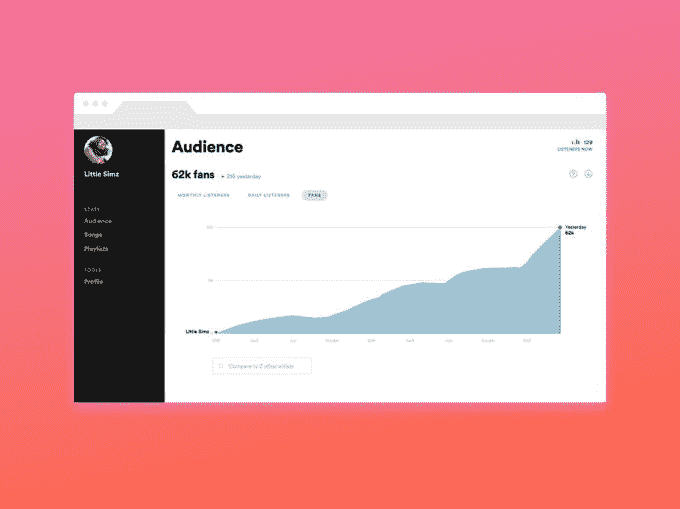
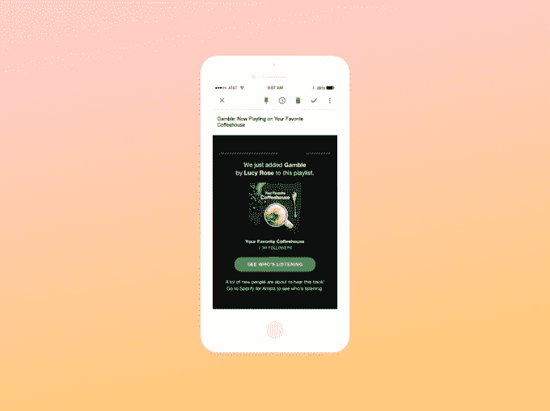
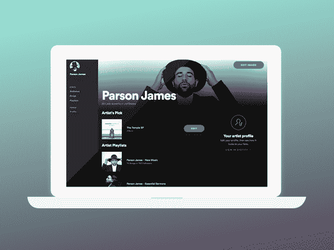

# Spotify 的艺术家仪表板退出测试版，提供流媒体见解、个人资料管理等 

> 原文：<https://web.archive.org/web/https://techcrunch.com/2017/04/18/spotifys-artist-dashboard-exits-beta-offering-streaming-insights-profile-management-more/>

在吸引艺术家加入其平台的战斗中，Spotify 使用了[独家广告](https://web.archive.org/web/20221205192328/https://qz.com/949942/spotifys-new-deal-with-universal-gives-exclusive-music-to-premium-subscribers-and-encourages-piracy-for-free-users/)、[免费广告](https://web.archive.org/web/20221205192328/https://www.bloomberg.com/news/articles/2017-02-10/spotify-befriends-katy-perry-in-quest-to-win-artists-favor?cmpid=socialflow-twitter-business&utm_content=business&utm_campaign=socialflow-organic&utm_source=twitter&utm_medium=social)、[更多听众的承诺](https://web.archive.org/web/20221205192328/https://beta.techcrunch.com/2017/03/02/spotify-50-million/)，以及开放艺术家关心的数据，如粉丝数量和收听次数。在后一方面，Spotify [在 2015 年末发布了一个名为 Fan Insights](https://web.archive.org/web/20221205192328/https://beta.techcrunch.com/2015/11/17/spotify-bets-on-data-to-lure-artists-to-its-platform/) 的数据仪表板，允许艺术家们查看他们的音乐在该服务上的表现如何。如今，Spotify 正在取消这项服务的测试标签——现在更名为“面向艺术家的 Spotify”——并向所有艺术家和管理团队开放。

与之前的 Fan Insights 一样，新的仪表板将提供关于艺术家音乐及其粉丝的数据，包括年龄、性别和位置等人口统计信息。

它显示了粉丝正在使用 Spotify 的哪些功能来发现和播放艺术家的歌曲——这有助于策划促销和合作伙伴关系。例如，它可以告知艺术家他们的粉丝喜欢哪些乐队和音乐家，这有助于艺术家确定与谁合作或巡回演出。

当然，它还会提供收听数据——这个数字会随着艺术家的音乐播放而实时更新——以及歌曲数据、播放列表数据和粉丝在播放列表中添加曲目时的通知。

随着面向艺术家的 Spotify 的重新推出，该平台已经扩大了其范围，不仅仅是音乐数据，还将成为艺术家的新家，为他们需要这项服务的所有人服务。

这包括获得验证(在他们的个人资料上获得勾号——这在以前需要单独的表格)，从 Spotify 获得[支持](https://web.archive.org/web/20221205192328/https://artists.spotify.com/contact)，甚至定制他们的艺术家个人资料页面。

艺术家将能够上传自己的照片到该服务，并通过提供他们的“选择”来进一步定制他们的个人资料——这可以是他们自己的特色歌曲，也可以是他们想要支持的另一位音乐家的歌曲。他们还可以创建和分享自己的播放列表——也可以播放自己的音乐或其他人的歌曲。

该公司表示，在过去的 17 个月里，成千上万的艺术家加入了 Fan Insights 测试版，这有助于为现在公开推出的新功能提供信息。这些现有用户将自动升级到新的 Spotify for Artists，而其他人可以通过访问他们在该服务上的个人资料页面开始，可在[这里](https://web.archive.org/web/20221205192328/https://artists.spotify.com/c/access)找到。

dashboard 的推出是对苹果的一次打击，苹果一直在努力帮助艺术家在自己的流媒体平台 Apple Music 上与粉丝互动。随着 2015 年 Connect 的推出，该公司再次试图在其 iTunes 商店中添加一个社交层，但没有成功，因为今天的艺术家通过脸书和 Twitter 直接吸引粉丝。(Connect 后来被[降职](https://web.archive.org/web/20221205192328/https://9to5mac.com/2016/05/06/apple-music-connect-demotion/)到软件中一个不太突出的位置。)

在复杂的流媒体行业——粉丝可以跨平台、跨服务收听，不一定要收听电台或购买唱片——给艺术家数据，从而让他们有能力自助，这可能会大大有助于吸引艺术家使用 Spotify 的平台。这具有更广泛的影响，有助于 Spotify 扩大其目录，并成为一个粉丝觉得他们的艺术家更容易接近和参与的地方，这反过来可能会增加订阅量。

Spotify 在数据方面下了一点赌注，也进行了战略性收购，如回声巢(Echo Nest)和 T2 的声音分析(Sonalytic)和 T4 的可能电视(MightyTV)和种子科学(Seed Scientific)等。

该公司表示，随着艺术家继续提供反馈，它计划在未来为其仪表板添加新功能。