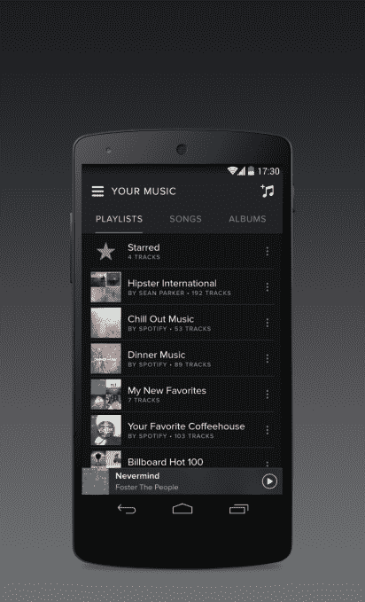

# Spotify 的重大重新设计今天在 Android 上推出 

> 原文：<https://web.archive.org/web/http://techcrunch.com/2014/04/29/spotifys-big-redesign-rolls-out-to-android-today/>

继本月早些时候[为流媒体音乐平台 Spotify 引入了一个新的、更简单和更黑暗的主题之后，](https://web.archive.org/web/20230130000946/https://techcrunch.com/2014/04/01/spotify-goes-over-to-the-dark-side-with-a-new-makeover/)Android 用户现在也将从今天开始获得一个更新的应用程序。像他们的网络、桌面和 iOS 同行一样，Android 用户现在也将看到更暗的主题、更新的排版和早先宣布的圆形图标，以及一些用于查找和管理音乐的新功能。

该公司表示，更新后的体验将于今天在 Android 上推出，预计将在“未来几周内”覆盖所有 Android 用户。

如果你错过了，在 4 月初，Spotify 为其服务推出了一个焕然一新的外观，专注于更好地突出内容，在新的布局中媒体被放在首要位置，艺术家页面有圆形图标，探索页面有更大的封面艺术。当时，该公司表示，这种外观是为了给品牌一个“清晰的身份”，以便一个“从你身后偷看”的朋友能够认出这项服务是 Spotify。

该公司承诺，重新设计首先在网络、桌面和 iPhone 应用上推出，并计划很快在其他移动平台上推出。

此外，Android 用户还会注意到改进的播放列表，对“你的音乐”部分的改变，这实际上已经在过去几周内推出。以前，这个部分(当时称为“集合”)有一些限制。例如，它不允许你将专辑保存到收藏中，这意味着你必须为每张新专辑制作播放列表。如今，“你的音乐”部分可以让你存储和查看播放列表、歌曲、专辑、艺术家和播放列表。

Spotify 表示，在 Android 上，“浏览”功能也随着更新得到了改善，提供了更多相关和本地化的内容。现在，这个部分可以帮助您找到要播放的内容，无需太多思考，提供精选的播放列表、热门列表、新发布的内容，以及大量按情绪和风格分类的播放列表，如“快乐”、“派对”、“流行音乐”、“锻炼”等，所有这些都提供了大量的子类别选择。(例如，情绪系列提供诸如“日落之歌”、“深度聚焦”、“聪明是新的性感”、“回家快乐”、“激动！”还有很多其他人。

更新后的应用程序将于今天推出，尽管可能还没有在你当地的 [Google Play](https://web.archive.org/web/20230130000946/https://play.google.com/store/apps/details?id=com.spotify.mobile.android.ui) 商店上线。