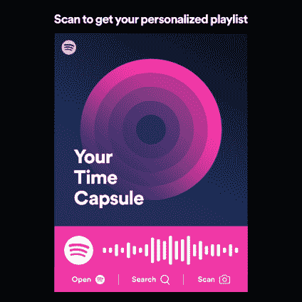

# Spotify 最新的个性化播放列表“你的时间胶囊”是来自你的过去的一个爆炸

> 原文：<https://web.archive.org/web/https://techcrunch.com/2017/09/28/spotifys-newest-personalized-playlist-your-time-capsule-is-a-blast-from-your-past/>

# Spotify 最新的个性化播放列表“你的时间胶囊”是对你的过去的一次冲击

Spotify 更好的功能之一——也是其应用在流媒体音乐市场的竞争优势——是其个性化播放列表。这些汇编早已超越了 Spotify 的 Discover Weekly，包括了其他选择，如 [Release Radar](https://web.archive.org/web/20230320030809/https://techcrunch.com/2016/08/05/spotify-release-radar/) 、你的[无底洞每日混合播放列表](https://web.archive.org/web/20230320030809/https://techcrunch.com/2016/09/27/spotify-daily-mix/)或最近增加的[夏季回放](https://web.archive.org/web/20230320030809/https://www.engadget.com/2017/06/08/spotify-summer-rewind-playlist/)。今天，Spotify 又增加了一个个性化播放列表，推出了专注于怀旧的 [Your Time Capsule](https://web.archive.org/web/20230320030809/https://timecapsule.spotify.com/) 。

正如公司[解释](https://web.archive.org/web/20230320030809/https://news.spotify.com/us/2017/09/28/spotify-launches-your-time-capsule/)的那样，你的时间胶囊将收集你十几岁和二十出头的 30 首最怀旧的歌曲，以创建它所谓的“记忆之旅的配乐”Spotify 指出，播放列表本身将长达两小时左右，并且只对 16 岁以上的用户开放——因为用户需要足够大才能怀旧！

要开始，你可以[访问播放列表的网页链接](https://web.archive.org/web/20230320030809/https://timecapsule.spotify.com/)；访问 Spotify 的 iOS 和 Android 应用程序中“浏览”中的“十年”部分；或者你可以在 Spotify 的“主页”顶部寻找。

虽然这些种类的增加可能看起来微不足道，但个性化播放列表的吸引力是 Spotify 能够保留其目前 1 . 4 亿总用户(免费和付费用户)并增加其应用程序参与度的一个关键方法。例如，它的《发现周刊》一开始就非常受欢迎，第一年就吸引了 4000 万听众。如今，Spotify 表示，它为每一个在 Spotify 上至少呆了两周的用户制作了一份每周发现。我们被告知，这意味着每周一它都会制作数千万个这样的播放列表。

换句话说，人们使用 Spotify 不仅仅是因为他们可以点播流媒体，他们还把它作为一种新的广播形式——一种播放列表驱动的体验，迎合你喜欢的东西。

这也不是容易复制的东西，因为竞争对手没有太多的数据可以访问，也没有足够的技术来理解它。

Spotify 过去曾表示，尽管其他音乐服务将会创建 Discover Weekly 克隆版，但 Spotify 在个性化方面仍有优势，因为它使用了流媒体数据。该公司还继续投资于提高其个性化和推荐功能的能力，例如，通过收购[回声巢](https://web.archive.org/web/20230320030809/https://techcrunch.com/2014/03/06/spotify-acquires-the-echo-nest/)、[声音分析](https://web.archive.org/web/20230320030809/https://techcrunch.com/2017/03/07/spotify-acquires-audio-detection-startup-sonalytic/)、 [MightyTV](https://web.archive.org/web/20230320030809/https://techcrunch.com/2017/03/27/spotify-acquires-content-recommendation-startup-mightytv/) 和[尼兰德](https://web.archive.org/web/20230320030809/https://techcrunch.com/2017/05/18/spotify-buys-ai-startup-niland/)等公司。

您的 Time Capsule 从今天开始对 60 个 Spotify 市场的所有用户开放。