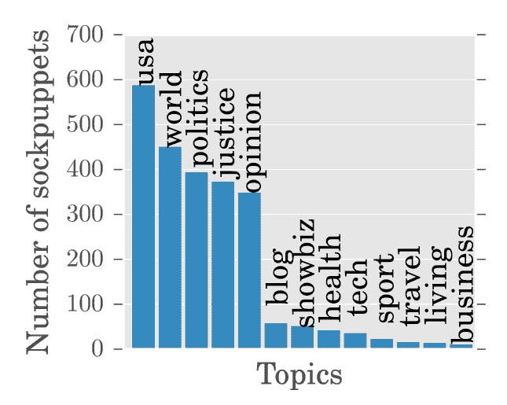

# 用科学发现足球

> 原文：<https://web.archive.org/web/https://techcrunch.com/2017/04/07/spotting-sockpuppets-with-science/>

如果你曾经冒险进入一个网站的评论区，或者在论坛或社交媒体上呆过一段时间，你可能会遇到 sockpuppets，由一个人控制的虚假账户——尽管你当时可能不知道。新的研究可能有助于自动识别这些过于热切的评论员，这对于在网络上引发理智的讨论来说是个好消息。

马里兰大学的 Srijan Kumar 带领一个团队对 sockpuppet 账户的一切进行了统计分析，从他们如何书写和相互交流到他们注册的用户名。他们的发现于本周在珀斯举行的万维网会议上公布。

这些数据来自使用 Disqus 作为评论平台的网站；该公司提供了“9 个社区的用户活动的完整跟踪，包括 2，897，847 名用户，2，129，355 次讨论和 62，744，175 篇帖子。”

他们发现足球的某些方面本身很有趣，但也有助于识别它们。这些帐户往往在同一时间和同一线索中活跃，但很少开始新的讨论。他们的用户名千差万别，但账户邮件通常几乎完全相同。他们有一些语言特征，这使他们有别于普通用户:更多的“我”和“你”，以及更糟糕的语法。他们主要关注时事:

 通过测量这些(以及更多)因素，该团队能够在大约三分之二的时间里识别出一个账户是否是一个傀儡——但更有趣的是，在确定两个账户是否属于同一个“傀儡师”时，它的准确率达到了 91%

在顶部的[图中，你可以看到 AV 俱乐部评论的可视化；蓝点是用户，红点是社交伙伴，因为他们的互动更频繁，所以倾向于聚集在一起。他们也更重要，因为他们比普通用户更活跃。](https://web.archive.org/web/20230319032539/https://techcrunch.com/wp-content/uploads/2017/04/sockpuppet-graph.png)

这离自动化的 sockpuppet 揭秘还有一段距离，但这些数据(除了发布之外，无疑还会以实物形式与 Disqus 共享)应该有助于版主和管理员在试图理解在线讨论的混乱时做出更明智的决定。很快，甚至可以安全地阅读评论了…嗯，可能不会。

如果你对这项研究挖掘出的足球运动的其他方面感到好奇，你可以[在这里](https://web.archive.org/web/20230319032539/https://www.cs.umd.edu/~srijan/pubs/sockpuppets-www2017.pdf)查看这篇论文的完整版本——除了统计数据，它非常具有可读性。