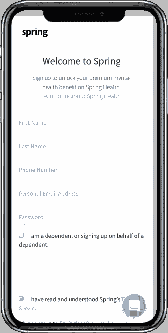

# Spring Health 筹集 600 万美元帮助员工获得个性化心理健康治疗 

> 原文：<https://web.archive.org/web/https://techcrunch.com/2018/07/12/spring-health-raises-6m-to-help-employees-get-access-to-personalized-mental-health-treatment/>

最近几个月，我们看到越来越多的资金流入精神健康工具——无论是人工智能驱动的工具，还是帮助患者找到冥想应用程序的帮助——随着小公司吸引投资者的注意力，这一趋势似乎开始变得更加强劲。

今天又有一个在 [Spring Health](https://web.archive.org/web/20221210025023/https://www.springhealth.com/) 获得资金，这是一个为小公司提供的平台，帮助他们的员工获得更多的心理健康治疗。这家初创公司希望为雇主提供一种简单有效的方式，开始以个性化精神健康计划的形式为员工提供这种治疗。除了访问网络和尽快联系治疗师或精神病医生的方法之外，员工还可以访问机密计划。该公司表示，它已经筹集了 600 万美元的额外资金，由 Rethink Impact 牵头，Work-Bench、BBG 风险投资公司和纽约市合作基金也加入了这轮融资。RRE 风险投资公司和威廉·沃伦基金会也参加了会议。

“… 我意识到心理健康护理在很大程度上是一种猜谜游戏:你用试错法来找到一个合适的治疗师，你用试错法来找到正确的治疗方案，无论是特定的药物鸡尾酒疗法还是特定类型的心理治疗，”首席执行官兼联合创始人 April Koh 说。“如今，我们周围的一切都是个性化的——像亚马逊上的购物、谷歌上的搜索结果和 Yelp 上的餐厅推荐——但你无法获得针对你的心理健康护理的个性化建议。我想从一开始就建立一个平台，为你提供正确的护理。因此，我与个性化精神病学的领先专家、我们的首席科学家亚当·切克洛德博士和我的朋友、我们的首席技术官阿布舍克·钱德拉合作，创办了 Spring Health。”

这家初创公司自称是一家在线精神健康诊所，为员工提供建议，如治疗方案或对他们日常生活的调整(如锻炼养生)。像其他机器学习驱动的平台一样，Spring Health 在最终员工面前放置了一份问卷，该问卷根据他们给出的回答进行调整，然后为该特定个人生成一个健康计划。随着越来越多的患者使用这项服务，它会获得更多的数据，并随着时间的推移改进这些建议。然后，这些患者将与公司网络中的临床医生和有执照的医疗卫生专业人员进行匹配。

Koh 说:“我们发现雇主们都在要求这么做。“作为一家公司，我们开始向卫生系统销售人工智能临床决策支持工具，以帮助医生做出数据驱动的决策。在向一家大型医疗系统销售该工具时，消息传到了他们的福利部门，他们找到我们，告诉我们他们需要福利部门的一些东西来满足员工的心理健康需求。当这种情况发生时，我们决定完全专注于为员工向雇主销售“全栈”精神健康解决方案。我们没有向医生出售工具，而是决定创建我们自己的一流精神卫生服务提供者网络，他们将使用我们的工具提供尽可能最好的精神卫生保健。”

然而，Spring Health 并不是唯一一家为寻求心理健康的员工创建智能匹配系统的初创公司。Lyra Health 是另一个帮助员工安全、保密地开始接受心理健康治疗的工具，[在今年 5 月筹集了 4500 万美元](https://web.archive.org/web/20221210025023/https://techcrunch.com/2018/05/07/lyra-health-raises-45m-to-create-a-smart-network-for-treating-mental-health-problems/)。但是 Spring Health 和 Lyra Health 都是一波创业公司的一部分，这些公司希望为员工创造更有效地寻求医疗服务的方法，这些方法由机器学习提供动力，并利用这些工具的成本和难度大幅下降。

这并不是精神健康类别中唯一一项获得关注的服务，T2 冥想应用 Calm 以 2.5 亿美元的估值筹集了 2700 万美元。雇主自然与员工的健康息息相关，由于所有这些应用程序都希望让心理健康治疗或改善心理健康变得更容易——更少成为禁忌——他们希望继续降低准入门槛，既从实际的产品惯性出发，也从一开始就让人们乐于寻求帮助。

“我认为风险投资者正在意识到，这是一个巨大的机会来破坏精神卫生保健，并使它变得容易获得、方便和负担得起。但是从我们的角度来看，这个领域的问题是有很多未经验证的、非基于证据的技术。围绕人工智能、大数据和机器学习，尤其是在精神卫生保健领域，有大量的软件。我们希望在基于证据和临床验证的精神卫生保健方面建立更高的标准。与市场上大多数精神卫生保健解决方案不同，我们在 JAMA 等顶级医学杂志上发表了多篇同行评审的文章，描述并证实了我们的技术。我们知道，我们的个性化建议和我们的护理导航方法是基于证据的，并且证明是有效的。