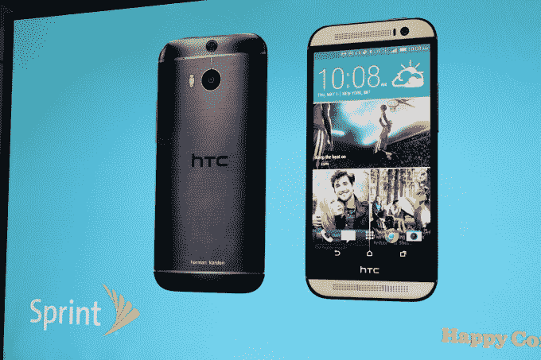

# Sprint 宣布与 Spotify 合作，推出 HTC One M8 Harman/Kardon 版智能手机 

> 原文：<https://web.archive.org/web/https://techcrunch.com/2014/04/29/sprint-announces-spotify-partnership-unveils-htc-one-m8-harmankardon-edition-smartphone/>

Sprint 今天召集了纽约媒体，展示了与 HTC 和 Harman/Kardon 合作的新智能手机，以及与 Spotify 的折扣合作关系。

Sprint 公布了与 Spotify 的合作伙伴关系，同时推出了一项名为 Sprint Sound sessions 的新服务，这是该运营商自己的门户网站，提供优质折扣直播活动、高级音乐发布，当然，还有 Spotify 的折扣访问。

以下是 Spotify 在 Sprint 上的定价方式。

从 5 月 9 日开始，所有现有的 Sprint 客户都将获得打折的 Spotify premium。有 Framily 计划的人将获得六个月的免费试用，然后根据家庭规模每月支付 8 美元至 5 美元(1-5 名家庭成员每月支付 7.99 美元，6-10 名家庭成员每月支付 4.99 美元)。

如果你不在 Framily 计划中，你将获得三个月的免费试用，然后每月支付 9.99 美元购买 Spotify Premium。

至于手机，是 HTC One M8 哈曼/卡顿版，有“直接从设备无损播放音乐”的能力。

据 Sprint 首席执行官 Dan Hesse 称，One M8 HK 版使用的技术读取的信息量是光盘的 6 倍。

Harman 首席执行官 Dinesh Paliwal 解释说，有两种不同的技术可以为用户带来更丰富的听觉体验。Clarifi 实时分析音乐，并实时重建歌曲以添加高音、低音和混响。这不像提高低音或均衡，因为“这不是科学的解决方案。”

另一项技术是 LiveStage。LiveStage 采用现场舞台录音，使其听起来像是来自分散在舞台上的乐队，而不是在单个通道中听到。

这款手机还配有一套价值 149 美元的哈曼/卡顿耳塞，配有音量、播放/暂停按钮。

根据 Peter Chou 的说法，HTC 还对 HTC One M8 HK 的设计进行了一些调整，增加了“高质量的金属，带有黑色涂层和香槟色，这样你一看到它就知道它是优质的”。但是*还不是全部*。

目前还没有定价的消息，但这款手机也将于 5 月 9 日上市。